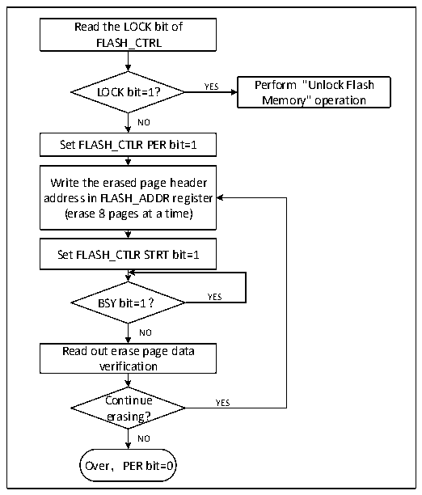

<!-- source-page: 257 -->

[← p.256](0256.md) · [index](../README.md) · [PDF p.257](https://ch32-riscv-ug.github.io/CH32V006/datasheet_en/CH32V00XRM.PDF#page=257) · [p.258 →](0258.md)

<!-- header: CH32V00X Reference Manual https://wch-ic.com -->

## 18.4 Flash Memory Operation Flow

### 18.4.1 Read Operations

With direct addressing in the general address space, any read operation of 8/16/32-bit data can access the contents  
of the flash module and get the corresponding data.  

### 18.4.2 Unlock the Flash Memory

After a system reset, the flash controller (FPEC) and FLASH_CTLR registers are locked and inaccessible. The  
flash controller module can be unlocked by writing a sequence to the FLASH_KEYR register.  
Unlock sequence.  
1) Write KEY1 = 0x45670123 to the FLASH_KEYR register (step 1 must be KEY1).  
2) Write KEY2 = 0xCDEF89AB to FLASH_KEYR register (step 2 must be KEY2).  
The above operations must be executed sequentially and consecutively, otherwise they are error operations and  
will lock the FPEC module and FLASH_CTLR registers and generate bus errors until the next system reset.  
The flash memory controller (FPEC) and FLASH_CTLR registers can be locked again by setting the &quot;LOCK&quot; bit  
of the FLASH_CTLR register to 1.  

### 18.4.3 Main Memory Standard Erase

Flash memory can be erased by sectors (1K bytes) or in its entirety.  

Figure 18-1 FLASH Page Erase  
 <!-- rendered from the PDF; verify at https://ch32-riscv-ug.github.io/CH32V006/datasheet_en/CH32V00XRM.PDF#page=257 -->

🖼 Text parsed from the figure above

Read the LOCK bit of  
FLASH_CTRL  
LOCK bit=1? YES Perform &quot;Unlock Flash  
Memory&quot; operation  
NO  
Set FLASH_CTLR PER bit=1  
Write the erased page header  
address in FLASH_ADDR register  
(erase 8 pages at a time)  
Set FLASH_CTLR STRT bit=1  
BSY bit=1？ YES  
NO  
Read out erase page data  
verification  
Continue YES  
erasing?  
NO  
Over，PER bit=0  

1) Check the FLASH_CTLR register LOCK bit, if it is 1, you need to perform the &quot;unlock flash&quot; operation.  
2) Set the PER bit of the FLASH_CTLR register to &#x27;1&#x27; to enable sector erase mode.  
3) Write the header address of the selected erasure to the FLASH_ADDR register.  
4) Set the STRT bit of the FLASH_CTLR register to ‘1’ to start an erase operation.  
<!-- image: p257-draw-image-00001 bbox=[515.88, 783.6, 534.96, 793.8] -->
<!-- footer: V1.5 251 -->
