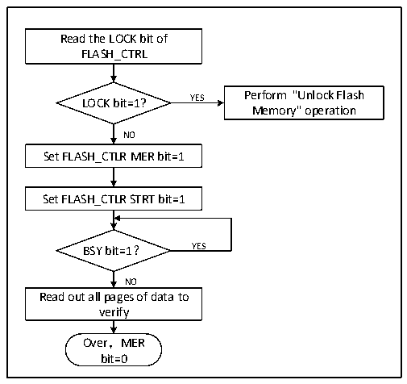

<!-- source-page: 258 -->

[← p.257](0257.md) · [index](../README.md) · [PDF p.258](https://ch32-riscv-ug.github.io/CH32V006/datasheet_en/CH32V00XRM.PDF#page=258) · [p.259 →](0259.md)

<!-- header: CH32V00X Reference Manual https://wch-ic.com -->
5) Wait for the BSY bit to become &#x27;0&#x27; or the EOP bit of the FLASH_STATR register to be &#x27;1&#x27; to indicate the end  
of erasure, and clear the EOP bit to 0.  
6) Read the data of the erasure page for verification.  
7) You can repeat steps 3-5 to continue sector erasing, and clear the PER bit to 0 when erasing ends.  
<em>Note: After erasing successfully, read the word-0xFF.</em>  

Figure 18-2 FLASH whole chip erase  
 <!-- rendered from the PDF; verify at https://ch32-riscv-ug.github.io/CH32V006/datasheet_en/CH32V00XRM.PDF#page=258 -->

🖼 Text parsed from the figure above

Read the LOCK bit of  
FLASH_CTRL  
LOCK bit=1? YES Perform &quot;Unlock Flash  
Memory&quot; operation  
NO  
Set FLASH_CTLR MER bit=1  
Set FLASH_CTLR STRT bit=1  
BSY bit=1？ YES  
NO  
Read out all pages of data to  
verify  
Over，MER  
bit=0  

1) Check the FLASH_CTLR register LOCK bit, if it is 1, you need to perform the &quot;unlock flash&quot; operation.  
2) Set the MER bit of the FLASH_CTLR register to &#x27;1&#x27;, and turn on the whole chip erase mode.  
3) Set the STRT bit of the FLASH_CTLR register to &#x27;1&#x27; to start the erase action.  
4) Waiting for the BSY bit to change to &#x27;0&#x27; or the EOP bit of the FLASH_STATR register to be &#x27;1&#x27; means the  
erasure is over, and the EOP bit is cleared to 0.  
5) Read the data of the erasure page for verification.  
6) Clear the MER bit 0.  

### 18.4.4 Fast Programming Mode Unlocking

Fast programming mode operation can be unlocked by writing a sequence to the FLASH_MODEKEYR register.  
After unlocking, the FLOCK bit of FLASH_CTLR register will be cleared to 0, indicating that fast erase and  
programming operations can be performed. The FLASH_CTLR register is locked again by software setting the  
&quot;FLOCK&quot; bit to 1.  
Unlock sequence.  
1) Write KEY1 = 0x45670123 to the FLASH_MODEKEYR register.  
2) Write KEY2 = 0xCDEF89AB to FLASH_MODEKEYR register.  
The above operations must be performed sequentially and consecutively, otherwise they are wrong operations will  
be locked and cannot be unlocked again until the next system reset.  
<em>Note: Fast programming operation requires unlocking the &quot;LOCK&quot; and &quot;FLOCK&quot; layers.</em>  

### 18.4.5 Main Memory Fast Programming

Fast programming by page (256 bytes).  
<!-- image: p258-draw-image-00001 bbox=[515.88, 783.6, 534.96, 793.8] -->
<!-- footer: V1.5 252 -->
