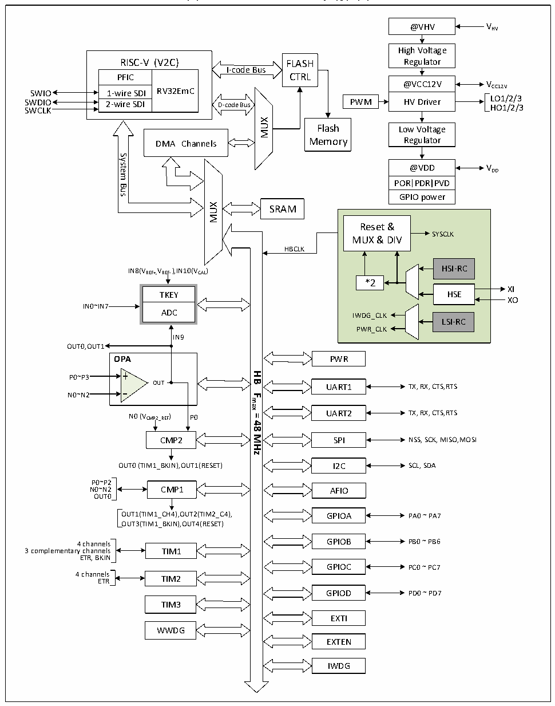

<!-- source-page: 6 -->

[← p.5](0005.md) · [index](../README.md) · [PDF p.6](https://ch32-riscv-ug.github.io/CH32V006/datasheet_zh/CH32V00XRM.PDF#page=6) · [p.7 →](0007.md)

<!-- header: CH32V00X应用手册 https://wch.cn -->

图1-5-1 CH32M007G8R6系统框图  
 <!-- rendered from the PDF; verify at https://ch32-riscv-ug.github.io/CH32V006/datasheet_zh/CH32V00XRM.PDF#page=6 -->

🖼 Text parsed from the figure above

@VHV V HV  
High Voltage  
RISC-V (V2C)  PFIC  RV32EmC  1-wire SDI  2-wire SDI  
Regulator  
RISC-V (V2C) FLASH  
I-code Bus  
PFIC CTRL  
@VCC12V V  
CC12V SWIO  
LO1/2/3  
SWDIO PWM HV Driver SWCLK HO1/2/3  
MUX  
Flash  
Low Voltage  
Regulator  
Memory  
DMA Channels  
System  
@VDD VDD  
POR  PDR  PVD  
Bus  
GPIO power  
MUX  
SRAM  
Reset &amp;  
SYSCLK  
MUX &amp; DIV  
HBCLK  
IN8(VREF+,VREF- ),IN10(VCAL) HSI-RC  
*2  
XI  
TKEY HSE  
XO  
IN0~IN7  
ADC IWDG_CLK  
LSI-RC  
PWR_CLK  
IN9  
OUT0,OUT1  
<strong>OPA</strong>  
PWR  
<strong>HB</strong>  
P0~P3  
OUT UART1 TX, RX, CTS,RTS  
N0~N2  
<strong>Fmax</strong>  
UART2 TX, RX, CTS,=RTS N0 (VCMP2_REF) P0  
<strong>48</strong>  
<strong>MHz</strong>  
CMP2 SPI NSS, SCK, MISO,MOSI  
OUT0 (TIM1_BKIN),OUT1(RESET) I2C  
SCL, SDA  
P0~P2  
N0~N2 CMP1 AFIO  
OUT0  
OUT1(TIM1_CH4),OUT2(TIM2_C4), GPIOA PA0 ~ PA7  
OUT3(TIM1_BKIN),OUT4(RESET)  
4 channels GPIOB PB0 ~ PB6  
3 complementary channels TIM1  
ETR, BKIN  
GPIOC PC0 ~ PC7  
4 channels  
ETR TIM2  
GPIOD PD0 ~ PD7  
TIM3  
EXTI  
WWDG  
EXTEN  
IWDG  

<!-- image: p6-draw-image-00001 bbox=[507.6, 786.0, 527.52, 797.04] -->
<!-- footer: V1.5 5 -->
