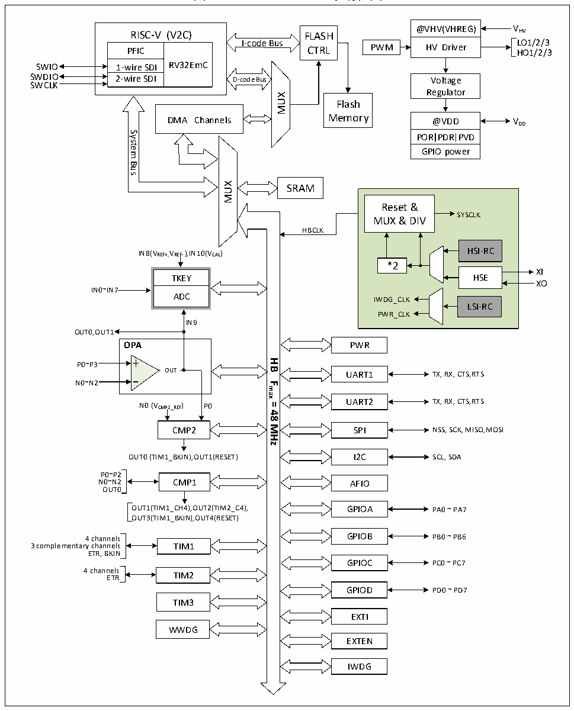

<!-- source-page: 8 -->

[← p.7](0007.md) · [index](../README.md) · [PDF p.8](https://ch32-riscv-ug.github.io/CH32V006/datasheet_zh/CH32V00XRM.PDF#page=8) · [p.9 →](0009.md)

<!-- header: CH32V00X应用手册 https://wch.cn -->

图1-5-3 CH32M007E8R6系统框图  
 <!-- rendered from the PDF; verify at https://ch32-riscv-ug.github.io/CH32V006/datasheet_zh/CH32V00XRM.PDF#page=8 -->

🖼 Text parsed from the figure above

RISC-V (V2C)  RISC-VPFIC  V (V2C) RV32EmC  1-wire SDI  2-wire SDI  
@VHV(VHREG)  HV Driver  
RISC-V (V2C) FLASH  
LO1/2/3  
I-code Bus  
PFIC CTRL  
SWIO  
SWDIO Voltage  
SWCLK  
Regulator  
MUX  
Flash  
@VDD  POR  PDR  PVD  GPIO power  
Memory  
DMA Channels  
System  
Bus  
MUX  
SRAM  
Reset &amp;  
SYSCLK  
MUX &amp; DIV  
HBCLK  
IN8(VREF+,VREF- ),IN10(VCAL) HSI-RC  
*2  
XI  
HSE  
TKEY HSE  
XO  
IN0~IN7  
ADC  
IWDG_CLK  
LSI-RC  
PWR_CLK  
IN9  
OUT0,OUT1  
<strong>OPA</strong>  
PWR  
<strong>HB</strong>  
P0~P3  
OUT UART1 TX, RX, CTS,RTS  
N0~N2  
<strong>Fmax</strong>  
UART2 TX, RX, CTS,=RTS N0 (VCMP2_REF) P0  
<strong>48</strong>  
<strong>MHz</strong>  
CMP2 SPI NSS, SCK, MISO,MOSI  
OUT0 (TIM1_BKIN),OUT1(RESET) I2C  
SCL, SDA  
P0~P2  
N0~N2 CMP1 AFIO  
OUT0  
OUT1(TIM1_CH4),OUT2(TIM2_C4), GPIOA PA0 ~ PA7  
OUT3(TIM1_BKIN),OUT4(RESET)  
4 channels GPIOB PB0 ~ PB6  
3 complementary channels TIM1  
ETR, BKIN  
GPIOC PC0 ~ PC7  
4 channels  
ETR TIM2  
GPIOD PD0 ~ PD7  
TIM3  
EXTI  
WWDG  
EXTEN  
IWDG  

系统中设有：通用DMA控制器用以减轻CPU负担、提高效率；时钟树分级管理用以降低了外设总  
的运行功耗，同时还兼有数据保护机制，时钟安全系统保护机制等措施来增加系统稳定性。  
● 指令总线（I-Code）将内核和FLASH指令接口相连，预取指在此总线上完成。  
● 数据总线（D-Code）将内核和FLASH数据接口相连，用于常量加载和调试。  
● 系统总线将内核和总线矩阵相连，用于协调内核、DMA、SRAM和外设的访问。  
● DMA总线负责DMA的HB主控接口与总线矩阵相连，该总线访问对象是FLASH数据、SRAM和外设。  
● 总线矩阵负责的是系统总线、数据总线、DMA总线、SRAM和HB桥之间的访问协调。  
<!-- image: p8-draw-image-00001 bbox=[507.6, 786.0, 527.52, 797.04] -->
<!-- footer: V1.5 7 -->
