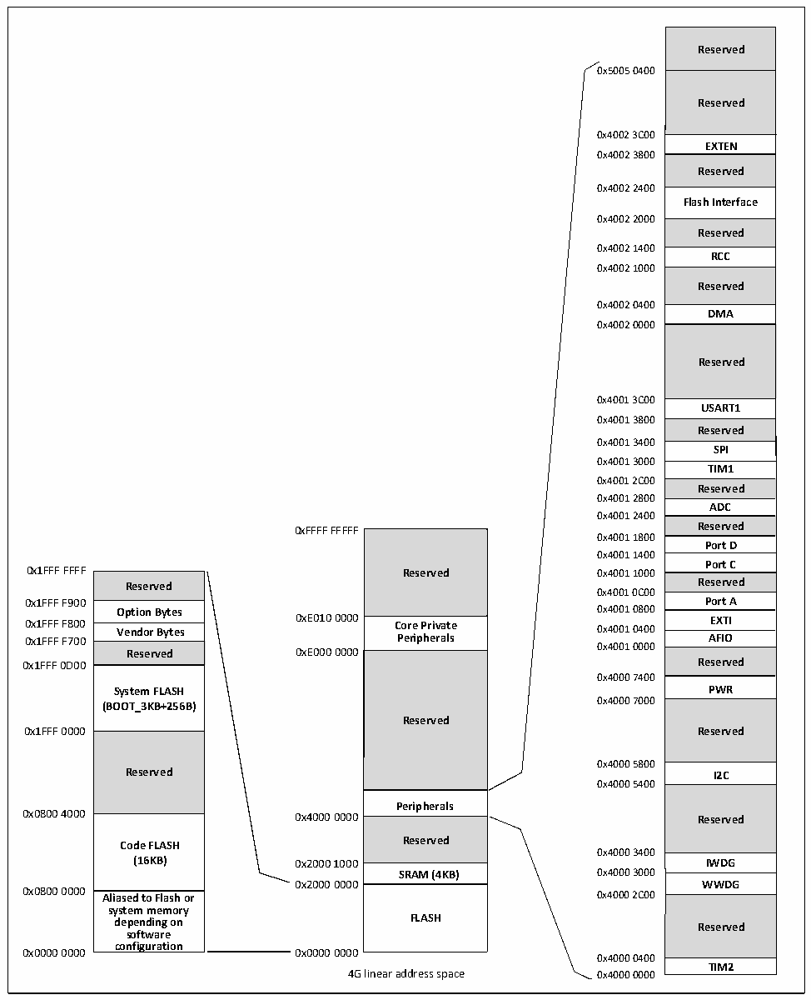

<!-- source-page: 9 -->

[← p.8](0008.md) · [index](../README.md) · [PDF p.9](https://ch32-riscv-ug.github.io/CH32V006/datasheet_zh/CH32V00XRM.PDF#page=9) · [p.10 →](0010.md)

<!-- header: CH32V00X应用手册 https://wch.cn -->

## 1.2 存储器映像

CH32V00X 系列产品都包含了程序存储器、数据存储器、内核寄存器和外设寄存器等等，它们都  
在一个4GB的线性空间寻址。  
系统存储以小端格式存放数据，即低字节存放在低地址，高字节存放在高地址。  

图1-6 CH32V002存储映像  
 <!-- rendered from the PDF; verify at https://ch32-riscv-ug.github.io/CH32V006/datasheet_zh/CH32V00XRM.PDF#page=9 -->

🖼 Text parsed from the figure above

Reserved  Reserved  
0x5005 0400  
0x4002 3C00  
<strong>EXTEN</strong>  
0x4002 3800  
<strong>Reserved</strong>  
0x4002 2400  
<strong>Flash Interface</strong>  
0x4002 2000  
<strong>Reserved</strong>  
0x4002 1400  
<strong>RCC</strong>  
0x4002 1000  
<strong>Reserved</strong>  
0x4002 0400  
<strong>DMA</strong>  
0x4002 0000  
<strong>Reserved</strong>  
0x4001 3C00  
<strong>USART1</strong>  
0x4001 3800  
Reserved  SPI  TIM1  Reserved  ADC  Reserved  Port D  Port C  Reserved  Port A  EXTI  AFIO  Reserved  PWR  Reserved  I2C  Reserved  
0x4001 3400  
0x4001 3000  
0x4001 2C00  
0x4001 2800  
0x4001 2400  
0xFFFF FFFFF Reserved  
Reserved  Core Private Peripherals  Reserved  
0x4001 1800  
0x4001 1400  
0x1FFF FFFF Reserved 0x4001 1000  
Reserved  Option Bytes  Vendor Bytes  Reserved  System FLASH (BOOT_3KB+256B)  Reserved  Code FLASH (16KB) Aliased to Flash or  Aliased to Flash or system memory depending on software configuration  
0x4001 0C00  
0x4001 0000  
Reserved 0xE000 0000  
0x4000 7400  
0x4000 5800  
0x4000 5400  
<strong>Peripherals</strong>  
Reserved  SRAM (4KB)  FLASH  
0x4000 3400  
SRAM (4KB) 0x4000 3000  
0x2000 0000 WWDG  
0x0800 0000 Aliased to Flash or 0x4000 2C00  
0x0000 0000 0x0000 0000  
0x4000 0400  
<strong>TIM2</strong>  
4G linear address space 0x4000 0000  

<!-- image: p9-draw-image-00001 bbox=[507.6, 786.0, 527.52, 797.04] -->
<!-- footer: V1.5 8 -->
