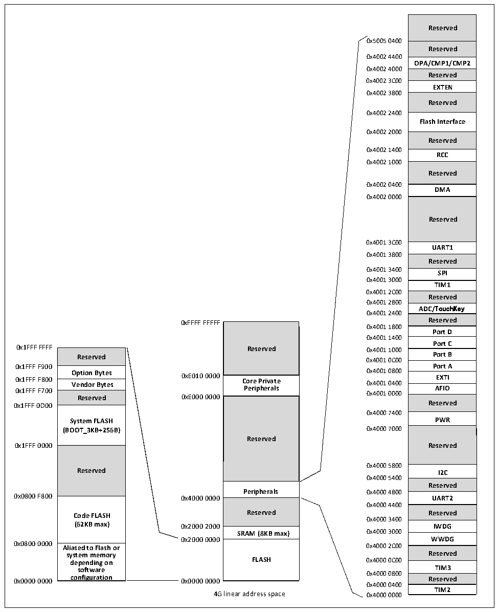

<!-- source-page: 12 -->

[← p.11](0011.md) · [index](../README.md) · [PDF p.12](https://ch32-riscv-ug.github.io/CH32V006/datasheet_zh/CH32V00XRM.PDF#page=12) · [p.13 →](0013.md)

<!-- header: CH32V00X应用手册 https://wch.cn -->

图1-9 CH32V007、CH32M007存储映像  
 <!-- rendered from the PDF; verify at https://ch32-riscv-ug.github.io/CH32V006/datasheet_zh/CH32V00XRM.PDF#page=12 -->

🖼 Text parsed from the figure above

Reserved  Reserved  OPA/CMP1/CMP2  Reserved  EXTEN  Reserved  Flash Interface  Reserved  RCC  Reserved  DMA  Reserved  UART1  Reserved  
0x5005 0400  
0x4002 4400  
0x4002 4000  
0x4002 3C00  
0x4002 3800  
0x4002 2400  
0x4002 2000  
0x4002 1400  
0x4002 1000  
0x4002 0400  
0x4002 0000  
0x4001 3C00  
0x4001 3800  
0x4001 3400  
<strong>SPI</strong>  
0x4001 3000  
<strong>TIM1</strong>  
0x4001 2C00  
<strong>Reserved</strong>  
0x4001 2800  
ADC/TouchKey  
0x4001 2400  
0xFFFF FFFFF Reserved  
0x4001 1800  
<strong>Port D</strong>  
0x4001 1400  
Port C  Port B  Port A  EXTI  AFIO  Reserved  PWR  Reserved  I2C  Reserved  
0x1FFF FFFF Reserved 0x4001 1000  
Reserved  Option Bytes  Vendor Bytes  Reserved  System FLASH (BOOT_3KB+256B)  Reserved  Code FLASH (62KB max) Aliased to Flash or  Aliased to Flash or system memory depending on software configuration  
<strong>Reserved Port B</strong>  
0x4001 0C00  
0x1FFF F900 Port A  
Option Bytes 0x4001 0800  
<strong>0x1FFF F800 Vendor Bytes 0xE010 0000 Core Private 0x4001 0400 EXTI</strong>  
0x1FFF F700 Peripherals 0x4001 0000 AFIO  
Reserved 0xE000 0000  
0x1FFF 0D00 Reserved  
0x4000 7400  
<strong>System FLASH PWR</strong>  
<strong>(BOOT_3KB+256B) 0x4000 7000</strong>  
<strong>Reserved</strong>  
<strong>0x1FFF 0000 Reserved</strong>  
0x4000 5800  
Reserved I2C  
0x4000 5400  
<strong>Peripherals 0x4000 4800</strong>  
Reserved  SRAM (8KB max)  FLASH  
0x4000 4400  
0x4000 3400  
<strong>SRAM (8KB max) 0x4000 3000</strong>  
0x2000 0000 WWDG  
0x0800 0000 Aliased to Flash or 0x4000 2C00  
Reserved  TIM3  Reserved  TIM2  
0x4000 0800  
0x4000 0400  
4G linear address space 0x4000 0000  

### 1.2.1 存储器分配

SRAM 起始地址 0x20000000，支持字节、半字（2 字节）、全字（4 字节）访问，用于存放数据，  
掉电后数据丢失。  
程序闪存存储区（Code FLASH），即用户区，用于用户的应用程序和常量数据存储。  
系统存储区（System FLASH），即BOOT区，用于系统引导程序存储（厂家固化自举加载程序）。  
用户自定义信息存储区，用于用户选择字存储。  
注：各型号产品储存器分配的具体内容请参考对应数据手册。  
<!-- image: p12-draw-image-00001 bbox=[507.6, 786.0, 527.52, 797.04] -->
<!-- footer: V1.5 11 -->
