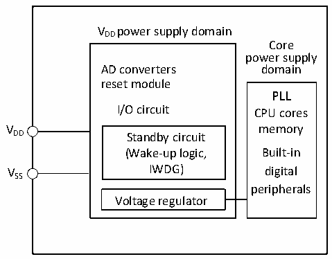
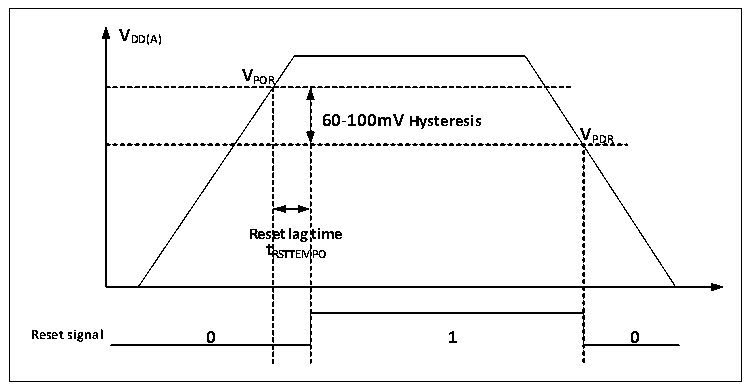

<!-- source-page: 13 -->

[← p.12](0012.md) · [index](../README.md) · [PDF p.13](https://ch32-riscv-ug.github.io/CH32V006/datasheet_zh/CH32V00XRM.PDF#page=13) · [p.14 →](0014.md)

<!-- header: CH32V00X应用手册 https://wch.cn -->

# 第 2 章 电源控制（PWR）

本章模块描述适用于CH32V00X微控制器全系列产品。  

## 2.1 概述

对于CH32V002、CH32V004、CH32V005、CH32V006、CH32V007，系统工作电压VDD 范围为2.0～5.5V，  
内置电压调节器提供内核所需的工作电源，电源结构如图2-1所示。  

图2-1 电源结构框图  
 <!-- rendered from the PDF; verify at https://ch32-riscv-ug.github.io/CH32V006/datasheet_zh/CH32V00XRM.PDF#page=13 -->

🖼 Text parsed from the figure above

VDD power supply domain  
Core  
power supply  
AD converters domain  
reset module  
PLL  
I/O circuit CPU cores  
V memory  
DD Standby circuit  
(Wake-up logic, Built-in  
VSS IWDG) digital  
peripherals  
Voltage regulator  

对于CH32M007：  
VHV：为内部高压调节器供电。  
VCC12V：为内部栅极驱动器以及内部低压调节器供电。  
VDD：为I/O引脚供电。  

## 2.2 电源管理

### 2.2.1 上电复位和掉电复位

系统内部集成了上电复位 POR 和掉电复位 PDR 电路，当芯片供电电压 VDD 低于对应门限电压时，  
系统被相关电路复位，无需外置额外的复位电路。上电门限电压 VPOR 和掉电门限电压 VPDR 的参数请参  
考对应的数据手册。  

图2-2 POR和PDR的工作示意图  
 <!-- rendered from the PDF; verify at https://ch32-riscv-ug.github.io/CH32V006/datasheet_zh/CH32V00XRM.PDF#page=13 -->

🖼 Text parsed from the figure above

<strong>VDD(A)</strong>  
<strong>VPOR</strong>  
60-100mV Hysteresis  Rese t R  et lag RSTTEM  time MPO  V  
<strong>VPDR</strong>  
<strong>tRSTTEMPO</strong>  
<strong>Reset signal 0 1 0</strong>  

### 2.2.2 可编程电压监测器

<!-- image: p13-draw-image-00001 bbox=[507.6, 786.0, 527.52, 797.04] -->
<!-- footer: V1.5 2 -->
