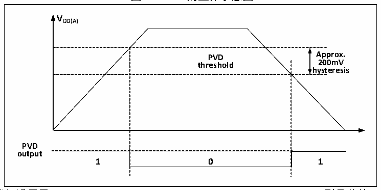

<!-- source-page: 14 -->

[← p.13](0013.md) · [index](../README.md) · [PDF p.14](https://ch32-riscv-ug.github.io/CH32V006/datasheet_zh/CH32V00XRM.PDF#page=14) · [p.15 →](0015.md)

<!-- header: CH32V00X应用手册 https://wch.cn -->
可编程电压监测器 PVD，主要被用于监控系统主电源的变化，与电源控制寄存器 PWR_CTLR 的  
PLS[1:0]所设置的门槛电压相比较，配合外部中断寄存器（EXTI）设置，可产生相关中断，以便及时  
通知系统进行数据保存等掉电前操作。  
具体配置如下：  
1） 设置PWR_CTLR寄存器的PLS[1:0]域，选择要监控电压阈值。  
2） 可选的中断处理。PVD 功能内部连接 EXTI 模块的第 8 线的上升/下降边沿触发设置，开启此中断  
（配置EXTI），当VDD 下降到PVD阈值以下或上升到PVD阈值之上时就会产生PVD中断。  
3） 设置PWR_CTLR寄存器的PVDE位来开启PVD功能。  
4） 读取 PWR_CSR 状态寄存器的 PVD0 位可获取当前系统主电源与 PLS[1:0]设置阈值关系，执行相应  
软处理。当VDD电压高于PLS[1:0]设置阈值，PVD0位置0；当VDD电压低于PLS[1:0]设置阈值，  
PVD0位置1。  

图2-3 PVD的工作示意图  
 <!-- rendered from the PDF; verify at https://ch32-riscv-ug.github.io/CH32V006/datasheet_zh/CH32V00XRM.PDF#page=14 -->

🖼 Text parsed from the figure above

<strong>VDD(A)</strong>  
PVD threshold  0  
<strong>hysteresis</strong>  
<strong>PVD</strong>  
<strong>output</strong>  

注：此功能仅适用于CH32V002、CH32V005、CH32V006、CH32V007、CH32M007型号芯片。  

## 2.3 低功耗模式

在系统复位后，微控制器处于正常工作状态（运行模式），此时可以通过降低系统主频或者关闭  
不用外设时钟或者降低工作外设时钟来节省系统功耗。如果系统不需要工作，可设置系统进入低功耗  
模式，并通过特定事件让系统跳出此状态。  
微控制器目前提供了2种低功耗模式，从处理器、外设、电压调节器等的工作差异上分为：  
● 睡眠模式：内核停止运行，所有外设（包含内核私有外设）仍在运行。  
● 待机模式：停止所有时钟，唤醒后，时钟切换到HSI。  

<!-- p14-table-002 (table-2-1@1) -->
<table><caption>表2-1 低功耗模式一览</caption><tr><th>模式</th><th>进入</th><th>唤醒源</th><th>对时钟的影响</th><th>电压调节器</th></tr><tr><td rowspan="2">睡眠</td><td>WFI</td><td>任意中断唤醒</td><td rowspan="2" style="text-align:left">内核时钟关闭， 其他时钟无影响</td><td rowspan="2">正常</td></tr><tr><td>WFE</td><td>唤醒事件唤醒</td></tr><tr><td>待机</td><td style="text-align:left">SLEEPDEEP置1PDDS置1WFI或WFE</td><td style="text-align:left">任意中断/事件（EXTI信号）、 AWU 事件、PVD 的输出、NRST引脚复位、IWDG复位。 注：任意事件可以唤醒系统， 但唤醒后系统不复位。</td><td style="text-align:left">关闭HSE、HSI、 PLL和外设时钟</td><td>低功耗模式</td></tr></table>

注：SLEEPDEEP位属于内核私有外设控制位，CH32V00X系列产品参考PFIC_SCTLR寄存器。  

### 2.3.1 低功耗配置选项

● WFI和WFE方式  
WFI：微控制器被具有中断控制器响应的中断源唤醒，系统唤醒后，将最先执行中断服务函数（微  
<!-- image: p14-draw-image-00001 bbox=[507.6, 786.0, 527.52, 797.04] -->
<!-- footer: V1.5 3 -->
