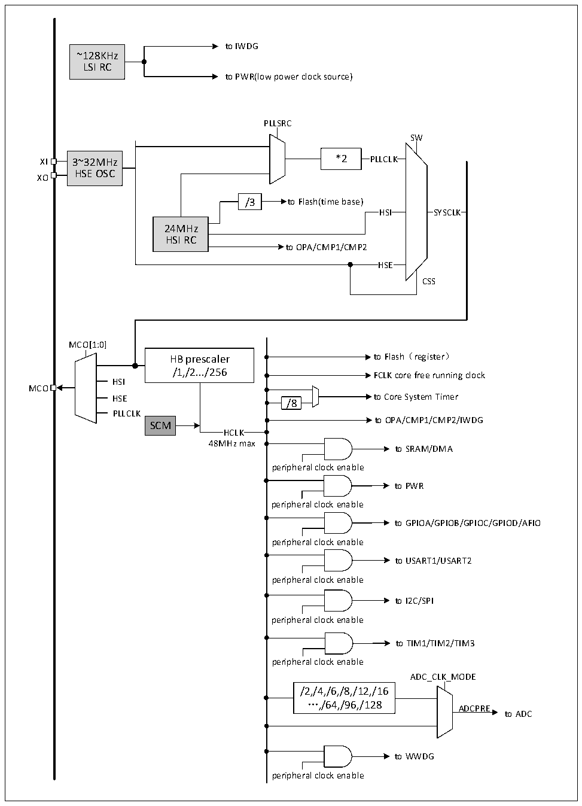

<!-- source-page: 23 -->

[← p.22](0022.md) · [index](../README.md) · [PDF p.23](https://ch32-riscv-ug.github.io/CH32V006/datasheet_zh/CH32V00XRM.PDF#page=23) · [p.24 →](0024.md)

<!-- header: CH32V00X应用手册 https://wch.cn -->

图3-4 CH32V007、CH32M007时钟树框图  
 <!-- rendered from the PDF; verify at https://ch32-riscv-ug.github.io/CH32V006/datasheet_zh/CH32V00XRM.PDF#page=23 -->

🖼 Text parsed from the figure above

to IWDG  
~128KHz  
LSI RC  
to PWR(low power clock source)  
PLLSRC  
SW  
XI 3~32MHz *2 PLLCLK  
HSE OSC  
XO  
/3 to Flash(time base)  
HSI SYSCLK  
24MHz  
HSI RC  
to OPA/CMP1/CMP2  
HSE  HSE  
CSS  
MCO[1:0]  
HB prescaler to Flash（register）  
/1,/2.../256  
FCLK core free running clock  
HSI  
MCO  
HSE to Core System Timer  
/8  
PLLCLK  
to OPA/CMP1/CMP2/IWDG  
SCM  
HCLK  
48MHz max  
to SRAM/DMA  
peripheral clock enable  
to PWR  
peripheral clock enable  
to GPIOA/GPIOB/GPIOC/GPIOD/AFIO  
peripheral clock enable  
to USART1/USART2  
peripheral clock enable  
to I2C/SPI  
peripheral clock enable  
to TIM1/TIM2/TIM3  
peripheral clock enable  
ADC_CLK_MODE  
/2,/4,/6,/8,/12,/16  
…,/64,/96,/128  
ADCPRE  
to ADC  
to WWDG  
peripheral clock enable  

<!-- image: p23-draw-image-00001 bbox=[507.6, 786.0, 527.52, 797.04] -->
<!-- footer: V1.5 12 -->
