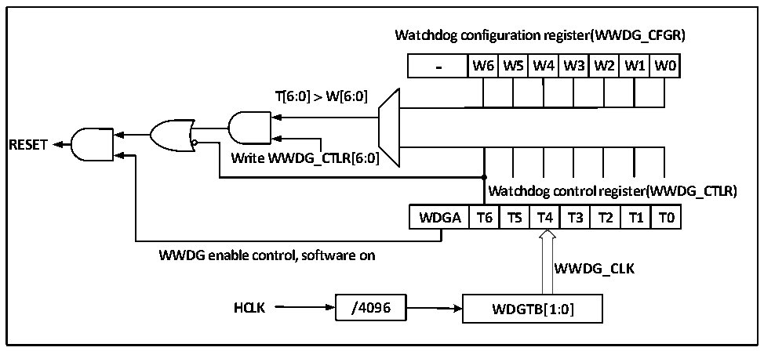

<!-- source-page: 39 -->

[← p.38](0038.md) · [index](../README.md) · [PDF p.39](https://ch32-riscv-ug.github.io/CH32V006/datasheet_zh/CH32V00XRM.PDF#page=39) · [p.40 →](0040.md)

<!-- header: CH32V00X应用手册 https://wch.cn -->

# 第 5 章 窗口看门狗（WWDG）

本章模块描述适用于CH32V00X微控制器全系列产品。  
窗口看门狗一般用来监测系统运行的软件故障，例如外部干扰、不可预见的逻辑错误等情况。它  
需要在一个特定的窗口时间（有上下限）内进行计数器刷新（喂狗），否则早于或者晚于这个窗口时  
间看门狗电路都会产生系统复位。  

## 5.1 主要特征

● 可编程的7位自减型计数器  
● 双条件复位：当前计数器值小于0x40，或者计数器值在窗口时间外被重装载  
● 唤醒提前通知功能（EWI），用于及时喂狗动作防止系统复位  

## 5.2 功能说明

### 5.2.1 原理和用法

窗口看门狗运行基于一个 7 位的递减计数器，其挂载在 HB 总线下，计数时基 WWDG_CLK 来源  
（HCLK/4096）时钟的分频，分频系数在配置寄存器WWDG_CFGR中的WDGTB[1:0]域设置。递减计数器  
处于自由运行状态，无论看门狗功能是否开启，计数器一直循环递减计数。如图5-1所示，窗口看门  
狗内部结构框图。  

图5-1 窗口看门狗结构框图  
 <!-- rendered from the PDF; verify at https://ch32-riscv-ug.github.io/CH32V006/datasheet_zh/CH32V00XRM.PDF#page=39 -->

🖼 Text parsed from the figure above

<strong>Watchdog configuration register(WWDG_CFGR)</strong>  
-  W6  W5  W4  W3  W2  W1  W0  
<strong>T[6:0] ＞ W[6:0]</strong>  
<strong>RESET</strong>  
<strong>Write WWDG_CTLR[6:0]</strong>  
<strong>Watchdog control register(WWDG_CTLR)</strong>  
WDGA  T6  T5  T4  T3  T2  T1  T0  
<strong>WWDG enable control, software on</strong>  
<strong>WWDG_CLK</strong>  
<strong>HCLK / 4 096 WDGTB[1:0]</strong>  

● 启动窗口看门狗  
系统复位后，看门狗处于关闭状态，设置 WWDG_CTLR 寄存器的 WDGA 位能够开启看门狗，随后它  
不能再被关闭，除非发生复位。  
注：可以通过设置RCC_PB1PCENR寄存器关闭WWDG的时钟来源，暂停WWDG_CLK计数，间接停止看门  
狗功能，或者通过设置RCC_PB1PRSTR寄存器复位WWDG模块，等效为复位的作用。  
● 看门狗配置  
看门狗内部是一个不断循环递减运行的7位计数器，支持读写访问。使用看门狗复位功能，需要  
执行下面几点操作：  
1） 计数时基：通过 WWDG_CFGR 寄存器的 WDGTB[1:0]位域，注意要开启 RCC 单元的 WWDG 模块时钟。  
<!-- image: p39-draw-image-00001 bbox=[507.6, 786.0, 527.52, 797.04] -->
<!-- footer: V1.5 28 -->
