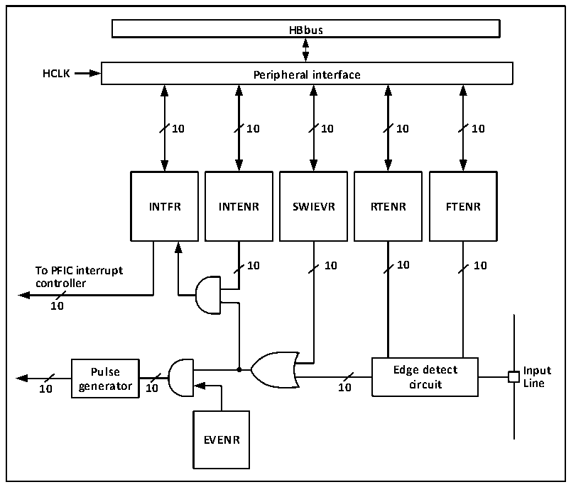

<!-- source-page: 44 -->

[← p.43](0043.md) · [index](../README.md) · [PDF p.44](https://ch32-riscv-ug.github.io/CH32V006/datasheet_zh/CH32V00XRM.PDF#page=44) · [p.45 →](0045.md)

<!-- header: CH32V00X应用手册 https://wch.cn -->

> ⬆ **Table continued** — rendered in full at [page 43](0043.md). <!-- p44-table-001 -->

## 6.4 外部中断和事件控制器（EXTI）

### 6.4.1 概述

图6-1 外部中断（EXTI）接口框图  
 <!-- rendered from the PDF; verify at https://ch32-riscv-ug.github.io/CH32V006/datasheet_zh/CH32V00XRM.PDF#page=44 -->

🖼 Text parsed from the figure above

<strong>HBbus</strong>  
<strong>HCLK Peripheral interface</strong>  
<strong>10 10 10 10 10</strong>  
<strong>INTFR INTENR SWIEVR RTENR FTENR</strong>  
<strong>10 10 10 10</strong>  
<strong>To PFIC interrupt</strong>  
<strong>controller</strong>  
<strong>10</strong>  
<strong>Pulse Edge detect Input</strong>  
<strong>10 generator 10 10 circuit Line</strong>  
<strong>EVENR</strong>  

由图6-1可以看出，外部中断的触发源既可以是软件中断（SWIEVR）也可以是实际的外部中断通  
道，外部中断通道的信号会先经过边沿检测电路（edge detect circuit）的筛选。只要产生软件中  
断或外部中断信号其一，就会通过图中的或门电路输出给事件使能和中断使能两个与门电路，只要有  
中断被使能或事件被使能，就会产生中断或事件。EXTI的六个寄存器由处理器通过HB接口访问。  
<!-- image: p44-draw-image-00001 bbox=[507.6, 786.0, 527.52, 797.04] -->
<!-- footer: V1.5 33 -->
