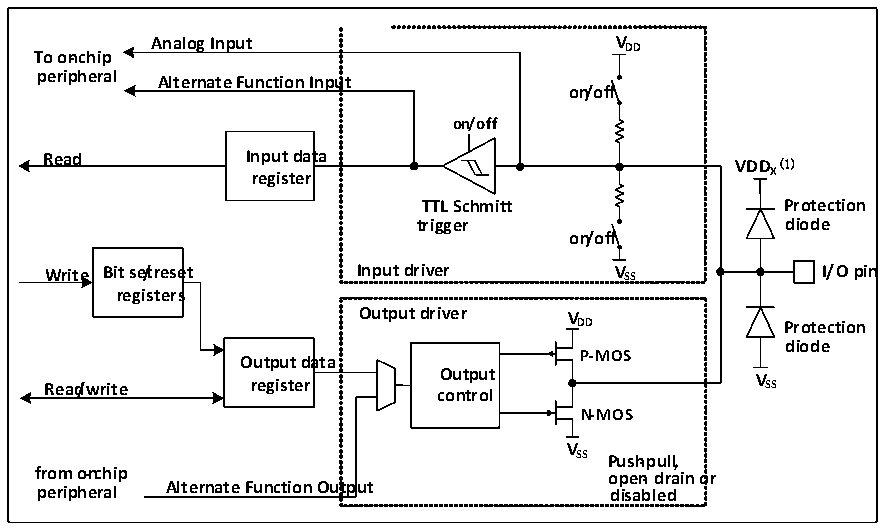

<!-- source-page: 61 -->

[← p.60](0060.md) · [index](../README.md) · [PDF p.61](https://ch32-riscv-ug.github.io/CH32V006/datasheet_zh/CH32V00XRM.PDF#page=61) · [p.62 →](0062.md)

<!-- header: CH32V00X应用手册 https://wch.cn -->

# 第 7 章 GPIO 及其复用功能（GPIO/AFIO）

本章模块描述适用于CH32V00X微控制器全系列产品。  
GPIO口可以配置成多种输入或输出模式，内置可关闭的上拉或下拉电阻，可以配置成推挽或开漏  
功能。GPIO口还可以复用成其他功能。  

## 7.1 主要特征

端口的每个引脚可以配置成以下的多种模式之一：  
● 浮空输入 ● 开漏输出  
● 上拉输入 ● 推挽输出  
● 下拉输入 ● 复用功能的输入和输出  
● 模拟输入  
许多引脚拥有复用功能，很多其他的外设把自己的输出和输入通道映射到这些引脚上，这些复用  
引脚具体用法需要参照各个外设，而对这些引脚是否复用和是否重映射的内容由本章说明。  

## 7.2 功能描述

### 7.2.1 概述

图7-1 GPIO模块基本结构框图  
 <!-- rendered from the PDF; verify at https://ch32-riscv-ug.github.io/CH32V006/datasheet_zh/CH32V00XRM.PDF#page=61 -->

🖼 Text parsed from the figure above

<strong>Analog Input VDD</strong>  
<strong>To on-chip</strong>  
<strong>peripheral Alternate Function Input</strong>  
<strong>on/off</strong>  
<strong>on/off</strong>  
<strong>Read Input data VDD (1)</strong>  
<strong>register X</strong>  
<strong>TTL Schmitt Protection</strong>  
<strong>trigger diode</strong>  
<strong>on/off</strong>  
<strong>Write Bit se/treset Input driver V SS I/O pin</strong>  
<strong>registers</strong>  
<strong>Output driver V</strong>  
<strong>DD Protection</strong>  
<strong>diode</strong>  
<strong>Output data P-MOS</strong>  
<strong>Read/write register c O o u n t t p r u ol t V SS</strong>  
<strong>N-MOS</strong>  
<strong>V</strong>  
<strong>SS Push-pull,</strong>  
<strong>from o-nchip open- drain or</strong>  
<strong>peripheral Alternate Function Output disabled</strong>  

注：当GPIO为普通IO时，VDDx为VDD，当GPIO为FTIO时，VDDx为VDD_FT。  
如图7-1所示IO口结构，每个引脚在芯片内部都有两只保护二极管，IO口内部可分为输入和输  
出驱动模块。其中输入驱动有弱上下拉电阻可选，可连接到 AD 等模拟输入的外设；如果输入到数字  
外设，就需要经过一个 TTL 施密特触发器，再连接到 GPIO 输入寄存器或其他复用外设。而输出驱动  
有一对 MOS 管，可通过配置上下的 MOS管是否使能来将 IO 口配置成开漏或推挽输出；输出驱动内部  
也可以配置成由GPIO控制输出还是由复用的其他外设控制输出。  

### 7.2.2 GPIO 的初始化功能

刚复位后，GPIO口运行在初始状态，这时大多数IO口都是运行在浮空输入状态，但也有HSE等  
<!-- image: p61-draw-image-00001 bbox=[507.6, 786.0, 527.52, 797.04] -->
<!-- footer: V1.5 50 -->
