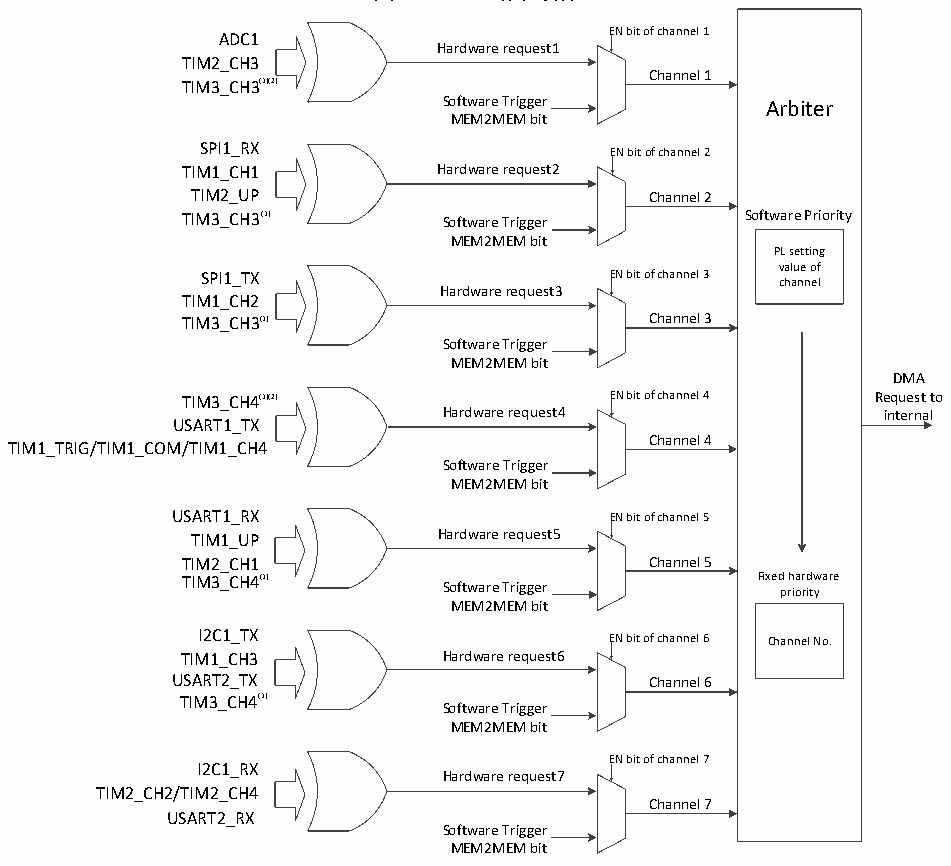

<!-- source-page: 79 -->

[← p.78](0078.md) · [index](../README.md) · [PDF p.79](https://ch32-riscv-ug.github.io/CH32V006/datasheet_zh/CH32V00XRM.PDF#page=79) · [p.80 →](0080.md)

<!-- header: CH32V00X应用手册 https://wch.cn -->

图8-1 DMA1请求映像  
 <!-- rendered from the PDF; verify at https://ch32-riscv-ug.github.io/CH32V006/datasheet_zh/CH32V00XRM.PDF#page=79 -->

🖼 Text parsed from the figure above

<!-- image: p79-draw-image-00016 inside the figure -->
EN bit of channel 1  
ADC1  
<!-- image: p79-draw-image-00002 inside the figure -->
Hardware request1  
<!-- image: p79-draw-image-00009 inside the figure -->
TIM2_CH3  
Channel 1  
TIM3_CH3(1)(2)  
Software Trigger Arbiter  
MEM2MEM bit  
SPI1_RX  
EN bit of channel 2  
<!-- image: p79-draw-image-00003 inside the figure -->
TIM1_CH1 Hardware request2  
<!-- image: p79-draw-image-00010 inside the figure -->
TIM2_UP Channel 2  
TIM3_CH3(1) Software Trigger Software Priority  
MEM2MEM bit  
PL setting  
value of  
SPI1_TX EN bit of channel 3  
channel  
<!-- image: p79-draw-image-00004 inside the figure -->
Hardware request3  
<!-- image: p79-draw-image-00011 inside the figure -->
TIM1_CH2  
TIM3_CH3(1) Channel 3  
Software Trigger  
MEM2MEM bit  
DMA  
TIM3_CH4(1)(2) EN bit of channel 4 Request to  
<!-- image: p79-draw-image-00005 inside the figure -->
Hardware request4 internal  
<!-- image: p79-draw-image-00012 inside the figure -->
USART1_TX  
Channel 4  
TIM1_TRIG/TIM1_COM/TIM1_CH4  
Software Trigger  
MEM2MEM bit  
USART1_RX EN bit of channel 5  
<!-- image: p79-draw-image-00006 inside the figure -->
TIM1_UP Hardware request5  
<!-- image: p79-draw-image-00013 inside the figure -->
TIM2_CH1 Channel 5  
TIM3_CH4(1) Fixed hardware  
Software Trigger priority  
MEM2MEM bit  
I2C1_TX EN bit of channel 6 Channel No.  
<!-- image: p79-draw-image-00007 inside the figure -->
TIM1_CH3 Hardware request6  
<!-- image: p79-draw-image-00014 inside the figure -->
USART2_TX Channel 6  
TIM3_CH4(1)  
Software Trigger  
MEM2MEM bit  
EN bit of channel 7  
I2C1_RX  
<!-- image: p79-draw-image-00008 inside the figure -->
Hardware request7  
<!-- image: p79-draw-image-00015 inside the figure -->
TIM2_CH2/TIM2_CH4  
Channel 7  
USART2_RX  
Software Trigger  
MEM2MEM bit  

<!-- p79-table-001 (table-8-2@1) -->
<table><caption>表8-2 DMA1各通道外设映射表</caption><tr><th>外设</th><th>通道1</th><th>通道2</th><th>通道3</th><th>通道4</th><th>通道5</th><th>通道6</th><th>通道7</th></tr><tr><td>ADC</td><td>ADC</td><td></td><td></td><td></td><td></td><td></td><td></td></tr><tr><td>SPI1</td><td></td><td>SPI1_RX</td><td>SPI1_TX</td><td></td><td></td><td></td><td></td></tr><tr><td>USART1</td><td></td><td></td><td></td><td>USART1_TX</td><td>USART1_RX</td><td></td><td></td></tr><tr><td>USART2</td><td></td><td></td><td></td><td></td><td></td><td>USART2_TX</td><td>USART2_RX</td></tr><tr><td>I2C1</td><td></td><td></td><td></td><td></td><td></td><td>I2C1_TX</td><td>I2C1_RX</td></tr><tr><td>TIM1</td><td></td><td>TIM1_CH1</td><td>TIM1_CH2</td><td style="text-align:left">TIM1_CH4TIM1_TRIGTIM1_COM</td><td>TIM1_UP</td><td>TIM1_CH3</td><td></td></tr><tr><td>TIM2</td><td>TIM2_CH3</td><td>TIM2_UP</td><td></td><td></td><td>TIM2_CH1</td><td></td><td style="text-align:left">TIM2_CH2TIM2_CH4</td></tr><tr><td>TIM3</td><td>TIM3_CH3（1）（2）</td><td>TIM3_CH3（1）</td><td>TIM3_CH3（1）</td><td>TIM3_CH4（1）（2）</td><td>TIM3_CH4（1）</td><td>TIM3_CH4（1）</td><td></td></tr></table>

注：  
（1）CH32M007的TIM3产生一次CH3事件，可以触发DMA1的1、2、3通道；TIM3产生一次CH4事  
件，可以触发DMA1的4、5、6通道。  
（2）CH32V006、CH32V007的TIM3产生一次CH3事件，仅可以触发DMA1的通道1；TIM3产生一次  
<!-- image: p79-draw-image-00001 bbox=[507.6, 786.0, 527.52, 797.04] -->
<!-- footer: V1.5 68 -->
