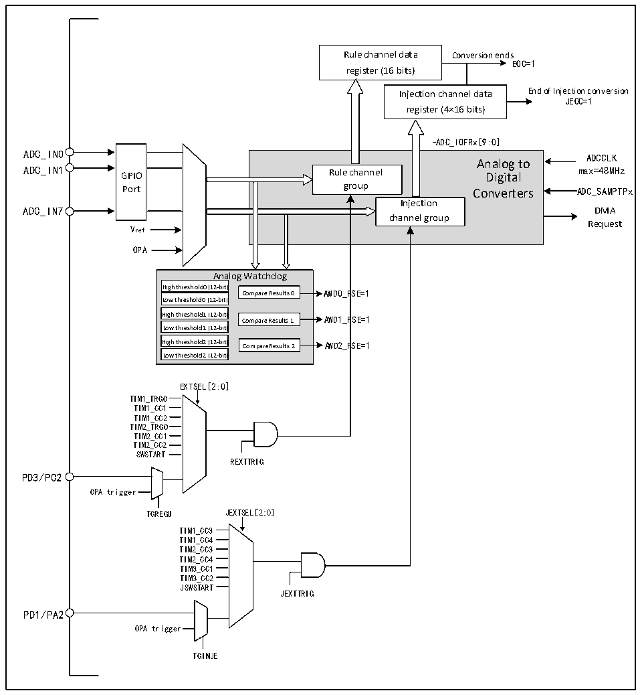

<!-- source-page: 85 -->

[← p.84](0084.md) · [index](../README.md) · [PDF p.85](https://ch32-riscv-ug.github.io/CH32V006/datasheet_zh/CH32V00XRM.PDF#page=85) · [p.86 →](0086.md)

<!-- header: CH32V00X应用手册 https://wch.cn -->

## 9.2 功能描述

### 9.2.1 模块结构

图9-1 ADC模块框图  
 <!-- rendered from the PDF; verify at https://ch32-riscv-ug.github.io/CH32V006/datasheet_zh/CH32V00XRM.PDF#page=85 -->

🖼 Text parsed from the figure above

Rule channel data Conversion ends  
EOC=1  
register (16 bits)  
Injection channel data End of Injection conversion  
JEOC=1  
register (4×16 bits)  
-ADC_IOFRx[:9:0]  
ADC_IN0  
GPIOPort  
Analog to Rule channel Digital group Converters Injection channel group  
ADCCLK  
ADC_IN7 DMA  
Request  
Vref  
OPA  
Analog Watchdog  
Ana High threshold0 (12-bit)  Low threshold0 (12-bit)  High threshold1 (12-bit)  Low threshold1 (12-bit)  High threshold2 (12-bit)  Low threshold2 (12-bit)  
Compare Results 0 AWD0_RSE=1  
High threshold1 (12-bit) Compare Results 1 AWD1_RSE=1  
High threshold2 (12-bit) Compare Results 2 AWD2_RSE=1  
EXTSEL[2:0]  
TIM1_TRGO  
TIM1_CC1  
TIM1_CC2  
TIM2_TRGO  
TIM2_CC1  
TIM2_CC2  
SWSTART  
REXTTRIG  
PD3/PC2  
OPA trigger  
TGREGU JEXTSEL[2:0]  
TIM1_CC3  
TIM1_CC4  
TIM2_CC3  
TIM2_CC4  
TIM3_CC1  
TIM3_CC2  
JSWSTART  
JEXTTRIG  
PD1/PA2  
OPA trigger  
TGINJE  

### 9.2.2 ADC 配置

1）模块上电  
ADC_CTLR2寄存器的ADON位为1表示ADC模块上电。当ADC模块从断电模式（ADON=0）下进入  
上电状态（ADON=1）后，需要延迟一段时间tSTAB 用于模块稳定时间。之后再次写入ADON位为1，用  
于作为软件启动ADC转换的启动信号。通过清除ADON位为0，可以终止当前转换并将ADC模块置于  
断电模式，这个状态下，ADC几乎不耗电。  
2）采样时钟  
模块的寄存器操作基于HBCLK（HB总线）时钟，其转换单元的时钟基准ADCCLK，由RCC_CFGR0寄  
存器的ADCPRE域配置分频。  
<!-- image: p85-draw-image-00001 bbox=[507.6, 786.0, 527.52, 797.04] -->
<!-- footer: V1.5 74 -->
