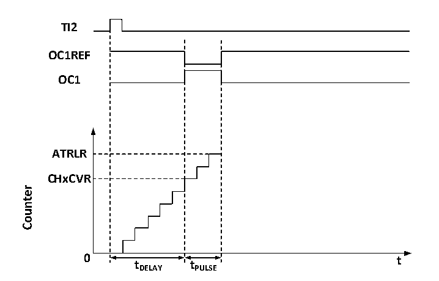

<!-- source-page: 112 -->

[← p.111](0111.md) · [index](../README.md) · [PDF p.112](https://ch32-riscv-ug.github.io/CH32V006/datasheet_zh/CH32V00XRM.PDF#page=112) · [p.113 →](0113.md)

<!-- header: CH32V00X应用手册 https://wch.cn -->

图11-5 单脉冲的产生  
 <!-- rendered from the PDF; verify at https://ch32-riscv-ug.github.io/CH32V006/datasheet_zh/CH32V00XRM.PDF#page=112 -->

🖼 Text parsed from the figure above

<strong>TI2</strong>  
<strong>OC1REF</strong>  
<strong>OC1</strong>  
<strong>ATRLR</strong>  
<strong>CHxCVR</strong>  
<!-- image: p112-draw-image-00002 inside the figure -->
<strong>0 t</strong>  
<strong>tDELAY tPULSE</strong>  

1） 设定TI2为触发。置CC2S域为01b，把 TI2FP2映射到 TI2；置 CC2P位为 0b，TI2FP2设为上升  
沿检测；置TS域为110b，TI2FP2设为触发源；置SMS域为110b，TI2FP2被用来启动计数器；  
2） Tdelay 由比较捕获寄存器的值确定，Tpulse 由自动重装值寄存器的值和比较捕获寄存器的值确  
定。  

### 11.3.9 编码器模式

编码器模式是定时器的一个典型应用，可以用来接入编码器的双相输出，核心计数器的计数方向  
和编码器的转轴方向同步，编码器每输出一个脉冲就会使核心计数器加一或减一。使用编码器的步骤  
为：将SMS域置为001b（只在TI2边沿计数）、010b（只在TI1边沿计数）或011b（在TI1和TI2双  
边沿计数），将编码器接到比较捕获通道1、2的输入端，给重装值寄存器设一个值，这个值可以设的  
大一点。在编码器模式时，定时器内部的比较捕获寄存器，预分频器，重复计数寄存器等都正常工作。  
下表表明了计数方向和编码器信号的关系。  

> ⚠ Table extraction recorded 2 issue(s) (overlapping merged cells); verify against [the PDF, p.112](https://ch32-riscv-ug.github.io/CH32V006/datasheet_zh/CH32V00XRM.PDF#page=112).

<!-- p112-table-002 (table-11-1@1) -->
<table><caption>表11-1 定时器编码器模式的计数方向和编码器信号之间的关系</caption><tr><th rowspan="2">计数有效边沿</th><th rowspan="2" colspan="2" style="text-align:left">相对信号的电平</th><th rowspan="2" colspan="2" style="text-align:left">TI1FP1信号边沿 上升沿 下降沿</th><th colspan="2">TI2FP2信号</th></tr><tr><td>的电平</td><td>下降沿</td><td>上升沿</td><td>下降沿</td></tr><tr><td rowspan="2">仅在TI1边沿计数</td><td colspan="2">高</td><td>向下计数</td><td>向上计数</td><td rowspan="2" colspan="2">不计数</td></tr><tr><td colspan="2">低</td><td>向上计数</td><td>向下计数</td></tr><tr><td rowspan="2">仅在TI2边沿计数</td><td colspan="2">高</td><td rowspan="2" colspan="2">不计数</td><td>向上计数</td><td>向下计数</td></tr><tr><td colspan="2">低</td><td>向下计数</td><td>向上计数</td></tr><tr><td rowspan="2">在TI1和TI2双边沿计数</td><td colspan="2">高</td><td>向下计数</td><td>向上计数</td><td>向上计数</td><td>向下计数</td></tr><tr><td colspan="2">低</td><td>向上计数</td><td>向下计数</td><td>向下计数</td><td>向上计数</td></tr></table>

### 11.3.10 定时器同步模式

定时器能够输出时钟脉冲（TRGO），也能接收其他定时器的输入（ITRx）。不同的定时器的ITRx的  
来源（别的定时器的TRGO）是不一样的。定时器内部触发连接如表11-2所示。  

> ⚠ Table extraction recorded 1 issue(s) (overlapping merged cells); verify against [the PDF, pp.112-113](https://ch32-riscv-ug.github.io/CH32V006/datasheet_zh/CH32V00XRM.PDF#page=112).

<!-- p112-table-003 (table-11-2@1) pages 112-113 -->
<table><caption>表11-2 定时器内部触发连接</caption><tr><th rowspan="2">从定时器</th><th rowspan="2" colspan="2" style="text-align:left">ITR0 （TS=000）</th><th rowspan="2" colspan="2" style="text-align:left">ITR1 （TS=001）</th><th rowspan="2" colspan="2" style="text-align:left">ITR2 （TS=010）</th><th rowspan="2" style="text-align:left">ITR3 （TS=011）</th></tr><tr></tr><tr><td>TIM1</td><td colspan="2">-</td><td colspan="2">TIM2</td><td colspan="2">-</td><td>-</td></tr><tr><td>TIM2</td><td>TIM1</td><td colspan="3">-</td><td>-</td><td colspan="2">-</td></tr></table>

<!-- image: p112-draw-image-00001 bbox=[507.6, 786.0, 527.52, 797.04] -->
<!-- footer: V1.5 101 -->
