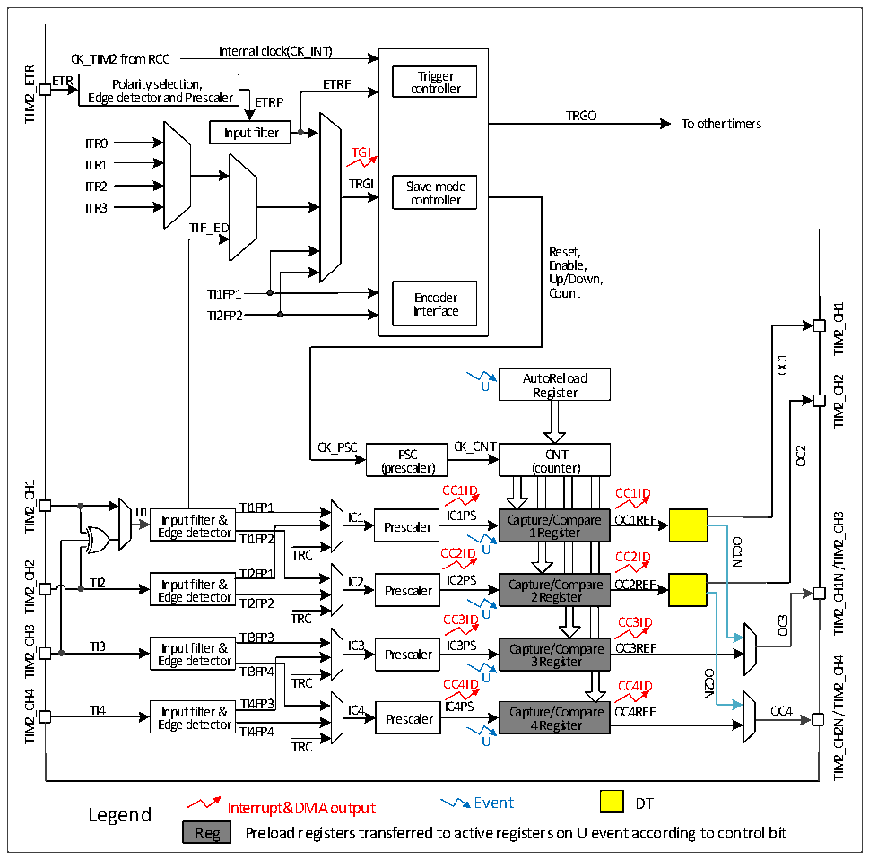

<!-- source-page: 132 -->

[← p.131](0131.md) · [index](../README.md) · [PDF p.132](https://ch32-riscv-ug.github.io/CH32V006/datasheet_zh/CH32V00XRM.PDF#page=132) · [p.133 →](0133.md)

<!-- header: CH32V00X应用手册 https://wch.cn -->

## 12.2 原理和结构

图12-1 通用定时器的结构框图  
 <!-- rendered from the PDF; verify at https://ch32-riscv-ug.github.io/CH32V006/datasheet_zh/CH32V00XRM.PDF#page=132 -->

🖼 Text parsed from the figure above

Internal clock(CK_INT)  
CK_TIM2 from RCC  
TIM2_ETR  
ETR Polarity selection, ETRF co T n ri t g r g o e lle r r  
Edge detector and Prescaler ETRP  
TRGO  
To other timers  
Input filter  
ITR0  
TGI  
ITR1  
ITR2 TRGI Slave mode  
controller  
ITR3  
TIF_ED  
Reset,  
Enable,  
Up/Down,  
TI1FP1 Encoder Count  
TIM2_CH1  
TI2FP2 interface  
OC1  
AutoReload  
TIM2_CH2  
U  
Register  
CK_PSC CK_CNT PSC CNT  
OC2  
(prescaler) (counter)  
ount  ter  er)  
TIM2_CH1  
CC1ID CC1ID  
TI1 Input filter &amp; TTII11FFPP11 IC1 IICC11PPSS Capture/Compare OC1REF  
Input filter &amp; Edge detector  TI1FP1  
/TIM2_CH3  
Edge detector Prescaler 1 Register  
TI1FP2  
OC1N  
TRC CC2ID U CC2ID  
TIM2_CH2  
TI2FP1 TI2 Input filter &amp; IC2 IC2PS Capture/Compare OC2REF  
TIM2_CH1N  
Prescaler  
Edge detector TI2FP2 2 Register  
TRC CC3IDU CC3ID  
OC3  
TIM2_CH3  
TI3FP3  
TI3 Input filter &amp; IC3 Prescaler IC3PS Capture/Compare OC3REF  
TIM2_CH4  
Edge detector 3 Register  
TI3FP4 TRC CC4ID U CC4ID  
OC2N  
TIM2_CH4  
TI4 Input filter &amp; TI4FP3 IC4 IC4PS Capture/Compare OC4REF OC4 Edge detector Prescaler 4 Register  
TIM2_CH2N/  
TI4FP4  
U  
TRC  
Legend Interrupt&amp;DMA output Event DT  
Reg Preload registers transferred to active registers on U event according to control bit  

### 12.2.1 概述

如图 12-1 所示，通用定时器的结构大致可以分为三部分，即输入时钟部分，核心计数器部分和  
比较捕获通道部分。  
通用定时器的时钟可以来自于HB总线时钟（CK_INT），可以来自外部时钟输入引脚（TIM2_ETR），  
可以来自于其他具有时钟输出功能的定时器（ITRx），还可以来自于比较捕获通道的输入端（TIM2_CHx）。  
这些输入的时钟信号经过各种设定的滤波分频等操作后成为 CK_PSC 时钟，输出给核心计数器部分。  
另外，这些复杂的时钟来源还可以作为TRGO输出给其他的定时器和ADC等外设。  
通用定时器的核心是一个16位计数器（CNT）。CK_PSC经过预分频器（PSC）分频后，成为CK_CNT  
再最终输给 CNT，CNT 支持增计数模式、减计数模式和增减计数模式，并有一个自动重装值寄存器  
（ATRLR）在每个计数周期结束后为CNT重装载初始化值。  
通用定时器拥有四组比较捕获通道，每组比较捕获通道都可以从专属的引脚上输入脉冲，也可以  
向引脚输出波形，即比较捕获通道支持输入和输出模式。比较捕获寄存器每个通道的输入都支持滤波、  
分频、边沿检测等操作，并支持通道间的互触发，还能为核心计数器CNT提供时钟。每个比较捕获通  
<!-- image: p132-draw-image-00001 bbox=[507.6, 786.0, 527.52, 797.04] -->
<!-- footer: V1.5 121 -->
