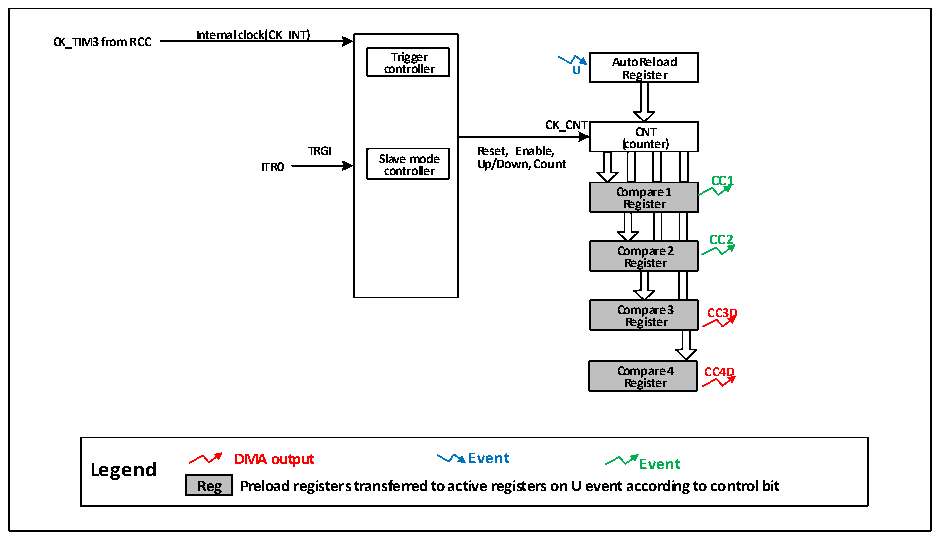

<!-- source-page: 156 -->

[← p.155](0155.md) · [index](../README.md) · [PDF p.156](https://ch32-riscv-ug.github.io/CH32V006/datasheet_zh/CH32V00XRM.PDF#page=156) · [p.157 →](0157.md)

<!-- header: CH32V00X应用手册 https://wch.cn -->

# 第 13 章 精简定时器（SLTM）

本章模块描述只适用于CH32V006、CH32V007和CH32M007产品。  
精简定时器（Streamlined Timer）模块包含一个16位可自动重装的定时器TIM3，用于产生特定  
频率的脉冲（非输出）配合TIM1以及ADC模块等使用。  

## 13.1 主要特征

精简定时器的主要特征包括：  
● 16位自动重装计数器，支持增计数模式，减计数模式和增减计数模式  
● 支持四路独立的比较通道，只支持输出比较。  
● 支持与TIM1的级联同步。  
● 支持使用DMA。  

## 13.2 原理和结构

图13-1精简定时器的结构框图  
 <!-- rendered from the PDF; verify at https://ch32-riscv-ug.github.io/CH32V006/datasheet_zh/CH32V00XRM.PDF#page=156 -->

🖼 Text parsed from the figure above

<strong>Internal clock(CK_INT)</strong>  
<strong>CK_TIM3 from RCC</strong>  
<strong>Trigger AutoReload</strong>  
<strong>controller U Register</strong>  
<strong>CK_CNT</strong>  
<strong>CNT</strong>  
<strong>(counter)</strong>  
<strong>TRGI Reset, Enable,</strong>  
oun  nte  er)  
<strong>ITR0 S c la o v n e t r m ol o le d r e Up/Down, Count</strong>  
<strong>CC1</strong>  
<strong>Compare 1</strong>  
<strong>Register</strong>  
<strong>CC2</strong>  
<strong>Compare 2</strong>  
<strong>Register</strong>  
<strong>Compare 3 CC3D</strong>  
<strong>Register</strong>  
<strong>Compare 4 CC4D</strong>  
<strong>Register</strong>  
<strong>Legend DMA output Event Event</strong>  
<strong>Reg Preload registers transferred to active registers on U event according to control bit</strong>  

### 13.2.1 概述

如图 13-1 所示，精简定时器的结构大致可以分为三部分，即输入时钟部分，核心计数器部分和  
比较通道部分。  
精简定时器的时钟可以来自于HB总线时钟（CK_INT），可以来自于其他具有时钟输出功能的定时  
器（ITR1）。这些输入的时钟信号经过设定的滤波操作后成为 CK_PSC 时钟，输出给核心计数器部分。  
精简定时器的核心是一个 16 位计数器（CNT）。CK_PSC 不分频直接输给 CNT，CNT 支持增计数模  
式、减计数模式和增减计数模式，并有一个自动重装值寄存器（ATRLR）在每个计数周期结束后为CNT  
重装载初始化值。  
精简定时器拥有四组比较通道，每组比较通道都拥有一组比较寄存器（CHxCVR），通道 1 和 2 支  
持与主计数器（CNT）进行比较而输出脉冲，即只支持输出模式；通道3和通道4支持主计数器（CNT）  
进行比较而产生DMA请求。  
<!-- image: p156-draw-image-00001 bbox=[507.6, 786.0, 527.52, 797.04] -->
<!-- footer: V1.5 145 -->
