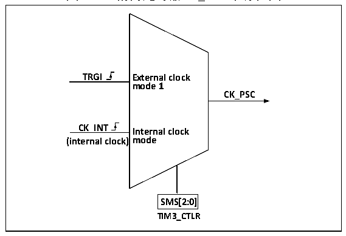

<!-- source-page: 157 -->

[← p.156](0156.md) · [index](../README.md) · [PDF p.157](https://ch32-riscv-ug.github.io/CH32V006/datasheet_zh/CH32V00XRM.PDF#page=157) · [p.158 →](0158.md)

<!-- header: CH32V00X应用手册 https://wch.cn -->

### 13.2.2 时钟输入

本节论述CK_PSC的来源。此处截取精简定时器的整体结构框图的时钟源部分。  

图13-2 精简定时器CK_PSC来源框图  
 <!-- rendered from the PDF; verify at https://ch32-riscv-ug.github.io/CH32V006/datasheet_zh/CH32V00XRM.PDF#page=157 -->

🖼 Text parsed from the figure above

<strong>TRGI External clock</strong>  
<strong>mode 1</strong>  
<strong>CK_PSC</strong>  
<strong>CK_INT Internal clock</strong>  
<strong>(internal clock)mode</strong>  
<strong>SMS[2:0]</strong>  
<strong>TIM3_CTLR</strong>  

可选的输入时钟可以分为2类：  
1) 内部HB时钟输入路线：CK_INT；  
2) 来自内部其他定时器的输入：ITRx。  
通过决定CK_PSC来源的SMS的输入脉冲选择可以将实际的操作分为两类：  
1) 选择内部时钟源（CK_INT）；  
2) 外部时钟源模式1；  
上文提到的2种时钟源来源都可通过这2种操作选定。  

#### 13.2.2.1 内部时钟源（CK_INT）

如果将 SMS 域保持为 000b 时启动精简定时器，那么就是选定内部时钟源（CK_INT）为时钟。此  
时CK_INT就是CK_PSC。  

#### 13.2.2.2 外部时钟源模式 1

如果将 SMS域设置为 111b时，就会启用外部时钟源模式 1。启用外部时钟源1时，TRGI被选定  
为CK_PSC的来源为内部触发ITR1。  

### 13.2.3 计数器和周边

CK_PSC不分频直接为CK_INT。精简定时器无计数时钟预分频功能。  

### 13.2.4 比较通道

比较通道是定时器实现复杂功能的核心，它的核心是比较寄存器，辅以输出的比较器组成。比较  
通道的结构框图如图13-3所示。  
<!-- image: p157-draw-image-00001 bbox=[507.6, 786.0, 527.52, 797.04] -->
<!-- footer: V1.5 146 -->
