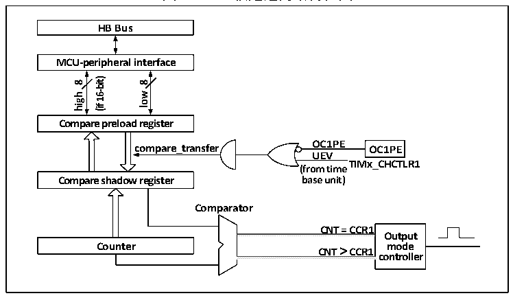

<!-- source-page: 158 -->

[← p.157](0157.md) · [index](../README.md) · [PDF p.158](https://ch32-riscv-ug.github.io/CH32V006/datasheet_zh/CH32V00XRM.PDF#page=158) · [p.159 →](0159.md)

<!-- header: CH32V00X应用手册 https://wch.cn -->

图13-3 比较通道的结构框图  
 <!-- rendered from the PDF; verify at https://ch32-riscv-ug.github.io/CH32V006/datasheet_zh/CH32V00XRM.PDF#page=158 -->

🖼 Text parsed from the figure above

<strong>HB Bus</strong>  
<strong>MCU-peripheral interface</strong>  
<strong>16-bit)</strong>  
<strong>8</strong>  
<strong>8</strong>  
<strong>low</strong>  
<strong>high</strong>  
<strong>(if</strong>  
<strong>Compare preload register</strong>  
<strong>compare_transfer OC1PE OC1PE</strong>  
<strong>UEV</strong>  
<strong>TIMx_CHCTLR1</strong>  
<strong>(from time</strong>  
<strong>base unit)</strong>  
<strong>Compare shadow register</strong>  
<strong>Comparator</strong>  
<strong>CNT = CCR1</strong>  
<strong>Output</strong>  
<!-- image: p158-draw-image-00002 inside the figure -->
<!-- image: p158-draw-image-00003 inside the figure -->
<strong>Counter CNT &gt; CCR1 mode</strong>  
<strong>controller</strong>  
<!-- image: p158-draw-image-00004 inside the figure -->
<!-- image: p158-draw-image-00005 inside the figure -->

比较寄存器由一个预装载寄存器和一个影子寄存器组成，读写过程仅操作预装载寄存器。在比较  
时，预装载寄存器的内容被复制到影子寄存器中，然后影子寄存器的内容与核心计数器（CNT）进行  
比较。  

## 13.3 功能和实现

精简定时器复杂功能的实现都是对定时器的比较通道、时钟输入电路和计数器及周边组件进行操  
作实现的。定时器的时钟输入可以来自于包括内部时钟源和其他定时器的触发输入的两个时钟源。对  
比较寄存通道和时钟源选择的操作直接决定其功能。比较通道是单向的，只工作在输出模式。  

### 13.3.1 比较输出模式

比较输出模式是定时器的基本功能之一。比较输出模式的原理是在核心计数器（CNT）的值与比  
较寄存器的值一致时，通道1，2输出特定的波形。通道3，4在产生比较一致事件时，如果预先设置  
了CCxDE位，则会产生一个DMA请求。  
配置为比较输出模式的步骤为下：  
1） 配置核心计数器（CNT）的时钟源和自动重装值；  
2） 设置好需要对比的计数值到比较寄存器（R16_TIMx_CHxCVR）中；  
3） 保持OCxPE为0，禁用比较获寄存器的预装载寄存器；  
4） 置CEN位启动定时器。  

### 13.3.2 定时器同步模式

定时器只能接收定时器1的输入（ITRx）。定时器内部触发连接如表13-1所示。  

<!-- p158-table-001 (table-13-1@1) -->
<table><caption>表13-1 GTPM内部触发连接</caption><tr><th>从定时器</th><th style="text-align:left">ITR0 （TS=000）</th><th style="text-align:left">ITR1 （TS=001）</th><th style="text-align:left">ITR2 （TS=010）</th><th style="text-align:left">ITR3 （TS=011）</th></tr><tr><td>TIM3</td><td>TIM1</td><td>-</td><td>-</td><td>-</td></tr></table>

### 13.3.3 调试模式

当系统进入调试模式时，根据DBG模块的设置可以控制定时器继续运转或者停止。  
<!-- image: p158-draw-image-00001 bbox=[507.6, 786.0, 527.52, 797.04] -->
<!-- footer: V1.5 147 -->
