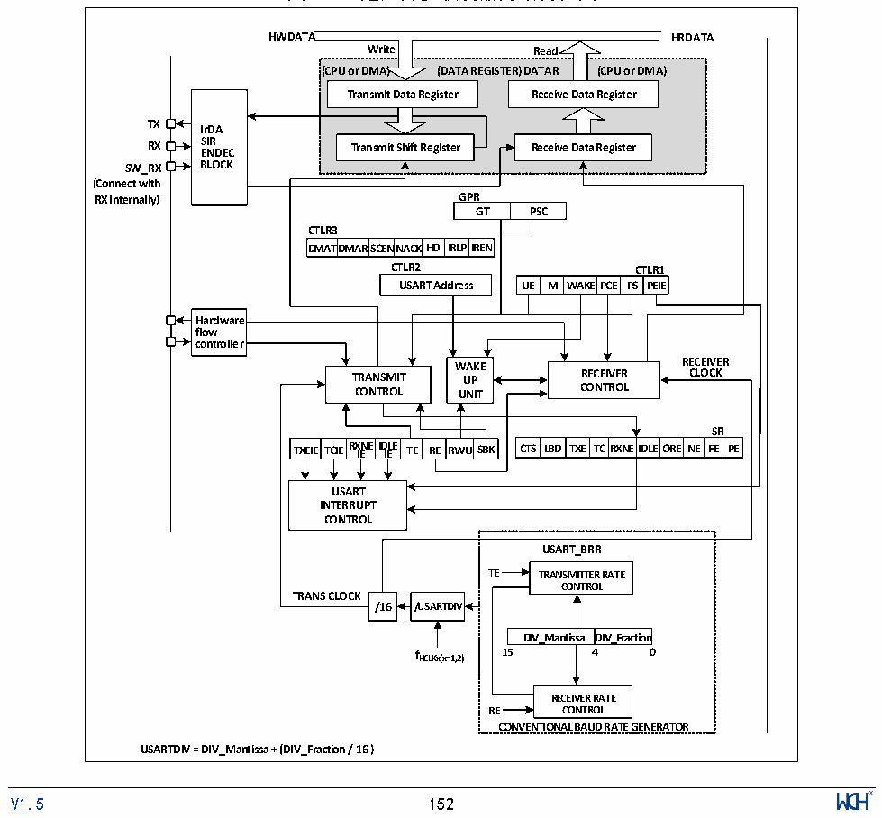

<!-- source-page: 163 -->

[← p.162](0162.md) · [index](../README.md) · [PDF p.163](https://ch32-riscv-ug.github.io/CH32V006/datasheet_zh/CH32V00XRM.PDF#page=163) · [p.164 →](0164.md)

<!-- header: CH32V00X应用手册 https://wch.cn -->

# 第 14 章 通用异步收发器（USART）

本章 USART1 模块描述适用于 CH32V00X 全系列产品；本章 USART2 模块描述只适用于 CH32V005、  
CH32V006、CH32V007和CH32M007产品。  
该模块包含2个通用异步收发器USART1和USART2。  

## 14.1 主要特征

● 全双工或半双工的异步通信  
● NRZ数据格式  
● 分数波特率发生器，最高3Mbps  
● 可编程数据长度  
● 可配置的停止位  
● 支持LIN，IrDA编码器  
● 支持DMA  
● 多种中断源  

## 14.2 概述

图14-1 通用异步收发器的结构框图  
 <!-- rendered from the PDF; verify at https://ch32-riscv-ug.github.io/CH32V006/datasheet_zh/CH32V00XRM.PDF#page=163 -->

🖼 Text parsed from the figure above

<strong>HWDATA HRDATA</strong>  
<strong>Write Read</strong>  
<strong>(CPU or DMA) (DATA REGISTER) DATAR (CPU or DMA)</strong>  
<strong>Transmit Data Register Receive Data Register</strong>  
<!-- image: p163-draw-image-00002 inside the figure -->
<strong>TX IrDA</strong>  
<strong>RX S E I N R DEC Transmit Shift Register Receive Data Register</strong>  
<strong>SW_RX BLOCK</strong>  
<strong>(Connect with</strong>  
<strong>RX Internally) GPR</strong>  
GPRGT  PSC  
<strong>CTLR3</strong>  
DMAT  TDMAR  SCENNA  ACKHD  IRLP  
<strong>DMATDMARSCENNACKHD IRLPIREN</strong>  
<strong>CTLR2 CTLR1</strong>  
WAKE  EPCE  PSCTPLRE  ERI1E  
Hardware flow controller  
<strong>WWAAKKEE RECEIVER</strong>  
<strong>TRANSMIT UUPP RECEIVER CLOCK</strong>  
<strong>CONTROL UUNNIITT CONTROL</strong>  
TXEIE  TCIE  RXNEIDLE IE IE  TE RE  RWU  
<strong>SR</strong>  
CTS LBD  TXE  TC  RXNE  EIDLE  EORE  NE  SRFE  RPE  
<strong>USART</strong>  
<strong>INTERRUPT</strong>  
<strong>CONTROL</strong>  
<strong>USART_BRR</strong>  
<strong>TE TRANSMITTER RATE</strong>  
<strong>CONTROL</strong>  
<strong>TRANS CLOCK</strong>  
<strong>/16 /USARTDIV</strong>  
DIV_Mantissa  DIV_Fraction  
<strong>fHCLKx(x=1,2) 15 4 0</strong>  
<strong>RECEIVER RATE</strong>  
<strong>RE CONTROL</strong>  
<strong>CONVENTIONAL BAUD RATE GENERATOR</strong>  
<strong>USARTDIV = DIV_Mantissa + (DIV_Fraction / 16 )</strong>  
<!-- image: p163-draw-image-00001 inside the figure -->
<!-- footer: V1.5 152 -->

