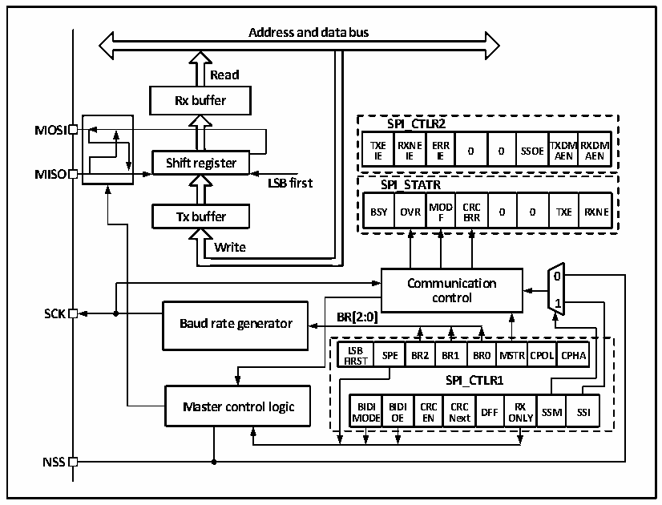

<!-- source-page: 186 -->

[← p.185](0185.md) · [index](../README.md) · [PDF p.186](https://ch32-riscv-ug.github.io/CH32V006/datasheet_zh/CH32V00XRM.PDF#page=186) · [p.187 →](0187.md)

<!-- header: CH32V00X应用手册 https://wch.cn -->

# 第 16 章 串行外设接口（SPI）

本章模块描述只适用于CH32V002、CH32V004、CH32V005、CH32V006、CH32V007和CH32M007产品。  
SPI支持以三线同步串行模式进行数据交互，加上片选线支持硬件切换主从模式，支持以单根数  
据线通讯。  

## 16.1 主要特征

### 16.1.1 SPI 特征

● 支持全双工同步串行模式  
● 支持单线半双工模式  
● 支持主模式和从模式，多主模式  
● 支持8位或16位数据结构  
● 最高时钟频率支持到FHCLK 的一半  
● 数据顺序支持MSB或LSB在前  
● 支持硬件或软件控制NSS引脚  
● 收发支持硬件CRC校验  
● 收发缓冲器支持DMA传输  
● 支持修改时钟相位和极性  

## 16.2 SPI 功能描述

### 16.2.1 概述

图16-1 SPI结构框图  
 <!-- rendered from the PDF; verify at https://ch32-riscv-ug.github.io/CH32V006/datasheet_zh/CH32V00XRM.PDF#page=186 -->

🖼 Text parsed from the figure above

<strong>Address and data bus</strong>  
<strong>Read</strong>  
<strong>Rx buffer</strong>  
<strong>SPI_CTLR2</strong>  
<strong>MOSI</strong>  
<strong>TXE RXNE ERR TXDMRXDM</strong>  
<strong>0 0 SSOE</strong>  
<strong>IE IE IE AEN AEN</strong>  
<strong>Shift register</strong>  
<strong>MISO</strong>  
<strong>LSB first SPI_STATR</strong>  
<strong>MOD CRC</strong>  
<strong>Tx buffer BSY OVR F ERR 0 0 TXE RXNE</strong>  
<strong>Write</strong>  
<!-- image: p186-draw-image-00002 inside the figure -->
<!-- image: p186-draw-image-00003 inside the figure -->
<strong>0</strong>  
<strong>Communication</strong>  
<strong>control</strong>  
<strong>1</strong>  
<strong>SCK BR[2:0]</strong>  
<strong>Baud rate generator</strong>  
BR[2:0]  LSBFIRST  SPE  BR2  BR1  BR0  MSTR  RCPOL  CPHA  
<strong>SPI_CTLR1</strong>  
BIDIMODE  BIDIOE  CRCEN  CRCNext  DFF  RXON  SSMLY  SSI  
<strong>NSS</strong>  

由图16-1可以看出，与SPI相关的主要是MISO、M0SI、SCK和NSS四个引脚。其中MISO引脚在  
SPI模块工作在主模式下时，是数据输入引脚；工作在从模式下时，是数据输出引脚。MOSI引脚工作  
<!-- image: p186-draw-image-00001 bbox=[507.6, 786.0, 527.52, 797.04] -->
<!-- footer: V1.5 175 -->
