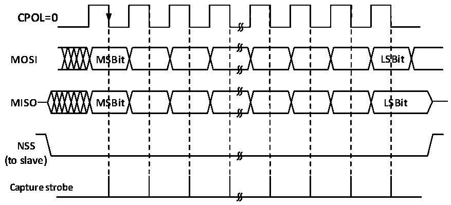
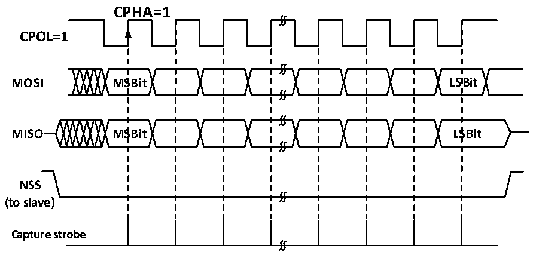

<!-- source-page: 191 -->

[← p.190](0190.md) · [index](../README.md) · [PDF p.191](https://ch32-riscv-ug.github.io/CH32V006/datasheet_zh/CH32V00XRM.PDF#page=191) · [p.192 →](0192.md)

<!-- header: CH32V00X应用手册 https://wch.cn -->

图16-8 SPI从模式读写模式2  
 <!-- rendered from the PDF; verify at https://ch32-riscv-ug.github.io/CH32V006/datasheet_zh/CH32V00XRM.PDF#page=191 -->

# MODE 2

# CPHA=1

🖼 Text parsed from the figure above

<strong>CPOL=0</strong>  
<strong>MOSI MSBit LSBit</strong>  
<strong>MISO MSBit LSBit</strong>  
<strong>NSS</strong>  
<strong>(to slave)</strong>  
<strong>Capture strobe</strong>  

图16-9 SPI从模式读写模式3  
 <!-- rendered from the PDF; verify at https://ch32-riscv-ug.github.io/CH32V006/datasheet_zh/CH32V00XRM.PDF#page=191 -->

# MODE 3

🖼 Text parsed from the figure above

CPHA=1  
<strong>CPOL=1</strong>  
<strong>MOSI MSBit LSBit</strong>  
<strong>MISO MSBit LSBit</strong>  
<strong>NSS</strong>  
<strong>(to slave)</strong>  
<strong>Capture strobe</strong>  

### 16.2.4 单工模式

SPI接口可以工作在半双工模式，即主设备使用MOSI引脚，从设备使用MISO引脚进行通讯。使  
用半双工通讯时需要把BIDIMODE置位，使用BIDIOE控制传输方向。  
在正常全双工模式下将RXONLY位置位可以将SPI模块设置为仅仅接收的单工模式，在RXONLY置  
位之后会释放一个数据脚，主模式和从模式释放的引脚并不相同。也可以不理会接收的数据将SPI置  
成只发送的模式。  

### 16.2.5 CRC

SPI 模块使用 CRC 校验保证全双工通信的可靠性，数据收发分别使用单独的 CRC 计算器。CRC 计  
算的多项式由多项式寄存器决定，对于8位数据宽度和16位数据宽度，会分别使用不同的计算方法。  
设置 CRCEN 位会启用 CRC 校验，同时会使 CRC 计算器复位。在发送完最后一个数据字节后，置  
CRCNEXT 位会在当前字节发送结束后发送 TXCRCR 计算器的计算结果，同时最后接收到的接收移位寄  
<!-- image: p191-draw-image-00001 bbox=[507.6, 786.0, 527.52, 797.04] -->
<!-- footer: V1.5 180 -->
