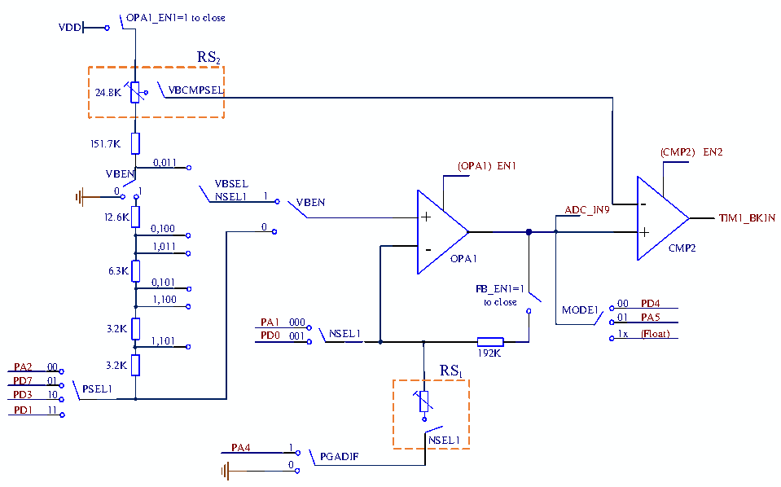

<!-- source-page: 199 -->

[← p.198](0198.md) · [index](../README.md) · [PDF p.199](https://ch32-riscv-ug.github.io/CH32V006/datasheet_zh/CH32V00XRM.PDF#page=199) · [p.200 →](0200.md)

<!-- header: CH32V00X应用手册 https://wch.cn -->

图17-1 OPA结构图  
 <!-- rendered from the PDF; verify at https://ch32-riscv-ug.github.io/CH32V006/datasheet_zh/CH32V00XRM.PDF#page=199 -->

🖼 Text parsed from the figure above

c  
OPA1_EN1=1 to close  
VDD  
RS2  
24.8K  VBCMPSEL  
151.7K  
(CMP2) EN2  
0,011 (OPA1) EN1  
VBEN  
VBSEL  
0 1  
NSEL1 1 VBEN -  
12.6K + ADC_IN9 TIM1_BKIN  
0,100 0 +  
1,011 - CMP2  
OPA1  
6.3K  
0,101  
FB_EN1=1  
1,100 to close 00 PD4  
MODE1  
01 PA5  
PA1 000  
3.2K PD0 001 NSEL1 1x (Float)  
1,101  
192K  
PA2 00 3.2K RS  
1  
PD7 01  
PSEL1  
PD3 10  
PD1 11  
NSEL1  
PA4 1  
PGADIF  
0  

# RS

# RS1 2

64K 27.4K 12.8K 6.2K 12.4K 00  
c c  
VBCMPSEL  
011 100 101 110 6.2K 01  
6.2K  
10  
NSEL1  

#### 17.2.1.1 OPA 单端输入

在OPA_CTLR1寄存器中：配置PSEL1位选择OPA1正负端引脚输入；配置MODE1位选择OPA1正负  
端引脚输出，且对应引脚配置为模拟输入，OPA_EN1位置1使能OPA1后，外部引脚即可内部链接OPA1。  
注：使用独立OPA1时可选择外部接入反馈电阻。  
<!-- image: p199-draw-image-00001 bbox=[507.6, 779.04, 527.52, 789.84] -->
<!-- footer: V1.5 188 -->
