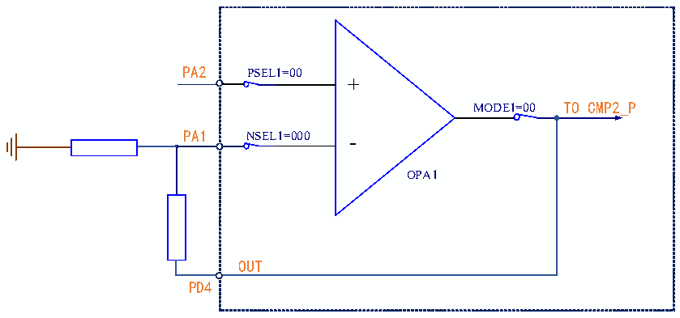
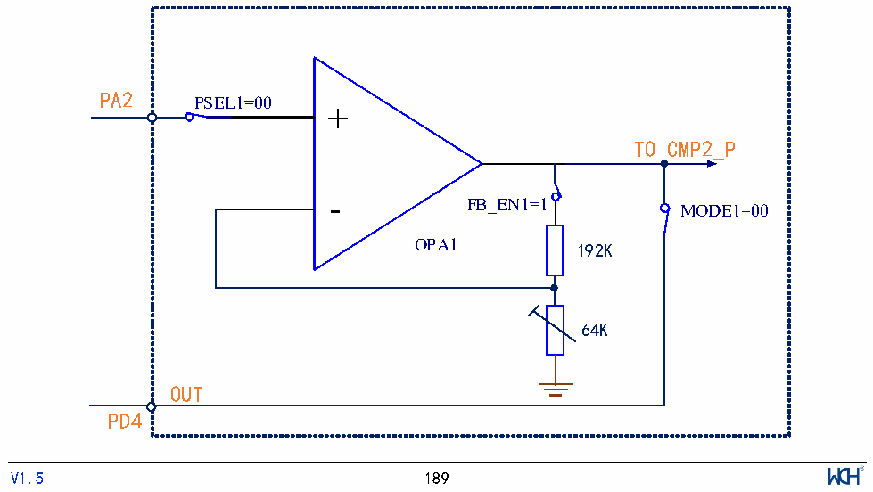

<!-- source-page: 200 -->

[← p.199](0199.md) · [index](../README.md) · [PDF p.200](https://ch32-riscv-ug.github.io/CH32V006/datasheet_zh/CH32V00XRM.PDF#page=200) · [p.201 →](0201.md)

<!-- header: CH32V00X应用手册 https://wch.cn -->

图17-2 OPA单端输入示意图  
 <!-- rendered from the PDF; verify at https://ch32-riscv-ug.github.io/CH32V006/datasheet_zh/CH32V00XRM.PDF#page=200 -->

🖼 Text parsed from the figure above

PA2 PSEL1=00  
+  
MODE1=00 TO CMP2_P  
PA1 NSEL1=000 -  
OPA1  
OUT  
PD4  

配置操作：  
1.解锁OPA：  
向OPA_KEY寄存器写入KEY1 = 0x45670123（第1步必须是KEY1）；  
向OPA_KEY寄存器写入KEY2 = 0xCDEF89AB（第2步必须是KEY2）。  
2.选择OPA引脚：  
在 OPA_CTLR1 寄存器中：配置 PSEL1 位为 00b(PA2)；NSEL1 位为 000b（PA1）；MODE1 位为 00b  
（PD4）。  
3.在OPA_CTLR1寄存器中：配置OPA_EN1位为1，使能OPA1。  

#### 17.2.1.2 OPA 内置可编程 PGA

在 OPA_CTLR1 寄存器中：配置 PGADIF 位为 0，选择 OPA 单端模式，使负端输入内部接地；配置  
NSEL1 位为 011b/100b/101b/110b，PGA增益为：4/8/16/32，且 FB_EN1位置 1，使能内部反馈电阻；  
配置PSEL1位选择正端输入；配置OPA_EN1位为1，使能OPA1。  
注：  
1）在内部可编程PGA模式中，外部引脚只需OPA正端输入与输出，负端输入默认为内部接地。  
2）选择增益后，为了避免输出饱和，输入电压应低于VDD除以增益倍数。  

图17-3 OPA内部可编程PGA示意图  
 <!-- rendered from the PDF; verify at https://ch32-riscv-ug.github.io/CH32V006/datasheet_zh/CH32V00XRM.PDF#page=200 -->

🖼 Text parsed from the figure above

PA2  
PSEL1=00  
+  
TO CMP2_P  
FB_EN1=1  
MODE1=00  
OPA1 192K  
64K  
OUT  
PD4  
<!-- image: p200-draw-image-00001 inside the figure -->
<!-- footer: V1.5 189 -->

