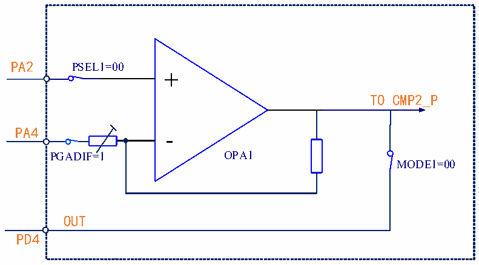

<!-- source-page: 201 -->

[← p.200](0200.md) · [index](../README.md) · [PDF p.201](https://ch32-riscv-ug.github.io/CH32V006/datasheet_zh/CH32V00XRM.PDF#page=201) · [p.202 →](0202.md)

<!-- header: CH32V00X应用手册 https://wch.cn -->
配置操作：  
1.解锁OPA：  
向OPA_KEY寄存器写入KEY1 = 0x45670123（第1步必须是KEY1）；  
向OPA_KEY寄存器写入KEY2 = 0xCDEF89AB（第2步必须是KEY2）。  
2.选择OPA引脚：  
在 OPA_CTLR1寄存器中：配置 PSEL1位为00b(PA2)；NSEL1位为 011b，且 FB_EN1位置 1，使能  
内部反馈电阻；MODE1位为00b（PD4）。  
3.在OPA_CTLR1寄存器中：配置OPA_EN1位为1，使能OPA1。  

#### 17.2.1.3 OPA 差分输入

在OPA_CTLR1寄存器中：配置PGADIF位为1，选择OPA差分输入PGA模式，此时负端输入为  
PA4；配置NSEL1位011b/100b/101b，PGA增益为：4/8/16，且FB_EN1位置1，使能内部反馈电  
阻；配置PSEL1位选择正端输入；配置OPA_EN1位为1，使能OPA1。  

图17-4 OPA差分输入示意图  
 <!-- rendered from the PDF; verify at https://ch32-riscv-ug.github.io/CH32V006/datasheet_zh/CH32V00XRM.PDF#page=201 -->

🖼 Text parsed from the figure above

PA2 PSEL1=00  
+  
TO CMP2_P  
PA4 -  
PGADIF=1 OPA1  
MODE1=00  
OUT  
PD4  

#### 17.2.1.4 OPA 自偏置差分 PGA

当OPA使用差分PGA时，可增加偏置电压，并将输出电压接入CMP2的正端输入，再与负端的参  
考电压比较后输出。  
在OPA_CFGR2寄存器中：配置RST_EN2位为1，使能CMP2复位功能，当CMP输出为高电平时复  
位系统；或配置OPA_CTLR2寄存器的BKIN_CFG位为10b，作为TIM1的刹车源。  
<!-- image: p201-draw-image-00001 bbox=[507.6, 779.04, 527.52, 789.84] -->
<!-- footer: V1.5 190 -->
