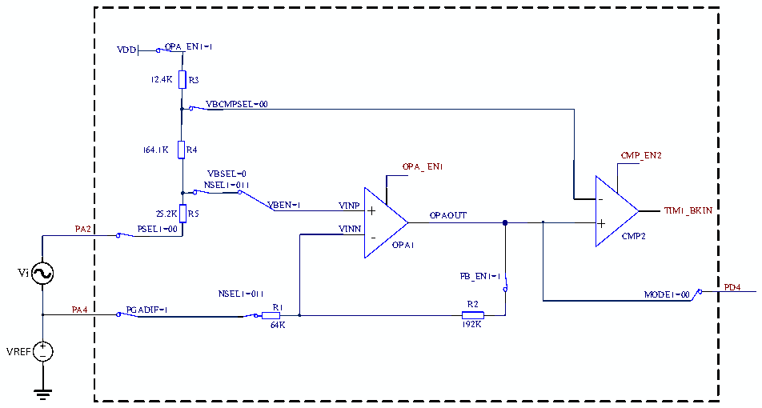

<!-- source-page: 202 -->

[← p.201](0201.md) · [index](../README.md) · [PDF p.202](https://ch32-riscv-ug.github.io/CH32V006/datasheet_zh/CH32V00XRM.PDF#page=202) · [p.203 →](0203.md)

<!-- header: CH32V00X应用手册 https://wch.cn -->

图17-5 OPA自偏置差分PGA输入示意图  
 <!-- rendered from the PDF; verify at https://ch32-riscv-ug.github.io/CH32V006/datasheet_zh/CH32V00XRM.PDF#page=202 -->

🖼 Text parsed from the figure above

VDD OPA_EN1=1  
12.4K R3  
VBCMPSEL=00  
164.1K R4  
CMP_EN2  
OPA_ EN1  
VBSEL=0  
NSEL1=011  
-  
25.2K R5 VBEN=1 VINP + OPAOUT TIM1_BKIN  
+  
PA2 PSEL1=00 VINN - CMP2  
OPA1  
Vi FB_EN1=1  
PD4  
NSEL1=011 MODE1=00  
PA4 PGADIF=1 R1 R2  
64K 192K  
VREF  

配置操作：  
1.解锁OPA：  
向OPA_KEY寄存器写入KEY1 = 0x45670123（第1步必须是KEY1）；  
向OPA_KEY寄存器写入KEY2 = 0xCDEF89AB（第2步必须是KEY2）。  
2.选择OPA引脚：  
在 OPA_CTLR1寄存器中：配置 OPA_EN1位为 1，使能 OPA1；配置 PSEL1位为00b(PA2)；NSEL为  
011b，且FB_EN1位置1，使能内部反馈电阻；MODE1为00b（PD4）。  
3.配置VBEN为1b,使能输出电压偏置；VBSEL为0b，选择PGA输出参考电压。  
4.CMP解锁：  
向CMP_KEY寄存器写入KEY1 = 0x45670123（第1步必须是KEY1）；  
向CMP_KEY寄存器写入KEY2 = 0xCDEF89AB（第2步必须是KEY2）。  
5.在OPA_CTLR1寄存器中：配置VBCMPSEL位为00b，给定CMP2负端参考电压值。  
6.在OPA_CFGR2寄存器中：配置BKIN_CFG为10b，作为TIM1的刹车源。  
7.在OPA_CFGR2寄存器中：配置CMP_EN2位为1，使能CMP2。  
根据图17-5给出了OPA输出偏置电压VBOPAOUT、OPA输出交流增益GainOPAOUT、CMP负端电压VBCMP 的计  
算方法，如表17-1、表17-2、表17-3所示：  

<!-- p202-table-001 (table-17-1@1) -->
<table><caption>表17-1 OPA输出偏置电压VBOPAOUT</caption><tr><th>VBSEL</th><th style="text-align:left">VBOPAOUT</th></tr><tr><td>VBSEL=0</td><td>(VDD+VREF)/2</td></tr><tr><td>VBSEL=1</td><td>VDD/4+VREF*3/4</td></tr></table>

<!-- p202-table-002 (table-17-2@1) -->
<table><caption>表17-2 OPA输出交流增益GainOPAOUT</caption><tr><th>VBSEL</th><th style="text-align:left">Gain OPAOUT</th></tr><tr><td>VBSEL=0</td><td>((R1+R2)/R1)-0.5</td></tr><tr><td>VBSEL=1</td><td>((R1+R2)/R1)-0.25</td></tr></table>

<!-- image: p202-draw-image-00001 bbox=[507.6, 779.04, 527.52, 789.84] -->
<!-- footer: V1.5 191 -->
