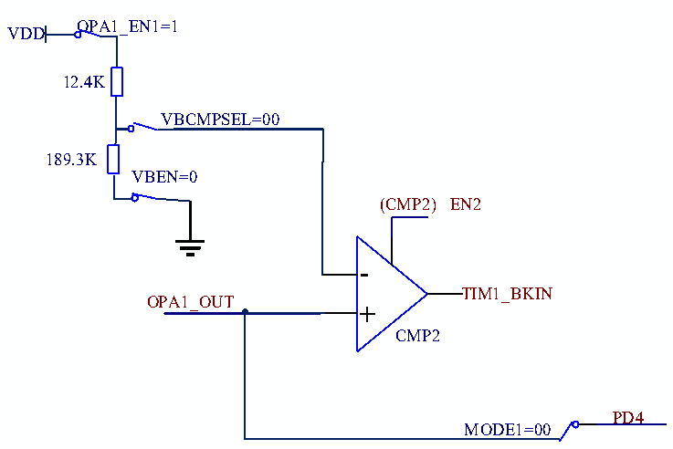

<!-- source-page: 203 -->

[← p.202](0202.md) · [index](../README.md) · [PDF p.203](https://ch32-riscv-ug.github.io/CH32V006/datasheet_zh/CH32V00XRM.PDF#page=203) · [p.204 →](0204.md)

<!-- header: CH32V00X应用手册 https://wch.cn -->

<!-- p203-table-001 (table-17-3@1) -->
<table><caption>表17-3 CMP负端电压VBCMP</caption><tr><th>VBCMPSEL</th><th style="text-align:left">VBCMP</th></tr><tr><td>VBCMPSEL=00</td><td>VDD*30/33+VINP*3/33</td></tr><tr><td>VBCMPSEL=01</td><td>VDD*29/33+VINP*4/33</td></tr><tr><td>VBCMPSEL=10</td><td>VDD*28/33+VINP*5/33</td></tr></table>

对于VREF未知的应用，可采用如下类似方式得到交流增益：  
1）NSEL=011b，操作上述1~7，ADC采样OPA_OUT得到ADC1。  
2）NSEL=100b，重复操作上述1~7，ADC采样OPA_OUT得到ADC2。  
3）则Vi=(ADC2-ADC1)/4。  

#### 17.2.1.5 CMP2 独立偏置模式

当CMP2单独使用时可独立增加CMP2负端偏置电压，并与OPA1_OUT结果比较后输出。在  
OPA_CFGR2寄存器中：配置RST_EN2位为1，使能CMP2复位功能，当CMP输出为高电平时复位系  
统；或配置OPA_CTLR2寄存器的BKIN_CFG位为10b，作为TIM1的刹车源。  

图17-6 CMP2独立偏置模式示意图  
 <!-- rendered from the PDF; verify at https://ch32-riscv-ug.github.io/CH32V006/datasheet_zh/CH32V00XRM.PDF#page=203 -->

🖼 Text parsed from the figure above

OPA1_EN1=1  
VDD  
12.4K  
VBCMPSEL=00  
189.3K  
VBEN=0  
(CMP2) EN2  
-  
TIM1_BKIN  
OPA1_OUT  
+  
CMP2  
PD4  
MODE1=00  

配置操作：  
1.解锁OPA：  
向OPA_KEY寄存器写入KEY1 = 0x45670123（第1步必须是KEY1）；  
向OPA_KEY寄存器写入KEY2 = 0xCDEF89AB（第2步必须是KEY2）。  
2.选择OPA引脚：  
在OPA_CTLR1寄存器中：配置OPA_EN1位为1，使能OPA1。  
3.配置VBEN为0b,使能输出电压偏置。  
4.CMP解锁：  
向CMP_KEY寄存器写入KEY1 = 0x45670123（第1步必须是KEY1）；  
向CMP_KEY寄存器写入KEY2 = 0xCDEF89AB（第2步必须是KEY2）。  
5.在OPA_CTLR1寄存器中：配置VBCMPSEL位为00b，给定CMP2负端参考电压值。  
6.在OPA_CFGR2寄存器中：配置BKIN_CFG为10b，作为TIM1的刹车源。  
7.在OPA_CFGR2寄存器中：配置CMP_EN2位为1，使能CMP2。  
<!-- image: p203-draw-image-00001 bbox=[507.6, 779.04, 527.52, 789.84] -->
<!-- footer: V1.5 192 -->
