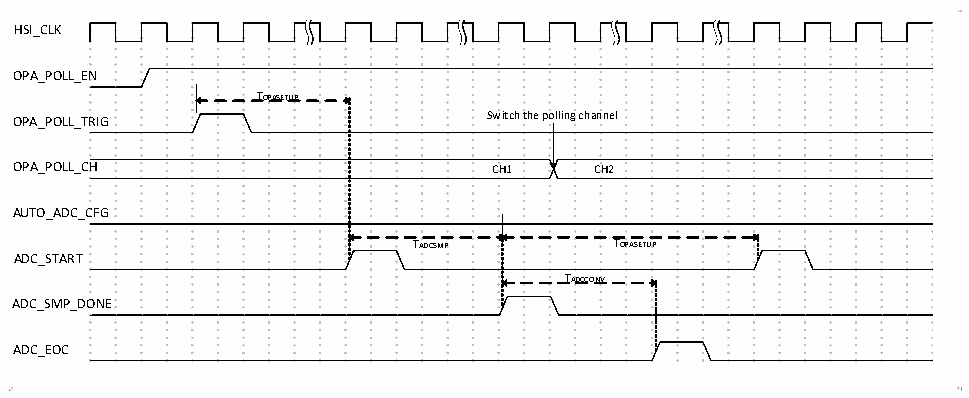
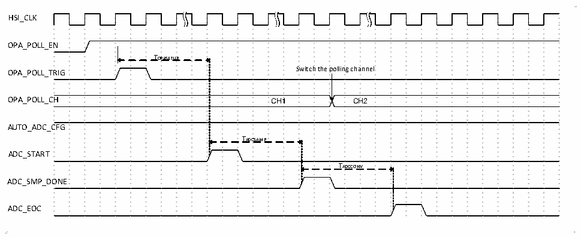

<!-- source-page: 204 -->

[← p.203](0203.md) · [index](../README.md) · [PDF p.204](https://ch32-riscv-ug.github.io/CH32V006/datasheet_zh/CH32V00XRM.PDF#page=204) · [p.205 →](0205.md)

<!-- header: CH32V00X应用手册 https://wch.cn -->

### 17.2.2 运放正输入端轮询

OPA的P端可从OPA_P0/OPA_P1/OPA_P2/OPA_P3中选择，可通过OPA_CFGR1寄存器中的POLL1_NUM  
来配置轮询的通道数量，至多可选 3 个通道；OPA 的轮询功能可实现定时依次选择  
OPA_P0/OPA_P1/OPA_P2/OPA_P3，轮流选中所有的P端；可通过配置OPA_CFGR1寄存器中的POLL_CHx  
位来设置OPA轮询顺序，配置POLL_EN位可打开OPA1正端轮询。  

图17-7 OPA轮询时序图1  
 <!-- rendered from the PDF; verify at https://ch32-riscv-ug.github.io/CH32V006/datasheet_zh/CH32V00XRM.PDF#page=204 -->

🖼 Text parsed from the figure above

HSI_CLK  
OPA_POLL_EN  
TOPASETUP  
OPA_POLL_TRIG Switch the polling channel  
OPA_POLL_CH CH1 CH2  
AUTO_ADC_CFG  
TADCSMP TOPASETUP  
ADC_START  
TADCCONV  
ADC_SMP_DONE  
ADC_EOC  

TOPASETUP：OPA建立时间。  
TADCSMP：ADC采样时间。  
TADCCONV：ADC转换时间。  
如图 17-7，在 AUTO_ADC_CFG 位配置为 0 时，配置的轮询触发事件发生后，经过 TOPASETUP，ADC 开  
始采样，在采样完成后，轮询通道切换，再经过TOPASETUP（注：设置OPA建立时间需大于ADC转换时间），  
进行下一次ADC采样，重复ADC采样后的流程。  

图17-8 OPA轮询时序图2  
 <!-- rendered from the PDF; verify at https://ch32-riscv-ug.github.io/CH32V006/datasheet_zh/CH32V00XRM.PDF#page=204 -->

🖼 Text parsed from the figure above

HSI_CLK  
OPA_POLL_EN  
TOPASETUP  
OPA_POLL_TRIG Switch the polling channel  
OPA_POLL_CH CH1 CH2  
AUTO_ADC_CFG  
TADCSAMP  
ADC_START  
TADCCONV  
ADC_SMP_DONE  
ADC_EOC  

TOPASETUP：OPA建立时间。  
TADCSMP：ADC采样时间。  
TADCCONV：ADC转换时间。  
如图 17-8，在 AUTO_ADC_CFG 位配置为 1 时，配置的轮询触发事件发生后，经过 TOPASETUP，ADC 开  
始采样，在采样完成后，轮询通道切换；等待后续轮询触发事件再次发生后重复上述流程。  
使用建议：实际使用时，若 ADC转换时间大于 OPA建立时间，建议 AUTO_ADC_CFG 位配置为 1同  
时配合 ADC扫描模式使用；若 ADC转换时间小于 OPA建立时间，建议 AUTO_ADC_CFG位配置为0同时  
配合ADC单次模式使用。  
<!-- image: p204-draw-image-00001 bbox=[507.6, 779.04, 527.52, 789.84] -->
<!-- footer: V1.5 193 -->
