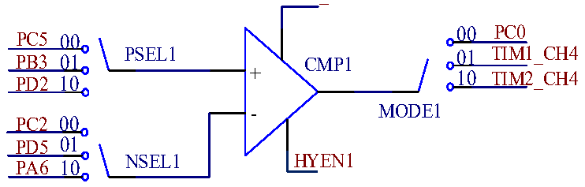

<!-- source-page: 205 -->

[← p.204](0204.md) · [index](../README.md) · [PDF p.205](https://ch32-riscv-ug.github.io/CH32V006/datasheet_zh/CH32V00XRM.PDF#page=205) · [p.206 →](0206.md)

<!-- header: CH32V00X应用手册 https://wch.cn -->

### 17.2.3 比较器 CMP

<!-- p205-table-001 (table-17-3@1) -->
<table><tr><th>置位OPA_CTLR2寄存器中的CMP_ENx，即可使能对应的CMPx。</th><th></th></tr><tr><td colspan="2" style="text-align:left">在OPA_CTLR2寄存器中：配置MODE1位可选择CMP1的输出通道；配置PSEL1，可选择CMP1的正</td></tr></table>

端输入引脚；配置NSEL1，可选择CMP1的负端输入引脚。  

<!-- p205-table-002 (table-17-3@1) -->
<table><tr><th></th><th colspan="2" style="text-align:left">CMP2正端输入引脚来自OPA1输出，可通过OPA_CTLR1寄存器中的MODE1位进行选择通道；负端</th></tr><tr><td colspan="3" style="text-align:left">参考电压由OPA_CTLR寄存器中的VBCMPSEL位控制，且仅在VBEN=1时有效。CMP2的输出作为TIM1的</td></tr><tr><td colspan="2">刹车源。</td><td></td></tr></table>

图17-9 CMP结构图  
 <!-- rendered from the PDF; verify at https://ch32-riscv-ug.github.io/CH32V006/datasheet_zh/CH32V00XRM.PDF#page=205 -->

CMP_EN1  

🖼 Text parsed from the figure above

00 PC0  
PC5 00  
PB3 01 PSEL1 CMP1 01 TIM1_CH4  
PD2 10 + 10 TIM2_CH4  
MODE1  
PC2 00  
PD5 01  
NSEL1 HYEN1  
PA6 10  

## 17.3 寄存器描述

<!-- p205-table-003 (table-17-4@1) -->
<table><caption>表17-4 OPA相关寄存器列表</caption><tr><th>名称</th><th>访问地址</th><th>描述</th><th>复位值</th></tr><tr><td>R32_OPA_CFGR1</td><td>0x40024000</td><td>OPA配置寄存器1</td><td>0x00000000</td></tr><tr><td>R32_OPA_CTLR1</td><td>0x40024004</td><td>OPA控制寄存器1</td><td>0x800C0736</td></tr><tr><td>R32_OPA_CFGR2</td><td>0x40024008</td><td>OPA配置寄存器2</td><td>0x00000000</td></tr><tr><td>R32_OPA_CTLR2</td><td>0x4002400C</td><td>OPA控制寄存器2</td><td>0x80000078</td></tr><tr><td>R32_OPA_KEY</td><td>0x40024010</td><td>OPA解锁键寄存器</td><td>0xXXXXXXXX</td></tr><tr><td>R32_CMP_KEY</td><td>0x40024014</td><td>CMP解锁键寄存器</td><td>0xXXXXXXXX</td></tr><tr><td>R32_POLL_KEY</td><td>0x40024018</td><td>POLL上锁键寄存器</td><td>0xXXXXXXXX</td></tr></table>

### 17.3.1 OPA 配置寄存器 1（OPA_CFGR1）

偏移地址：0x00  

<!-- p205-table-004 (table-17-4@1) -->
<table class="bitfield"><colgroup><col style="width:6.2500%"><col style="width:6.2500%"><col style="width:6.2500%"><col style="width:6.2500%"><col style="width:6.2500%"><col style="width:6.2500%"><col style="width:6.2500%"><col style="width:6.2500%"><col style="width:6.2500%"><col style="width:6.2500%"><col style="width:6.2500%"><col style="width:6.2500%"><col style="width:6.2500%"><col style="width:6.2500%"><col style="width:6.2500%"><col style="width:6.2500%"></colgroup><tr><th>31</th><th>30</th><th>29</th><th>28</th><th>27</th><th>26</th><th>25</th><th>24</th><th>23</th><th>22</th><th>21</th><th>20</th><th>19</th><th>18</th><th>17</th><th>16</th></tr><tr><td>POLL_LOCK</td><td colspan="3">Reserved</td><td colspan="3">POLL_SEL</td><td>POLL_SWSTRT</td><td colspan="2">Reserved</td><td colspan="2">POLL_CH3</td><td colspan="2">POLL_CH2</td><td colspan="2">POLL_CH1</td></tr></table>

<!-- p205-table-005 (table-17-4@1) -->
<table class="bitfield"><colgroup><col style="width:6.2500%"><col style="width:6.2500%"><col style="width:6.2500%"><col style="width:6.2500%"><col style="width:6.2500%"><col style="width:6.2500%"><col style="width:6.2500%"><col style="width:6.2500%"><col style="width:6.2500%"><col style="width:6.2500%"><col style="width:6.2500%"><col style="width:6.2500%"><col style="width:6.2500%"><col style="width:6.2500%"><col style="width:6.2500%"><col style="width:6.2500%"></colgroup><tr><th>15</th><th>14</th><th>13</th><th>12</th><th>11</th><th>10</th><th>9</th><th>8</th><th>7</th><th>6</th><th>5</th><th>4</th><th>3</th><th>2</th><th>1</th><th>0</th></tr><tr><td>Reserved</td><td>IF_OUT_POLL_CH3</td><td>IF_OUT_POLL_CH2</td><td>IF_OUT_POLL_CH1</td><td>Reserved</td><td>NMI_EN</td><td>Reserved</td><td>IE_OUT1</td><td>AUTO_ADC_CFG</td><td colspan="2">SETUP_CFG</td><td>RST_EN1</td><td colspan="2">POLL1_NUM</td><td>Reserved</td><td>POLL_EN</td></tr></table>

<!-- p205-table-006 (table-17-4@1) pages 205-207 -->
<table><tr><th>位</th><th>名称</th><th>访问</th><th>描述</th><th>复位值</th></tr><tr><td>31</td><td>POLL_LOCK</td><td>RO</td><td style="text-align:left">POLL锁： 1：POLL上锁； 0：POLL解锁。 注：模块不复位，该位无法解锁。</td><td>0</td></tr><tr><td>[30:28]</td><td>Reserved</td><td>RO</td><td>保留。</td><td>0</td></tr><tr><td>[27:25]</td><td>POLL_SEL</td><td>RW</td><td style="text-align:left">OPA轮询触发事件选择： 000：软件配置； 001：TIM1_CH4； 010：TIM2_CH4； 011：TIM3_CH1； 100：TIM3_CH2； 其他：保留。</td><td>0</td></tr><tr><td>24</td><td>POLL_SWSTRT</td><td>WO</td><td style="text-align:left">启动OPA轮询，需要设置软件触发。 1：启动OPA轮询； 0：复位状态。 此位由软件置位，轮询开始后硬件清0。</td><td>0</td></tr><tr><td>[23:22]</td><td>Reserved</td><td>RO</td><td>保留。</td><td>0</td></tr><tr><td>[21:20]</td><td>POLL_CH3</td><td>RW</td><td style="text-align:left">OPA轮询顺序： 配置第3个轮询通道。</td><td>0</td></tr><tr><td>[19:18]</td><td>POLL_CH2</td><td>RW</td><td style="text-align:left">OPA轮询顺序： 配置第2个轮询通道。</td><td>0</td></tr><tr><td>[17:16]</td><td>POLL_CH1</td><td>RW</td><td style="text-align:left">OPA轮询顺序： 配置第1个轮询通道。</td><td>0</td></tr><tr><td>15</td><td>Reserved</td><td>RO</td><td>保留。</td><td>0</td></tr><tr><td>14</td><td>IF_OUT_POLL_CH3</td><td>RW0</td><td style="text-align:left">第 3 个轮询通道轮询到 OPA1 输出为高电平的中断标志： 1：OPA输出为高电平； 0：无效。</td><td>0</td></tr><tr><td>13</td><td>IF_OUT_POLL_CH2</td><td>RW0</td><td style="text-align:left">第 2 个轮询通道轮询到 OPA1 输出为高电平的中断标志： 1：OPA输出为高电平； 0：无效。</td><td>0</td></tr><tr><td>12</td><td>IF_OUT_POLL_CH1</td><td>RW0</td><td style="text-align:left">第 1 个轮询通道轮询到 OPA1 输出为高电平的中断标志： 1：OPA输出为高电平； 0：无效。</td><td>0</td></tr><tr><td>11</td><td>Reserved</td><td>RO</td><td>保留。</td><td>0</td></tr><tr><td>10</td><td>NMI_EN</td><td>RW</td><td style="text-align:left">OPA连接NMI中断使能： 1：开启； 0：关闭。</td><td>0</td></tr><tr><td>9</td><td>Reserved</td><td>RO</td><td>保留。</td><td>0</td></tr><tr><td>8</td><td>IE_OUT1</td><td>RW</td><td style="text-align:left">OPA1中断使能： 1：开启中断使能； 0：关闭中断使能。</td><td>0</td></tr><tr><td>7</td><td>AUTO_ADC_CFG</td><td>RW</td><td style="text-align:left">OPA轮询自动触发ADC转换配置位： 1：轮询功能下，ADC采样结束后，OPA切换通道； 0：轮询功能下，ADC采样结束后，OPA切换通道，经过SETUP_CFG设定时间后自动触发ADC转换。</td><td>0</td></tr><tr><td>[6:5]</td><td>SETUP_CFG</td><td>RW</td><td style="text-align:left">OPA建立时间配置，建立时间之后将触发ADC转换： 00、10：0.5μs； 01：0.312μs； 11：0.77μs。</td><td>0</td></tr><tr><td>4</td><td>RST_EN1</td><td>RW</td><td style="text-align:left">OPA1复位系统使能： 1：开启 OPA1复位功能，OPA1 轮询结果为高电平时将复位系统； 0：关闭OPA1复位功能。</td><td>0</td></tr><tr><td>[3:2]</td><td>POLL1_NUM</td><td>RW</td><td style="text-align:left">配置OPA1轮询的正端个数： 00：轮询1个通道； 01：轮询2个通道； 10：轮询3个通道； 11：保留。 注：轮询顺序可配置。</td><td>0</td></tr><tr><td>1</td><td>Reserved</td><td>RO</td><td>保留。</td><td>0</td></tr><tr><td>0</td><td>POLL_EN</td><td>RW</td><td style="text-align:left">OPA1正端轮询使能： 1：打开OPA1正端轮询使能； 0：关闭OPA1正端轮询使能。</td><td>0</td></tr></table>

<!-- image: p205-draw-image-00001 bbox=[507.6, 779.04, 527.52, 789.84] -->
<!-- footer: V1.5 194 -->
