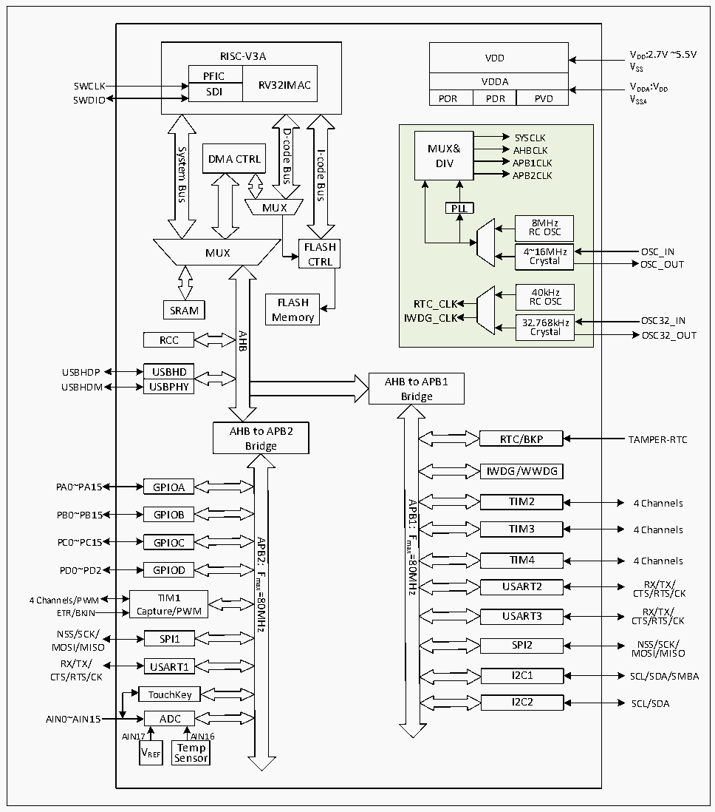

<!-- source-page: 4 -->

[← p.3](0003.md) · [index](../README.md) · [PDF p.4](https://ch32-riscv-ug.github.io/CH32V103/datasheet_en/CH32V103DS0.PDF#page=4) · [p.5 →](0005.md)

<!-- header: CH32V103 Datasheet https://wch-ic.com -->
multiple groups of buses. The core adopts pipeline processing structure and sets up static branch prediction and  
instruction prefetching mechanism to achieve the best performance ratio of low-power consumption, low-cost and  
high-speed operation of the system. There is a general DMA controller in the controller to reduce the burden of CPU  
and improve efficiency. Clock tree hierarchical management reduces the total power consumption of peripherals.  
At the same time, it also has data protection mechanism, clock security system protection mechanism and other  
measures to increase system stability.  
The following figure is the internal architecture block diagram of the series of products.  

Figure 1-1 System architecture  
 <!-- rendered from the PDF; verify at https://ch32-riscv-ug.github.io/CH32V103/datasheet_en/CH32V103DS0.PDF#page=4 -->

🖼 Text parsed from the figure above

VDD  VDDA  POR  VDDAPDR  PVD  
RISC-V3A  
VSS  
PFICSDI  RV32IMAC  SDI  
SWDIO  
D-code  
SYSCLK MUX&amp; AHBCLK DIV APB1CLKAPB2CLKPLL8MHz RC OSC4~16MHz Crystal 40kHz RTC_CLK RC OSCIWDG_CLK32.768kHz Crystal  
System  
I-code  
DMA CTRL  
Bus  
Bus  
Bus  
MUX  
8MHz RC OSC  4~16MHz Crystal  
FLASH  
MUX  
Crystal OSC_OUT  
CTRL  
40kHz RC OSC  32.768kHz Crystal  
FLASH  
SRAM  
Memory  
Crystal OSC32_OUT  
AHB  
RCC  
USBHD  UUSSBBPHHDY  
USBHDP  
AHB to APB1  
USBHDM USBPHY  
Bridge  
AHB to APB2  
RTC/BKP  
TAMPER-RTC  
Bridge  
IWDG/WWDG  
PA0~PA15 GPIOA  
TIM2  
4 Channels  
APB1:  
PB0~PB15 GPIOB  
TIM3  
4 Channels  
Fmax=80MHz  
APB2:  
PC0~PC15 GPIOC  
TIM4  
4 Channels  
PD0~PD2 GPIOD  
Fmax=80MHz  
RX/TX/  
USART2  
CTS/RTS/CK  
4 Channels/PWM TIM1  
ETR/BKIN Capture/PWM  
RX/TX/  
USART3  
CTS/RTS/CK  
NSS/SCK/  
SPI1  
NSS/SCK/  
SPI2  
MOSI/MISO  
MOSI/MISO  
RX/TX/ USART1  
I2C1  
SCL/SDA/SMBA  
CTS/RTS/CK  
TouchKey  
I2C2  
SCL/SDA  
AIN0~AIN15 ADC  
AIN17 AIN16  
T  
e  
m  
p  
VREF  
S  
e  
n  
so  
r  

<!-- image: p4-draw-image-00001 bbox=[510.96, 783.36, 530.88, 793.68] -->
<!-- footer: V1.2 2 -->
