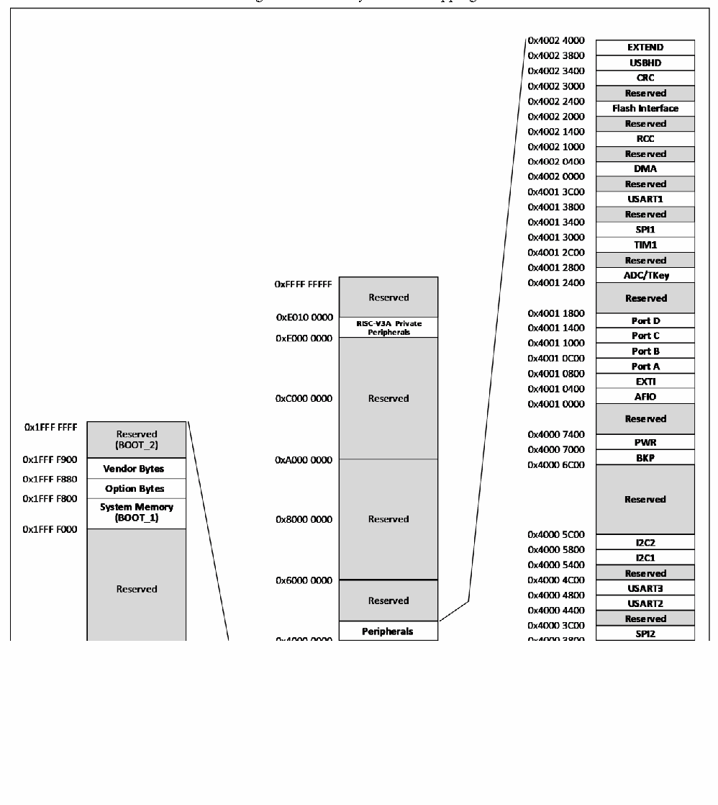

<!-- source-page: 5 -->

[← p.4](0004.md) · [index](../README.md) · [PDF p.5](https://ch32-riscv-ug.github.io/CH32V103/datasheet_en/CH32V103DS0.PDF#page=5) · [p.6 →](0006.md)

<!-- header: CH32V103 Datasheet https://wch-ic.com -->

## 1.3 Memory Mapping

Figure 1-2 Memory address mapping  
 <!-- rendered from the PDF; verify at https://ch32-riscv-ug.github.io/CH32V103/datasheet_en/CH32V103DS0.PDF#page=5 -->

🖼 Text parsed from the figure above

<!-- image: p5-draw-image-00002 inside the figure -->
<!-- image: p5-draw-image-00003 inside the figure -->
<!-- image: p5-draw-image-00004 inside the figure -->
<!-- image: p5-draw-image-00005 inside the figure -->
<!-- image: p5-draw-image-00006 inside the figure -->

<!-- image: p5-draw-image-00001 bbox=[510.96, 783.36, 530.88, 793.68] -->
<!-- footer: V1.2 3 -->
