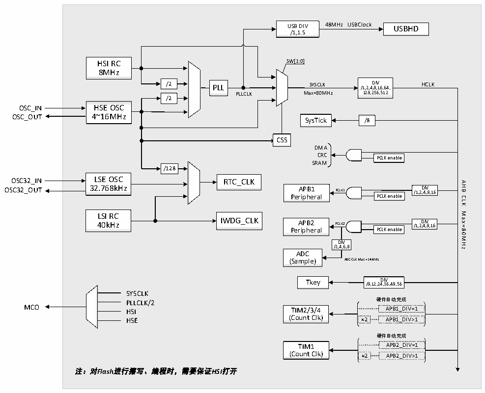

<!-- source-page: 6 -->

[← p.5](0005.md) · [index](../README.md) · [PDF p.6](https://ch32-riscv-ug.github.io/CH32V103/datasheet_en/CH32V103DS0.PDF#page=6) · [p.7 →](0007.md)

<!-- header: CH32V103 Datasheet https://wch-ic.com -->

## 1.4 Clock Tree

The system provides four sets of clock sources: high-speed internal RC oscillator (HSI), low-speed internal RC  
oscillator (LSI), high-speed external oscillator or clock signal (HSE), low-speed external oscillator or clock signal  
(LSE). Wherein, the system bus clock (SYSCLK) comes from a high frequency clock source (HSI/HSE) or a higher  
clock generated after it is fed into the PLL frequency doubling. The AHB domain, APB1 domain and APB2 domain  
are obtained by the system clock or the previous stage through the corresponding prescaler frequency division.  
The low frequency clock source provides a clock reference for RTC and independent watchdogs.  
The PLL frequency doubling clock provides the working clock reference 48MHz of the USBHD module directly  
through the frequency divider.  

Figure 1-3 Clock tree block diagram  
 <!-- rendered from the PDF; verify at https://ch32-riscv-ug.github.io/CH32V103/datasheet_en/CH32V103DS0.PDF#page=6 -->

🖼 Text parsed from the figure above

<!-- image: p6-draw-image-00002 inside the figure -->
<!-- image: p6-draw-image-00014 inside the figure -->
48MHz USBClock  
<!-- image: p6-draw-image-00015 inside the figure -->
USB DIV USBHD  
/1,1.5  
<!-- image: p6-draw-image-00003 inside the figure -->
SW[1:0]  
HSI RC  
<!-- image: p6-draw-image-00017 inside the figure -->
8MHz  
<!-- image: p6-draw-image-00018 inside the figure -->
<!-- image: p6-draw-image-00008 inside the figure -->
<!-- image: p6-draw-image-00004 inside the figure -->
<!-- image: p6-draw-image-00005 inside the figure -->
/2 PLL /1,2,4 D ,8 IV ,16,64, HCLK  
SYSCLK  
128,256,512  
PLLCLK Max=80MHz  
<!-- image: p6-draw-image-00007 inside the figure -->
/2  
<!-- image: p6-draw-image-00006 inside the figure -->
OSC_IN HSE OSC  
OSC_OUT 4~16MHz  
<!-- image: p6-draw-image-00020 inside the figure -->
<!-- image: p6-draw-image-00019 inside the figure -->
SysTick /8  
<!-- image: p6-draw-image-00041 inside the figure -->
CSS  
DMA  
<!-- image: p6-draw-image-00022 inside the figure -->
<!-- image: p6-draw-image-00023 inside the figure -->
CRC PCLK enable  
<!-- image: p6-draw-image-00024 inside the figure -->
SRAM  
<!-- image: p6-draw-image-00021 inside the figure -->
<!-- image: p6-draw-image-00010 inside the figure -->
/128  
<!-- image: p6-draw-image-00009 inside the figure -->
<!-- image: p6-draw-image-00013 inside the figure -->
OSC32_IN LSE OSC RTC_CLK  
AHB  
<!-- image: p6-draw-image-00029 inside the figure -->
OSC32_OUT 32.768kHz  
<!-- image: p6-draw-image-00028 inside the figure -->
APB1 PCLK1 /1,2 D ,4 IV ,8,16  
<!-- image: p6-draw-image-00025 inside the figure -->
<!-- image: p6-draw-image-00026 inside the figure -->
<!-- image: p6-draw-image-00027 inside the figure -->
Peripheral PCLK enable  
CLK  
<!-- image: p6-draw-image-00011 inside the figure -->
Max=80MHz  
<!-- image: p6-draw-image-00012 inside the figure -->
LSI RC  
IWDG_CLK 40kHz  
<!-- image: p6-draw-image-00034 inside the figure -->
<!-- image: p6-draw-image-00033 inside the figure -->
APB2 PCLK2 /1,2 D ,4 IV ,8,16  
<!-- image: p6-draw-image-00030 inside the figure -->
<!-- image: p6-draw-image-00031 inside the figure -->
<!-- image: p6-draw-image-00032 inside the figure -->
Peripheral PCLK enable  
<!-- image: p6-draw-image-00035 inside the figure -->
DIV  
/2,4,6,8  
<!-- image: p6-draw-image-00036 inside the figure -->
ADC  
(Sample) ADC CLK Max = 14MHz  
<!-- image: p6-draw-image-00040 inside the figure -->
<!-- image: p6-draw-image-00039 inside the figure -->
Tkey /8,12,24 D , I 3 V 6,48,56  
<!-- image: p6-draw-image-00016 inside the figure -->
SYSCLK  
PLLCLK/2 硬件自动完成  
MCO HSI TIM2/3/4 APB1_DIV=1  
<!-- image: p6-draw-image-00037 inside the figure -->
HSE (Count Clk) ×2 APB1_DIV&gt;1  
硬件自动完成  
<!-- image: p6-draw-image-00038 inside the figure -->
TIM1 APB2_DIV=1  
(Count Clk) ×2 APB2_DIV&gt;1  
注：对Flash进行擦写、编程时，需要保证HSI打开  

<em>Note:</em>  
<em>1. When using USB function, the frequency of using PLL, CPU must be 48MHz or 72MHz at the same time.</em>  
<em>2. When the ADC sampling time is 1us, APB2 must be set to 14MHz, 28MHz or 56MHz.</em>  
<em>3. When the system wakes up from sleep, the system will automatically switch to HSI as the clock frequency.</em>  
<em>4. When erasing, writing and programming Flash, you must make sure that HSI is open.</em>  
<!-- image: p6-draw-image-00001 bbox=[510.96, 783.36, 530.88, 793.68] -->
<!-- footer: V1.2 4 -->
