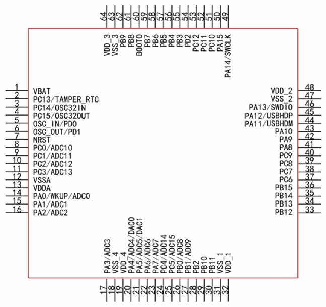
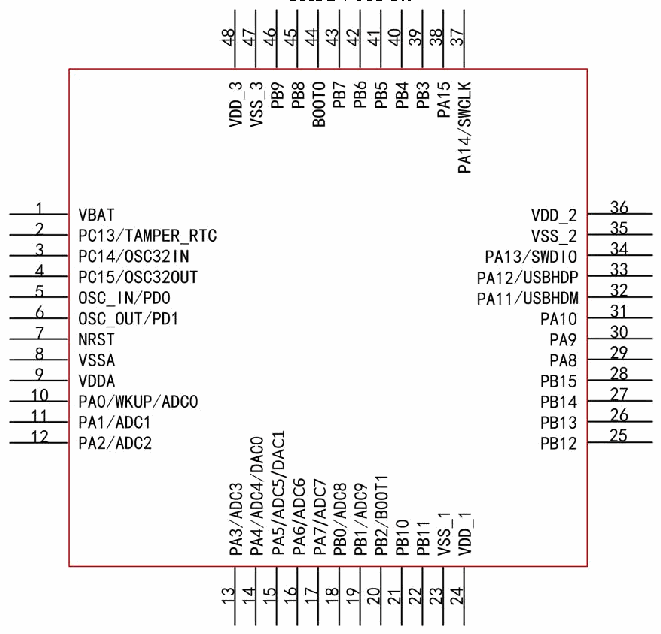

<!-- source-page: 13 -->

[← p.12](0012.md) · [index](../README.md) · [PDF p.13](https://ch32-riscv-ug.github.io/CH32V103/datasheet_en/CH32V103DS0.PDF#page=13) · [p.14 →](0014.md)

<!-- header: CH32V103 Datasheet https://wch-ic.com -->

# Chapter 2 Pinouts and Pin Definitions

## 2.1 Pinouts

CH32V103R8T6  

 <!-- p13-draw-image-00002 rendered from the PDF -->

CH32V103Cx  

 <!-- p13-draw-image-00003 rendered from the PDF -->

<!-- image: p13-draw-image-00001 bbox=[515.52, 783.36, 535.44, 793.68] -->
<!-- footer: V1.2 11 -->
