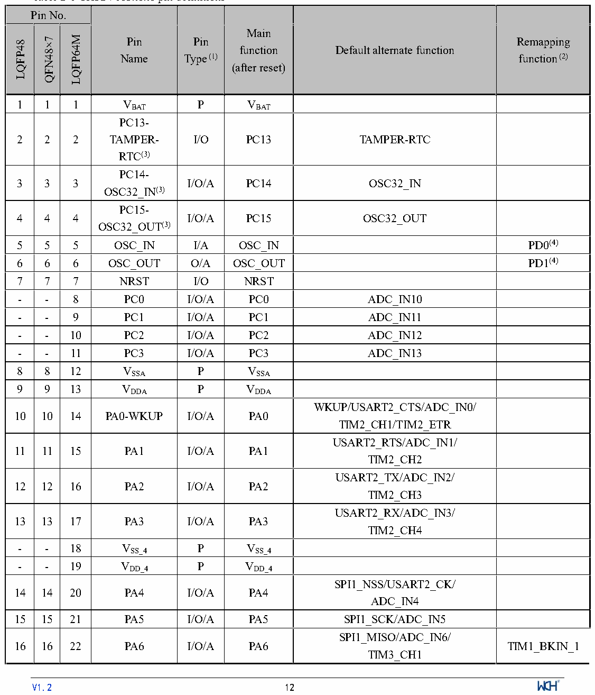

<!-- source-page: 14 -->

[← p.13](0013.md) · [index](../README.md) · [PDF p.14](https://ch32-riscv-ug.github.io/CH32V103/datasheet_en/CH32V103DS0.PDF#page=14) · [p.15 →](0015.md)

<!-- header: CH32V103 Datasheet https://wch-ic.com -->

## 2.2 Pin Definitions

<em>Note that the pin function description in the following table is for all functions and does not involve specific model</em>  
<em>products. There are differences in peripheral resources between different models. Please confirm this function</em>  
<em>according to the product model resource table before checking.</em>  

 <!-- p14-cluster-01 uncaptioned graphics, rendered from the PDF; verify at https://ch32-riscv-ug.github.io/CH32V103/datasheet_en/CH32V103DS0.PDF#page=14 -->

🖼 Text parsed from the figure above

<!-- p14-table-001 (table-2-1@1) -->
<table><caption>Table 2-1 CH32V103x8x6 pin definitions</caption><tr><th colspan="3">Pin No.</th><th rowspan="2" style="text-align:left">Pin Name</th><th rowspan="2" style="text-align:left">Pin Type (1)</th><th rowspan="2" style="text-align:left">Main function (after reset)</th><th rowspan="2">Default alternate function</th><th rowspan="2" style="text-align:left">Remapping function (2)</th></tr><tr><td>LQFP48</td><td>QFN48×7</td><td>LQFP64M</td></tr><tr><td>1</td><td>1</td><td>1</td><td style="text-align:left">VBAT</td><td>P</td><td style="text-align:left">VBAT</td><td></td><td></td></tr><tr><td>2</td><td>2</td><td>2</td><td style="text-align:left">PC13- TAMPER- RTC(3)</td><td>I/O</td><td>PC13</td><td>TAMPER-RTC</td><td></td></tr><tr><td>3</td><td>3</td><td>3</td><td style="text-align:left">PC14- OSC32_IN(3)</td><td>I/O/A</td><td>PC14</td><td>OSC32_IN</td><td></td></tr><tr><td>4</td><td>4</td><td>4</td><td style="text-align:left">PC15- OSC32_OUT(3)</td><td>I/O/A</td><td>PC15</td><td>OSC32_OUT</td><td></td></tr><tr><td>5</td><td>5</td><td>5</td><td>OSC_IN</td><td>I/A</td><td>OSC_IN</td><td></td><td>PD0(4)</td></tr><tr><td>6</td><td>6</td><td>6</td><td>OSC_OUT</td><td>O/A</td><td>OSC_OUT</td><td></td><td>PD1(4)</td></tr><tr><td>7</td><td>7</td><td>7</td><td>NRST</td><td>I/O</td><td>NRST</td><td></td><td></td></tr><tr><td>-</td><td>-</td><td>8</td><td>PC0</td><td>I/O/A</td><td>PC0</td><td>ADC_IN10</td><td></td></tr><tr><td>-</td><td>-</td><td>9</td><td>PC1</td><td>I/O/A</td><td>PC1</td><td>ADC_IN11</td><td></td></tr><tr><td>-</td><td>-</td><td>10</td><td>PC2</td><td>I/O/A</td><td>PC2</td><td>ADC_IN12</td><td></td></tr><tr><td>-</td><td>-</td><td>11</td><td>PC3</td><td>I/O/A</td><td>PC3</td><td>ADC_IN13</td><td></td></tr><tr><td>8</td><td>8</td><td>12</td><td style="text-align:left">VSSA</td><td>P</td><td style="text-align:left">VSSA</td><td></td><td></td></tr><tr><td>9</td><td>9</td><td>13</td><td style="text-align:left">VDDA</td><td>P</td><td style="text-align:left">VDDA</td><td></td><td></td></tr><tr><td>10</td><td>10</td><td>14</td><td>PA0-WKUP</td><td>I/O/A</td><td>PA0</td><td style="text-align:left">WKUP/USART2_CTS/ADC_IN0/ TIM2_CH1/TIM2_ETR</td><td></td></tr><tr><td>11</td><td>11</td><td>15</td><td>PA1</td><td>I/O/A</td><td>PA1</td><td style="text-align:left">USART2_RTS/ADC_IN1/ TIM2_CH2</td><td></td></tr><tr><td>12</td><td>12</td><td>16</td><td>PA2</td><td>I/O/A</td><td>PA2</td><td style="text-align:left">USART2_TX/ADC_IN2/ TIM2_CH3</td><td></td></tr><tr><td>13</td><td>13</td><td>17</td><td>PA3</td><td>I/O/A</td><td>PA3</td><td style="text-align:left">USART2_RX/ADC_IN3/ TIM2_CH4</td><td></td></tr><tr><td>-</td><td>-</td><td>18</td><td style="text-align:left">VSS_4</td><td>P</td><td style="text-align:left">VSS_4</td><td></td><td></td></tr><tr><td>-</td><td>-</td><td>19</td><td style="text-align:left">VDD_4</td><td>P</td><td style="text-align:left">VDD_4</td><td></td><td></td></tr><tr><td>14</td><td>14</td><td>20</td><td>PA4</td><td>I/O/A</td><td>PA4</td><td style="text-align:left">SPI1_NSS/USART2_CK/ ADC_IN4</td><td></td></tr><tr><td>15</td><td>15</td><td>21</td><td>PA5</td><td>I/O/A</td><td>PA5</td><td>SPI1_SCK/ADC_IN5</td><td></td></tr><tr><td>16</td><td>16</td><td>22</td><td>PA6</td><td>I/O/A</td><td>PA6</td><td style="text-align:left">SPI1_MISO/ADC_IN6/ TIM3_CH1</td><td>TIM1_BKIN_1</td></tr></table>

1 1 1 VBAT P VBAT  
<!-- image: p14-draw-image-00001 inside the figure -->
<!-- footer: V1.2 12 -->

