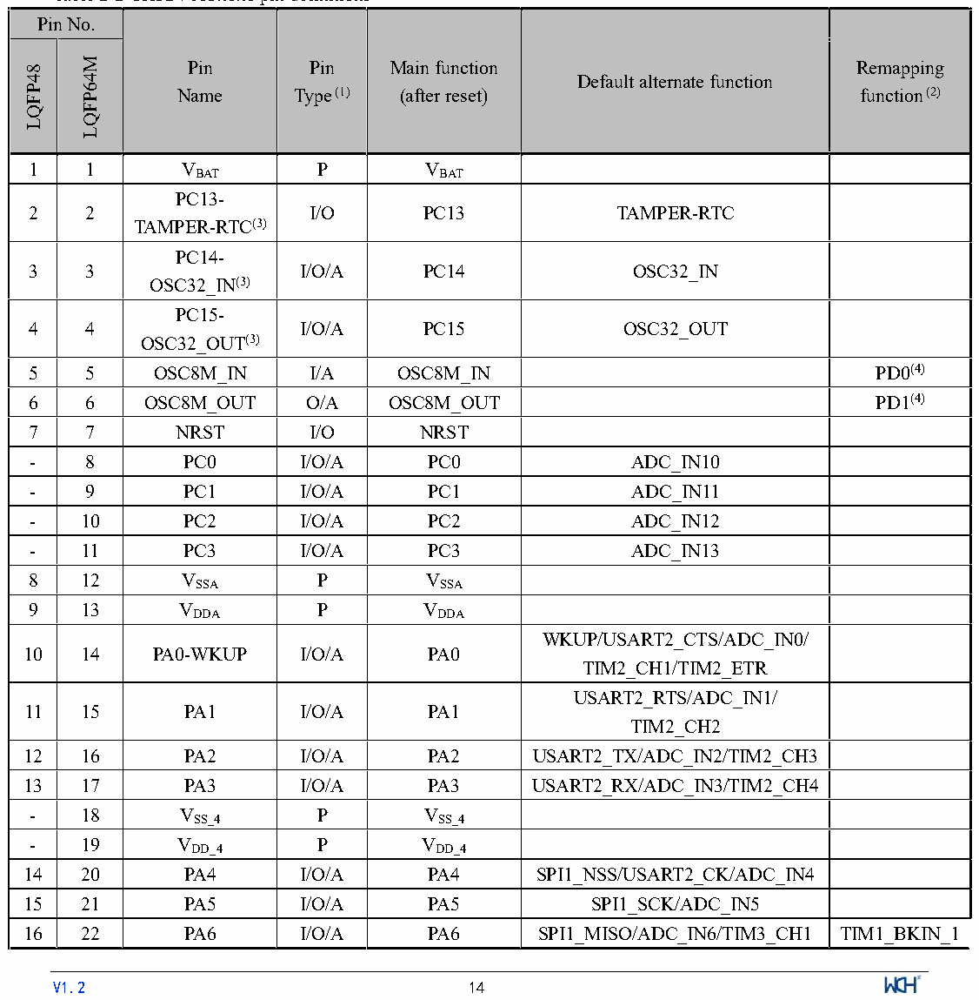

<!-- source-page: 16 -->

[← p.15](0015.md) · [index](../README.md) · [PDF p.16](https://ch32-riscv-ug.github.io/CH32V103/datasheet_en/CH32V103DS0.PDF#page=16) · [p.17 →](0017.md)

<!-- header: CH32V103 Datasheet https://wch-ic.com -->

> ⬆ **Table continued** — rendered in full at [page 15](0015.md). <!-- p16-table-001 -->

 <!-- p16-cluster-01 uncaptioned graphics, rendered from the PDF; verify at https://ch32-riscv-ug.github.io/CH32V103/datasheet_en/CH32V103DS0.PDF#page=16 -->

🖼 Text parsed from the figure above

<!-- p16-table-002 (table-2-2@1) pages 16-18 -->
<table><caption>Table 2-2 CH32V103x6x6 pin definitions</caption><tr><th colspan="2">Pin No.</th><th rowspan="2" style="text-align:left">Pin Name</th><th rowspan="2" style="text-align:left">Pin Type (1)</th><th rowspan="2" style="text-align:left">Main function (after reset)</th><th rowspan="2">Default alternate function</th><th rowspan="2" style="text-align:left">Remapping function (2)</th></tr><tr><td>LQFP48</td><td>LQFP64M</td></tr><tr><td>1</td><td>1</td><td style="text-align:left">VBAT</td><td>P</td><td style="text-align:left">VBAT</td><td></td><td></td></tr><tr><td>2</td><td>2</td><td style="text-align:left">PC13- TAMPER-RTC(3)</td><td>I/O</td><td>PC13</td><td>TAMPER-RTC</td><td></td></tr><tr><td>3</td><td>3</td><td style="text-align:left">PC14- OSC32_IN(3)</td><td>I/O/A</td><td>PC14</td><td>OSC32_IN</td><td></td></tr><tr><td>4</td><td>4</td><td style="text-align:left">PC15- OSC32_OUT(3)</td><td>I/O/A</td><td>PC15</td><td>OSC32_OUT</td><td></td></tr><tr><td>5</td><td>5</td><td>OSC8M_IN</td><td>I/A</td><td>OSC8M_IN</td><td></td><td>PD0(4)</td></tr><tr><td>6</td><td>6</td><td>OSC8M_OUT</td><td>O/A</td><td>OSC8M_OUT</td><td></td><td>PD1(4)</td></tr><tr><td>7</td><td>7</td><td>NRST</td><td>I/O</td><td>NRST</td><td></td><td></td></tr><tr><td>-</td><td>8</td><td>PC0</td><td>I/O/A</td><td>PC0</td><td>ADC_IN10</td><td></td></tr><tr><td>-</td><td>9</td><td>PC1</td><td>I/O/A</td><td>PC1</td><td>ADC_IN11</td><td></td></tr><tr><td>-</td><td>10</td><td>PC2</td><td>I/O/A</td><td>PC2</td><td>ADC_IN12</td><td></td></tr><tr><td>-</td><td>11</td><td>PC3</td><td>I/O/A</td><td>PC3</td><td>ADC_IN13</td><td></td></tr><tr><td>8</td><td>12</td><td style="text-align:left">VSSA</td><td>P</td><td style="text-align:left">VSSA</td><td></td><td></td></tr><tr><td>9</td><td>13</td><td style="text-align:left">VDDA</td><td>P</td><td style="text-align:left">VDDA</td><td></td><td></td></tr><tr><td>10</td><td>14</td><td>PA0-WKUP</td><td>I/O/A</td><td>PA0</td><td style="text-align:left">WKUP/USART2_CTS/ADC_IN0/ TIM2_CH1/TIM2_ETR</td><td></td></tr><tr><td>11</td><td>15</td><td>PA1</td><td>I/O/A</td><td>PA1</td><td style="text-align:left">USART2_RTS/ADC_IN1/ TIM2_CH2</td><td></td></tr><tr><td>12</td><td>16</td><td>PA2</td><td>I/O/A</td><td>PA2</td><td>USART2_TX/ADC_IN2/TIM2_CH3</td><td></td></tr><tr><td>13</td><td>17</td><td>PA3</td><td>I/O/A</td><td>PA3</td><td>USART2_RX/ADC_IN3/TIM2_CH4</td><td></td></tr><tr><td>-</td><td>18</td><td style="text-align:left">VSS_4</td><td>P</td><td style="text-align:left">VSS_4</td><td></td><td></td></tr><tr><td>-</td><td>19</td><td style="text-align:left">VDD_4</td><td>P</td><td style="text-align:left">VDD_4</td><td></td><td></td></tr><tr><td>14</td><td>20</td><td>PA4</td><td>I/O/A</td><td>PA4</td><td>SPI1_NSS/USART2_CK/ADC_IN4</td><td></td></tr><tr><td>15</td><td>21</td><td>PA5</td><td>I/O/A</td><td>PA5</td><td>SPI1_SCK/ADC_IN5</td><td></td></tr><tr><td>16</td><td>22</td><td>PA6</td><td>I/O/A</td><td>PA6</td><td>SPI1_MISO/ADC_IN6/TIM3_CH1</td><td>TIM1_BKIN_1</td></tr><tr><td>17</td><td>23</td><td>PA7</td><td>I/O/A</td><td>PA7</td><td>SPI1_MOSI/ADC_IN7/TIM3_CH2</td><td style="text-align:left">TIM1_CH1N_ 1</td></tr><tr><td>-</td><td>24</td><td>PC4</td><td>I/O/A</td><td>PC4</td><td>ADC_IN14</td><td></td></tr><tr><td>-</td><td>25</td><td>PC5</td><td>I/O/A</td><td>PC5</td><td>ADC_IN15</td><td></td></tr><tr><td>18</td><td>26</td><td>PB0</td><td>I/O/A</td><td>PB0</td><td>ADC_IN8/TIM3_CH3</td><td style="text-align:left">TIM1_CH2N_ 1</td></tr><tr><td>19</td><td>27</td><td>PB1</td><td>I/O/A</td><td>PB1</td><td>ADC_IN9/TIM3_CH4</td><td style="text-align:left">TIM1_CH3N_ 1</td></tr><tr><td>20</td><td>28</td><td>PB2</td><td>I/O</td><td>PB2/BOOT1</td><td></td><td></td></tr><tr><td>21</td><td>29</td><td>PB10</td><td>I/O</td><td>PB10</td><td></td><td>TIM2_CH3_1</td></tr><tr><td>22</td><td>30</td><td>PB11</td><td>I/O</td><td>PB11</td><td></td><td>TIM2_CH4_1</td></tr><tr><td>23</td><td>31</td><td style="text-align:left">VSS_1</td><td>P</td><td style="text-align:left">VSS_1</td><td></td><td></td></tr><tr><td>24</td><td>32</td><td style="text-align:left">VDD_1</td><td>P</td><td style="text-align:left">VDD_1</td><td></td><td></td></tr><tr><td>25</td><td>33</td><td>PB12</td><td>I/O</td><td>PB12</td><td>TIM1_BKIN</td><td></td></tr><tr><td>26</td><td>34</td><td>PB13</td><td>I/O</td><td>PB13</td><td>TIM1_CH1N</td><td></td></tr><tr><td>27</td><td>35</td><td>PB14</td><td>I/O</td><td>PB14</td><td>TIM1_CH2N</td><td></td></tr><tr><td>28</td><td>36</td><td>PB15</td><td>I/O</td><td>PB15</td><td>TIM1_CH3N</td><td></td></tr><tr><td>-</td><td>37</td><td>PC6</td><td>I/O</td><td>PC6</td><td></td><td>TIM3_CH1_1</td></tr><tr><td>-</td><td>38</td><td>PC7</td><td>I/O</td><td>PC7</td><td></td><td>TIM3_CH2_1</td></tr><tr><td>-</td><td>39</td><td>PC8</td><td>I/O</td><td>PC8</td><td></td><td>TIM3_CH3_1</td></tr><tr><td>-</td><td>40</td><td>PC9</td><td>I/O</td><td>PC9</td><td></td><td>TIM3_CH4_1</td></tr><tr><td>29</td><td>41</td><td>PA8</td><td>I/O</td><td>PA8</td><td>USART1_CK/TIM1_CH1/MCO</td><td></td></tr><tr><td>30</td><td>42</td><td>PA9</td><td>I/O</td><td>PA9</td><td>USART1_TX/TIM1_CH2</td><td></td></tr><tr><td>31</td><td>43</td><td>PA10</td><td>I/O</td><td>PA10</td><td>USART1_RX/TIM1_CH3</td><td></td></tr><tr><td>32</td><td>44</td><td>PA11</td><td>I/O/A</td><td>PA11</td><td style="text-align:left">USART1_CTS/USBHDM/TIM1_CH4</td><td></td></tr><tr><td>33</td><td>45</td><td>PA12</td><td>I/O/A</td><td>PA12</td><td style="text-align:left">USART1_RTS/USBHDP/TIM1_ETR</td><td></td></tr><tr><td>34</td><td>46</td><td>PA13</td><td>I/O</td><td>SWDIO</td><td></td><td>PA13(5)</td></tr><tr><td>35</td><td>47</td><td style="text-align:left">VSS_2</td><td>P</td><td style="text-align:left">VSS_2</td><td></td><td></td></tr><tr><td>36</td><td>48</td><td style="text-align:left">VDD_2</td><td>P</td><td style="text-align:left">VDD_2</td><td></td><td></td></tr><tr><td>37</td><td>49</td><td>PA14</td><td>I/O</td><td>SWCLK</td><td></td><td>PA14(5)</td></tr><tr><td>38</td><td>50</td><td>PA15</td><td>I/O</td><td>PA15</td><td></td><td style="text-align:left">TIM2_CH1_1/ TIM2_ETR_1/ SPI1_NSS_1</td></tr><tr><td>-</td><td>51</td><td>PC10</td><td>I/O</td><td>PC10</td><td></td><td></td></tr><tr><td>-</td><td>52</td><td>PC11</td><td>I/O</td><td>PC11</td><td></td><td></td></tr><tr><td>-</td><td>53</td><td>PC12</td><td>I/O</td><td>PC12</td><td></td><td></td></tr><tr><td>-</td><td>54</td><td>PD2</td><td>I/O</td><td>PD2</td><td>TIM3_ETR</td><td></td></tr><tr><td>39</td><td>55</td><td>PB3</td><td>I/O</td><td>PB3</td><td></td><td style="text-align:left">TIM2_CH2_1/ SPI1_SCK_1</td></tr><tr><td>40</td><td>56</td><td>PB4</td><td>I/O</td><td>PB4</td><td></td><td style="text-align:left">TIM3_CH1_1/ SPI1_MISO_1</td></tr><tr><td>41</td><td>57</td><td>PB5</td><td>I/O</td><td>PB5</td><td>I2C1_SMBAI</td><td style="text-align:left">TIM3_CH2_1/ SPI1_MOSI_1</td></tr><tr><td>42</td><td>58</td><td>PB6</td><td>I/O/A</td><td>PB6</td><td>I2C1_SCL</td><td style="text-align:left">USART1_TX_ 1</td></tr><tr><td>43</td><td>59</td><td>PB7</td><td>I/O/A</td><td>PB7</td><td>I2C1_SDA</td><td style="text-align:left">USART1_RX_ 1</td></tr><tr><td>44</td><td>60</td><td>BOOT0</td><td>I</td><td>BOOT0</td><td></td><td></td></tr><tr><td>45</td><td>61</td><td>PB8</td><td>I/O/A</td><td>PB8</td><td></td><td>I2C1_SCL_1</td></tr><tr><td>46</td><td>62</td><td>PB9</td><td>I/O/A</td><td>PB9</td><td></td><td>I2C1_SDA_1</td></tr><tr><td>47</td><td>63</td><td style="text-align:left">VSS_3</td><td>P</td><td style="text-align:left">VSS_3</td><td></td><td></td></tr><tr><td>48</td><td>64</td><td style="text-align:left">VDD_3</td><td>P</td><td style="text-align:left">VDD_3</td><td></td><td></td></tr></table>

1 1 VBAT P VBAT  
<!-- image: p16-draw-image-00001 inside the figure -->
<!-- footer: V1.2 14 -->

