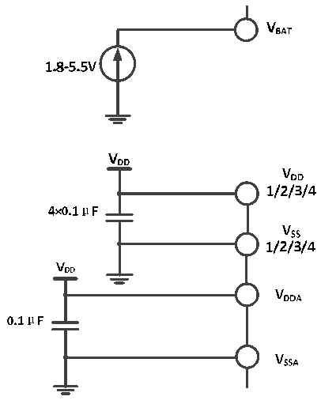

<!-- source-page: 21 -->

[← p.20](0020.md) · [index](../README.md) · [PDF p.21](https://ch32-riscv-ug.github.io/CH32V103/datasheet_en/CH32V103DS0.PDF#page=21) · [p.22 →](0022.md)

<!-- header: CH32V103 Datasheet https://wch-ic.com -->

# Chapter 3 Electrical Characteristics

## 3.1 Test Conditions

Unless otherwise specified and indicated, all voltages are referenced to VSS.  
All minimum and maximum values are guaranteed in the worst conditions of ambient temperature, supply voltage and  
clock frequency. Typical values are based on normal temperature (25℃) and VDD= 3.3V environment, which are given  
only as design guidelines.  
The data based on comprehensive evaluation, design simulation or technology characteristics are not tested in production.  
On the basis of comprehensive evaluation, the minimum and maximum values refer to sample tests. Unless otherwise  
specified that is tested, the characteristic parameters are guaranteed by comprehensive evaluation or design.  
Power supply scheme:  

Figure 3-1 Typical circuit for conventional power supply  
 <!-- rendered from the PDF; verify at https://ch32-riscv-ug.github.io/CH32V103/datasheet_en/CH32V103DS0.PDF#page=21 -->

🖼 Text parsed from the figure above

<!-- image: p21-draw-image-00019 inside the figure -->
<!-- image: p21-draw-image-00020 inside the figure -->
<!-- image: p21-draw-image-00023 inside the figure -->
<!-- image: p21-draw-image-00021 inside the figure -->
<!-- image: p21-draw-image-00025 inside the figure -->
<!-- image: p21-draw-image-00027 inside the figure -->
<!-- image: p21-draw-image-00028 inside the figure -->
<!-- image: p21-draw-image-00024 inside the figure -->
<!-- image: p21-draw-image-00022 inside the figure -->
<!-- image: p21-draw-image-00026 inside the figure -->
<!-- image: p21-draw-image-00007 inside the figure -->
<!-- image: p21-draw-image-00008 inside the figure -->
<!-- image: p21-draw-image-00015 inside the figure -->
<!-- image: p21-draw-image-00016 inside the figure -->
<!-- image: p21-draw-image-00030 inside the figure -->
<!-- image: p21-draw-image-00032 inside the figure -->
<!-- image: p21-draw-image-00034 inside the figure -->
<!-- image: p21-draw-image-00031 inside the figure -->
<!-- image: p21-draw-image-00033 inside the figure -->
<!-- image: p21-draw-image-00029 inside the figure -->
<!-- image: p21-draw-image-00035 inside the figure -->
<!-- image: p21-draw-image-00045 inside the figure -->
<!-- image: p21-draw-image-00043 inside the figure -->
<!-- image: p21-draw-image-00047 inside the figure -->
<!-- image: p21-draw-image-00049 inside the figure -->
<!-- image: p21-draw-image-00048 inside the figure -->
<!-- image: p21-draw-image-00044 inside the figure -->
<!-- image: p21-draw-image-00046 inside the figure -->
<!-- image: p21-draw-image-00017 inside the figure -->
<!-- image: p21-draw-image-00018 inside the figure -->
<!-- image: p21-draw-image-00037 inside the figure -->
<!-- image: p21-draw-image-00039 inside the figure -->
<!-- image: p21-draw-image-00041 inside the figure -->
<!-- image: p21-draw-image-00038 inside the figure -->
<!-- image: p21-draw-image-00040 inside the figure -->
<!-- image: p21-draw-image-00036 inside the figure -->
<!-- image: p21-draw-image-00042 inside the figure -->
<!-- image: p21-draw-image-00009 inside the figure -->
<!-- image: p21-draw-image-00010 inside the figure -->
<!-- image: p21-draw-image-00011 inside the figure -->
<!-- image: p21-draw-image-00012 inside the figure -->
<!-- image: p21-draw-image-00002 inside the figure -->
<!-- image: p21-draw-image-00004 inside the figure -->
<!-- image: p21-draw-image-00006 inside the figure -->
<!-- image: p21-draw-image-00005 inside the figure -->
<!-- image: p21-draw-image-00003 inside the figure -->
<!-- image: p21-draw-image-00013 inside the figure -->
<!-- image: p21-draw-image-00014 inside the figure -->

## 3.2 Absolute Maximum Ratings

Critical or exceeding the absolute maximum value may cause the chip to operate improperly or even be damaged.  

<!-- p21-table-001 (table-3-1@1) pages 21-22 -->
<table><caption>Table 3-1 Absolute maximum ratings</caption><tr><th>Symbol</th><th>Description</th><th>Min.</th><th>Max.</th><th>Unit</th></tr><tr><td style="text-align:left">T (1) A</td><td>Operating ambient temperature</td><td>-40</td><td>85</td><td>℃</td></tr><tr><td style="text-align:left">TS</td><td>Storage ambient temperature</td><td>-40</td><td>105</td><td>℃</td></tr><tr><td style="text-align:left">V -V (1) DD SS</td><td style="text-align:left">External main supply voltage (including V and V ) DDA DD</td><td>-0.3</td><td>5.5</td><td>V</td></tr><tr><td style="text-align:left">V (1) IN</td><td>Input voltage on pins</td><td style="text-align:left">V -0.3SS</td><td>5.5</td><td>V</td></tr><tr><td style="text-align:left">|△V |(1) DDx</td><td>Variations between different power pins</td><td></td><td>50</td><td>mV</td></tr><tr><td style="text-align:left">|V -V |(1) SSx SS</td><td>Variations between different ground pins</td><td></td><td>50</td><td>mV</td></tr><tr><td style="text-align:left">V (1) ESD(HBM)</td><td style="text-align:left">ESD voltage (human body model, non-contact type)</td><td>4000</td><td></td><td>V</td></tr><tr><td style="text-align:left">I (2) VDD</td><td style="text-align:left">Total current into V /V power lines (source) DD DDA</td><td></td><td>50</td><td>mA</td></tr><tr><td style="text-align:left">I (2) Vss</td><td style="text-align:left">Total current out of V ground lines (sink) SS</td><td></td><td>50</td><td rowspan="3"></td></tr><tr><td rowspan="2" style="text-align:left">I (1) IO</td><td>Input current on any I/O and control pin</td><td></td><td>-25</td></tr><tr><td style="text-align:left">Output current on any I/O and control pin</td><td></td><td>25</td></tr></table>

<!-- image: p21-draw-image-00001 bbox=[515.52, 783.36, 535.44, 793.68] -->
<!-- footer: V1.2 19 -->
