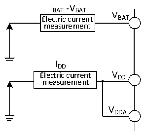

<!-- source-page: 23 -->

[← p.22](0022.md) · [index](../README.md) · [PDF p.23](https://ch32-riscv-ug.github.io/CH32V103/datasheet_en/CH32V103DS0.PDF#page=23) · [p.24 →](0024.md)

<!-- header: CH32V103 Datasheet https://wch-ic.com -->

> ⬆ **Table continued** — rendered in full at [page 22](0022.md). <!-- p23-table-001 -->

<em>Note: 1. Design parameters;</em>  
<em>2. Normal temperature test value.</em>  

### 3.3.3 Built-in Reference Voltage

<!-- p23-table-002 (table-3-5@1) -->
<table><caption>Table 3-5 Built-in reference voltage</caption><tr><th>Symbol</th><th>Parameter</th><th>Condition</th><th>Min.</th><th>Max.</th><th>Unit</th></tr><tr><td style="text-align:left">VREFINT</td><td>Built-in reference voltage</td><td style="text-align:left">T = -40℃ ~ 85℃ A</td><td>1.12</td><td>1.28</td><td>V</td></tr><tr><td style="text-align:left">TS_vrefint</td><td style="text-align:left">ADC sampling time when reading the internal reference voltage</td><td>Slow sampling recommended</td><td>0.107</td><td>17.1</td><td style="text-align:left">1/f ADC</td></tr></table>

### 3.3.4 Supply Current Characteristics

Current consumption is a comprehensive index of a variety of parameters and factors. These parameters and factors  
include operating voltage, ambient temperature, I/O pin load, software configuration of the product, the operating  
frequency, flip rate of the I/O pin, the location of the program in memory and the executed code, etc. The current  
consumption measurement method is as follows:  

Figure 3-2 Current consumption measurement  
 <!-- rendered from the PDF; verify at https://ch32-riscv-ug.github.io/CH32V103/datasheet_en/CH32V103DS0.PDF#page=23 -->

🖼 Text parsed from the figure above

IBAT-VBAT  
V  
Electric current BAT  
measurement  
IDD  
Electric current V DD  
measurement  
VDDA  

The microcontroller is in the following conditions:  
In the case of normal temperature VDD=3.3V, during the test: all IO ports are configured with pull-up input,  
enabling or turning off all peripheral clocks (excluding GPIO peripherals), and no peripheral function is initialized.  
<!-- image: p23-draw-image-00001 bbox=[515.52, 783.36, 535.44, 793.68] -->
<!-- footer: V1.2 21 -->
