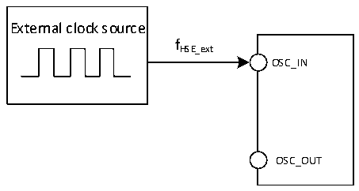
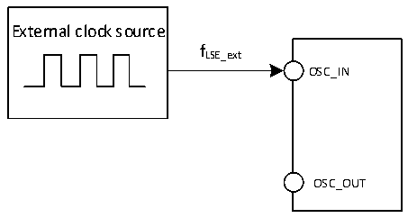

<!-- source-page: 26 -->

[← p.25](0025.md) · [index](../README.md) · [PDF p.26](https://ch32-riscv-ug.github.io/CH32V103/datasheet_en/CH32V103DS0.PDF#page=26) · [p.27 →](0027.md)

<!-- header: CH32V103 Datasheet https://wch-ic.com -->

> ⬆ **Table continued** — rendered in full at [page 25](0025.md). <!-- p26-table-001 -->

<em>Note: The above are measured parameters.</em>  

### 3.3.5 External Clock Source Characteristics

<!-- p26-table-002 (table-3-9@1) -->
<table><caption>Table 3-9 From external high-speed clock</caption><tr><th>Symbol</th><th>Parameter</th><th>Condition</th><th>Min.</th><th>Typ.</th><th>Max.</th><th>Unit</th></tr><tr><td style="text-align:left">FHSE_ext</td><td>External clock frequency</td><td></td><td></td><td>8</td><td>25</td><td>MHz</td></tr><tr><td style="text-align:left">V (1) HSEH</td><td>OSC_IN input pin high level voltage</td><td></td><td style="text-align:left">0.8VDD</td><td></td><td style="text-align:left">VDD</td><td>V</td></tr><tr><td style="text-align:left">V (1) HSEL</td><td>OSC_IN input pin low level voltage</td><td></td><td>0</td><td></td><td style="text-align:left">0.2VDD</td><td>V</td></tr><tr><td style="text-align:left">C in(HSE)</td><td>OSC_IN input capacitance</td><td></td><td></td><td>5</td><td></td><td>pF</td></tr><tr><td style="text-align:left">DuCy (HSE)</td><td>Duty Cycle</td><td></td><td></td><td>50</td><td></td><td>%</td></tr></table>

<em>Note 1: Failure to meet this condition may cause a level recognition error.</em>  

Figure 3-3 Externally provided high frequency clock source circuit  
 <!-- rendered from the PDF; verify at https://ch32-riscv-ug.github.io/CH32V103/datasheet_en/CH32V103DS0.PDF#page=26 -->

🖼 Text parsed from the figure above

External clock source  
fHSE_ext  
OSC_IN  
OSC_OUT  

<!-- p26-table-003 (table-3-10@1) -->
<table><caption>Table 3-10 From external low-speed clock</caption><tr><th>Symbol</th><th>Parameter</th><th>Condition</th><th>Min.</th><th>Typ.</th><th>Max.</th><th>Unit</th></tr><tr><td style="text-align:left">FLSE_ext</td><td>User external clock frequency</td><td></td><td></td><td>32.768</td><td>1000</td><td>KHz</td></tr><tr><td style="text-align:left">VLSEH</td><td style="text-align:left">OSC32_IN input pin high level voltage</td><td></td><td style="text-align:left">0.8VDD</td><td></td><td style="text-align:left">VDD</td><td>V</td></tr><tr><td style="text-align:left">VLSEL</td><td>OSC32_IN input pin low voltage</td><td></td><td>0</td><td></td><td style="text-align:left">0.2VDD</td><td>V</td></tr><tr><td style="text-align:left">C in(LSE)</td><td>OSC32_IN input capacitance</td><td></td><td></td><td>5</td><td></td><td>pF</td></tr><tr><td style="text-align:left">DuCy (LSE)</td><td>Duty cycle</td><td></td><td></td><td>50</td><td></td><td>%</td></tr></table>

Figure 3-4 Externally provided low frequency clock source circuit  
 <!-- rendered from the PDF; verify at https://ch32-riscv-ug.github.io/CH32V103/datasheet_en/CH32V103DS0.PDF#page=26 -->

🖼 Text parsed from the figure above

External clock source  
fLSE_ext  
OSC_IN  
OSC_OUT  

<!-- image: p26-draw-image-00001 bbox=[515.52, 783.36, 535.44, 793.68] -->
<!-- footer: V1.2 24 -->
