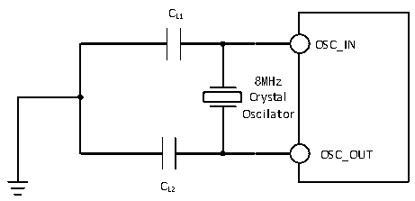
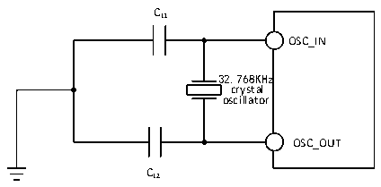

<!-- source-page: 27 -->

[← p.26](0026.md) · [index](../README.md) · [PDF p.27](https://ch32-riscv-ug.github.io/CH32V103/datasheet_en/CH32V103DS0.PDF#page=27) · [p.28 →](0028.md)

<!-- header: CH32V103 Datasheet https://wch-ic.com -->

<!-- p27-table-001 (table-3-11@1) -->
<table><caption>Table 3-11 High-Speed external clocks generated using one crystal/ceramic resonator</caption><tr><th>Symbol</th><th>Parameter</th><th>Condition</th><th>Min.</th><th>Typ.</th><th>Max.</th><th>Unit</th></tr><tr><td style="text-align:left">FOSC_IN</td><td>Resonator frequency</td><td></td><td>4</td><td>8</td><td>16</td><td>MHz</td></tr><tr><td style="text-align:left">I (1) 2</td><td>HSE drive current</td><td style="text-align:left">V = 3.3V, 20p load DD</td><td></td><td>0.2</td><td></td><td>mA</td></tr><tr><td style="text-align:left">g (1) m</td><td>Oscillator transconductance</td><td>Startup</td><td></td><td>4.6</td><td></td><td>mA/V</td></tr><tr><td style="text-align:left">t SU(HSE)</td><td>Startup time</td><td style="text-align:left">V stabilization DD</td><td></td><td>1</td><td>2</td><td>ms</td></tr></table>

<em>Note: 1. Design parameters</em>  
Circuit reference design and requirements:  
The load capacitance of the crystal is generally 20pF (CL1=CL2, recommended 5~25pF). Please refer to the  
manufacturer&#x27;s data manual of the crystal used.  

Figure 3-5 Typical circuit for external 8M crystal  
 <!-- rendered from the PDF; verify at https://ch32-riscv-ug.github.io/CH32V103/datasheet_en/CH32V103DS0.PDF#page=27 -->

🖼 Text parsed from the figure above

CL1  
OSC_IN  
8MHz  
Crystal  
Oscillator  
OSC_OUT  
CL2  

<!-- p27-table-002 (table-3-12@1) -->
<table><caption>Table 3-12 Low-speed external clocks generated using a crystal/ceramic resonator (fLSE=32.768KHz)</caption><tr><th>Symbol</th><th>Parameter</th><th>Condition</th><th>Min.</th><th>Typ.</th><th>Max.</th><th>Unit</th></tr><tr><td style="text-align:left">I (1) 2</td><td>LSE drive current</td><td style="text-align:left">V = 3.3VDD</td><td></td><td>0.5</td><td></td><td>uA</td></tr><tr><td style="text-align:left">g (1) m</td><td>Oscillator transconductance</td><td>Startup</td><td></td><td>13.5</td><td></td><td>uA/V</td></tr><tr><td style="text-align:left">t SU(LSE)</td><td>Startup time</td><td style="text-align:left">V stabilization DD</td><td></td><td>200</td><td>500</td><td>mS</td></tr></table>

<em>Note: 1. Design parameters</em>  
Circuit reference design and requirements:  
The load capacitance of the crystal generally does not exceed 15pF (CL1=CL2, recommended 5~15pF). In practice,  
please refer to the manufacturer&#x27;s data manual of the crystal used.  

Figure 3-6 Typical Circuit for External 32.768K Crystal  
 <!-- rendered from the PDF; verify at https://ch32-riscv-ug.github.io/CH32V103/datasheet_en/CH32V103DS0.PDF#page=27 -->

🖼 Text parsed from the figure above

CL1  
OSC_IN  
32.768KHz  
crystal  
oscillator  
OSC_OUT  
CL2  

<em>Note: The load capacitance CL is calculated by the following formula: CL = CL1 × CL2 / (CL1 + CL2) + Cstray,</em>  
<em>where Cstray is the capacitance of the pins and the capacitance associated with the PCB board or PCB, and its</em>  
<em>typical value is between 2pF and 7pF.</em>  
<!-- image: p27-draw-image-00001 bbox=[515.52, 783.36, 535.44, 793.68] -->
<!-- footer: V1.2 25 -->
