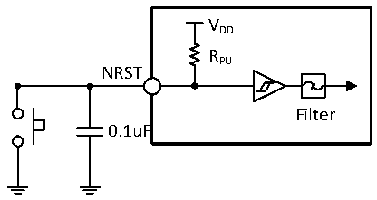

<!-- source-page: 31 -->

[← p.30](0030.md) · [index](../README.md) · [PDF p.31](https://ch32-riscv-ug.github.io/CH32V103/datasheet_en/CH32V103DS0.PDF#page=31) · [p.32 →](0032.md)

<!-- header: CH32V103 Datasheet https://wch-ic.com -->

### 3.3.11 NRST Pin Characteristics

<!-- p31-table-001 (table-3-22@1) -->
<table><caption>Table 3-22 External reset pin characteristics</caption><tr><th>Symbol</th><th>Parameter</th><th>Condition</th><th>Min.</th><th>Typ.</th><th>Max.</th><th>Unit</th></tr><tr><td style="text-align:left">V (1) IL(NRST)</td><td>NRST input low level voltage</td><td></td><td>-0.3</td><td></td><td>0.8</td><td>V</td></tr><tr><td style="text-align:left">V (1) IH(NRST)</td><td>NRST input high level voltage</td><td></td><td style="text-align:left">0.65VDD</td><td></td><td style="text-align:left">V +0.5DD</td><td>V</td></tr><tr><td style="text-align:left">V hys(NRST)</td><td>NRST Schmitt trigger voltage hysteresis</td><td></td><td></td><td>330</td><td></td><td>mV</td></tr><tr><td style="text-align:left">R (2) PU</td><td>Weak pull-up equivalent resistance</td><td></td><td>30</td><td>42</td><td>55</td><td>KΩ</td></tr><tr><td style="text-align:left">T (1) F(NRST)</td><td style="text-align:left">NRST input can be filtered for pulse width</td><td></td><td></td><td></td><td>4</td><td>ns</td></tr><tr><td style="text-align:left">T (1) NF(NRST)</td><td style="text-align:left">NRST input cannot be filtered pulse width</td><td></td><td>20</td><td></td><td></td><td>ns</td></tr></table>

<em>Note:</em>  
<em>1. Design parameters;</em>  
<em>2. The pull-up resistor is a real resistor in series with a switchable PMOS implementation. The resistance of this</em>  
<em>PMOS/NMOS switch is very small (about 10%).</em>  
Circuit reference design and requirements:  

Figure 3-7 Typical circuit of external reset pin  
 <!-- rendered from the PDF; verify at https://ch32-riscv-ug.github.io/CH32V103/datasheet_en/CH32V103DS0.PDF#page=31 -->

🖼 Text parsed from the figure above

VDD  
RPU  
NRST  
Filter  
0.1uF  

### 3.3.12 TIM Timer Characteristics

<!-- p31-table-002 (table-3-23@1) -->
<table><caption>Table 3-23 TIMx characteristics</caption><tr><th>Symbol</th><th>Parameter</th><th>Condition</th><th>Min.</th><th>Max.</th><th>Unit</th></tr><tr><td rowspan="2" style="text-align:left">t res(TIM)</td><td rowspan="2">Timer reference clock</td><td></td><td>1</td><td></td><td style="text-align:left">t TIMxCLK</td></tr><tr><td style="text-align:left">f = 72MHz TIMxCLK</td><td>13.9</td><td></td><td>ns</td></tr><tr><td rowspan="2" style="text-align:left">FEXT</td><td rowspan="2" style="text-align:left">Timer external clock frequency on CH1 to CH4</td><td></td><td>0</td><td style="text-align:left">f /2TIMxCLK</td><td>MHz</td></tr><tr><td style="text-align:left">f = 72MHz TIMxCLK</td><td>0</td><td>36</td><td>MHz</td></tr><tr><td style="text-align:left">R esTIM</td><td>Timer resolution</td><td></td><td></td><td>16</td><td>位</td></tr><tr><td rowspan="2" style="text-align:left">t COUNTER</td><td rowspan="2" style="text-align:left">16-bit counter clock cycle when the internal clock is selected</td><td></td><td>1</td><td>65536</td><td style="text-align:left">t TIMxCLK</td></tr><tr><td style="text-align:left">f = 72MHz TIMxCLK</td><td>0.0139</td><td>910</td><td>us</td></tr><tr><td rowspan="2" style="text-align:left">t MAX_COUNT</td><td rowspan="2">Maximum possible count</td><td></td><td></td><td>65535</td><td style="text-align:left">t TIMxCLK</td></tr><tr><td style="text-align:left">f = 72MHz TIMxCLK</td><td></td><td>59.6</td><td>s</td></tr></table>

<em>Note: All of the above are guaranteed by design parameters.</em>  
<!-- image: p31-draw-image-00001 bbox=[515.52, 783.36, 535.44, 793.68] -->
<!-- footer: V1.2 29 -->
