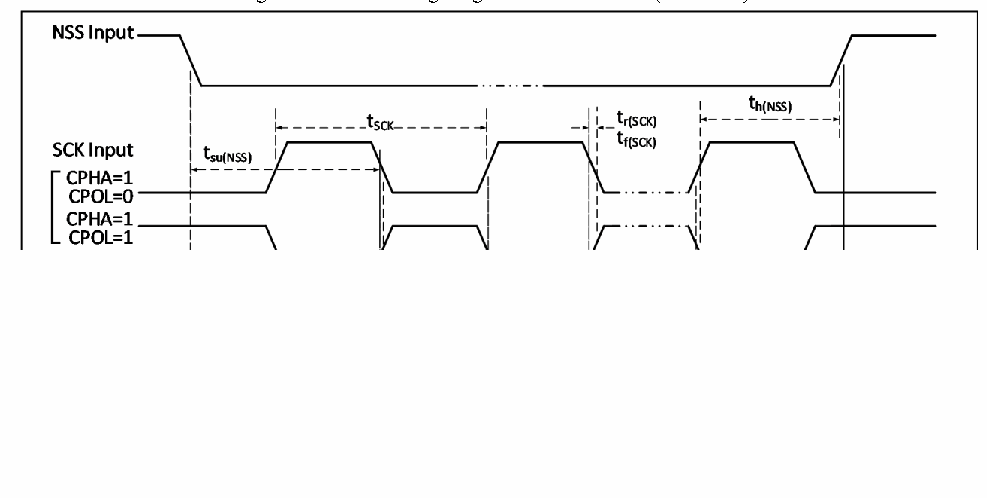

<!-- source-page: 34 -->

[← p.33](0033.md) · [index](../README.md) · [PDF p.34](https://ch32-riscv-ug.github.io/CH32V103/datasheet_en/CH32V103DS0.PDF#page=34) · [p.35 →](0035.md)

<!-- header: CH32V103 Datasheet https://wch-ic.com -->

Figure 3-11 SPI timing diagram in Slave mode (CPHA=1)  
 <!-- rendered from the PDF; verify at https://ch32-riscv-ug.github.io/CH32V103/datasheet_en/CH32V103DS0.PDF#page=34 -->

🖼 Text parsed from the figure above

<!-- image: p34-draw-image-00002 inside the figure -->
<!-- image: p34-draw-image-00003 inside the figure -->

<!-- p34-table-001 (table-3-25@1) -->
<table><caption>Table 3-25 SPI interface characteristics</caption><tr><th>Symbol</th><th>Parameter</th><th>Condition</th><th>Min.</th><th>Max.</th><th>Unit</th></tr><tr><td rowspan="2" style="text-align:left">f /t SCK SCK</td><td rowspan="2">SPI clock frequency</td><td>Master mode</td><td></td><td>36</td><td>MHz</td></tr><tr><td>Slave mode</td><td></td><td>36</td><td>MHz</td></tr><tr><td style="text-align:left">t /t r(SCK) f(SCK)</td><td>SPI clock rise and fall time</td><td>Load capacitance: C = 30pF</td><td></td><td>20</td><td>ns</td></tr><tr><td style="text-align:left">t SU(NSS)</td><td>NSS setup time</td><td>Slave mode</td><td style="text-align:left">2t HCLK</td><td></td><td>ns</td></tr><tr><td style="text-align:left">t h(NSS)</td><td>NSS hold time</td><td>Slave mode</td><td style="text-align:left">2t HCLK</td><td></td><td>ns</td></tr><tr><td style="text-align:left">t /t w(SCKH) w(SCKL)</td><td style="text-align:left">SCK high-level and low-level time</td><td style="text-align:left">Master mode, f = 36MHz, PCLK Prescaler factor = 4</td><td>40</td><td>60</td><td>ns</td></tr><tr><td style="text-align:left">t SU(MI)</td><td rowspan="2">Data input setup time</td><td>Master mode</td><td>5</td><td></td><td>ns</td></tr><tr><td style="text-align:left">t SU(SI)</td><td>Slave mode</td><td>5</td><td></td><td>ns</td></tr><tr><td style="text-align:left">t h(MI)</td><td rowspan="2">Data input hold time</td><td>Master mode</td><td>5</td><td></td><td>ns</td></tr><tr><td style="text-align:left">t h(SI)</td><td>Slave mode</td><td>4</td><td></td><td>ns</td></tr><tr><td style="text-align:left">t a(SO)</td><td>Data output access time</td><td style="text-align:left">Slave mode, f = 20MHz PCLK</td><td>0</td><td style="text-align:left">1t HCLK</td><td>ns</td></tr><tr><td style="text-align:left">t dis(SO)</td><td>Data output disable time</td><td>Slave mode</td><td>0</td><td>10</td><td>ns</td></tr><tr><td style="text-align:left">t V(SO)</td><td rowspan="2">Data output valid time</td><td>Slave mode (After enable edge)</td><td></td><td>25</td><td>ns</td></tr><tr><td style="text-align:left">t V(MO)</td><td>Master mode (After enable edge)</td><td></td><td>5</td><td>ns</td></tr><tr><td style="text-align:left">t h(SO)</td><td rowspan="2">Data output hold time</td><td>Slave mode (After enable edge)</td><td>15</td><td></td><td>ns</td></tr><tr><td style="text-align:left">t h(MO)</td><td>Master mode (After enable edge)</td><td>0</td><td></td><td>ns</td></tr></table>

### 3.3.15 USB Interface Characteristics

<!-- p34-table-002 (table-3-26@1) pages 34-35 -->
<table><caption>Table 3-26 USB interface I/O characteristics</caption><tr><th>Symbol</th><th>Parameter</th><th>Condition</th><th>Min.</th><th>Max.</th><th>Unit</th></tr><tr><td rowspan="2" style="text-align:left">VDD</td><td rowspan="2">USB operating voltage</td><td style="text-align:left">Not enable USB5VSEL control bit</td><td>3.0</td><td>3.6</td><td rowspan="2">V</td></tr><tr><td>Enable USB5VSEL control bit</td><td>4.2</td><td>5.5</td></tr><tr><td rowspan="2" style="text-align:left">V (1) SE</td><td rowspan="2">USB operating voltage</td><td style="text-align:left">V = 3.3VDD</td><td>1.2</td><td>1.9</td><td rowspan="2">V</td></tr><tr><td style="text-align:left">V = 5VDD</td><td>1.2</td><td>2</td></tr><tr><td style="text-align:left">VOL</td><td>Static output low level</td><td></td><td></td><td>0.3</td><td>V</td></tr><tr><td style="text-align:left">VOH</td><td>Static output high level</td><td></td><td>2.8</td><td>3.6</td><td>V</td></tr></table>

<!-- image: p34-draw-image-00001 bbox=[515.52, 783.36, 535.44, 793.68] -->
<!-- footer: V1.2 32 -->
