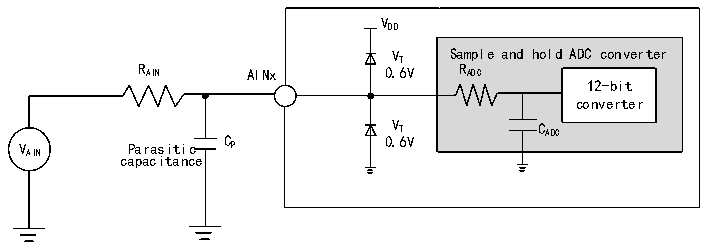
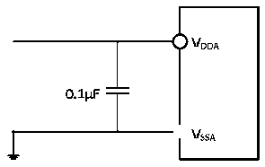

<!-- source-page: 36 -->

[← p.35](0035.md) · [index](../README.md) · [PDF p.36](https://ch32-riscv-ug.github.io/CH32V103/datasheet_en/CH32V103DS0.PDF#page=36) · [p.37 →](0037.md)

<!-- header: CH32V103 Datasheet https://wch-ic.com -->

> ⬆ **Table continued** — rendered in full at [page 35](0035.md). <!-- p36-table-001 -->

<em>Note: The above are guaranteed design parameters.</em>  
Cp indicates the parasitic capacitance on the PCB and pads (about 5pF), which may be related to the quality of the  
pads and PCB layout. Larger values of Cp will reduce the conversion accuracy and the solution is to reduce the fADC  
value.  

Figure 3-12 ADC typical connection diagram  
 <!-- rendered from the PDF; verify at https://ch32-riscv-ug.github.io/CH32V103/datasheet_en/CH32V103DS0.PDF#page=36 -->

🖼 Text parsed from the figure above

V  
DD  
V Sample and hold ADC converter  
T  
R AIN AINx 0.6V R ADC  
12-bit  
converter  
V Parasitic C P 0 V . T 6V C ADC  
AIN capacitance  

Figure 3-13 Analog power supply and decoupling circuit reference  
 <!-- rendered from the PDF; verify at https://ch32-riscv-ug.github.io/CH32V103/datasheet_en/CH32V103DS0.PDF#page=36 -->

🖼 Text parsed from the figure above

<!-- image: p36-draw-image-00002 inside the figure -->
<!-- image: p36-draw-image-00003 inside the figure -->
<!-- image: p36-draw-image-00006 inside the figure -->
<!-- image: p36-draw-image-00008 inside the figure -->
<!-- image: p36-draw-image-00010 inside the figure -->
<!-- image: p36-draw-image-00009 inside the figure -->
<!-- image: p36-draw-image-00007 inside the figure -->
<!-- image: p36-draw-image-00004 inside the figure -->
<!-- image: p36-draw-image-00005 inside the figure -->

### 3.3.17 TS Characteristics

<!-- p36-table-002 (table-3-29@1) -->
<table><caption>Table 3-29 TS characteristics</caption><tr><th>Symbol</th><th>Parameter</th><th>Condition</th><th>Min.</th><th>Typ.</th><th>Max.</th><th>Unit</th></tr><tr><td>Avg_Slope</td><td>Average slope</td><td></td><td>3.3</td><td>4.3</td><td>5.3</td><td>mV/℃</td></tr><tr><td style="text-align:left">V25</td><td>Voltage at 25°C</td><td></td><td>1.1</td><td>1.34</td><td>1.6</td><td>V</td></tr><tr><td style="text-align:left">TS_temp</td><td style="text-align:left">ADC sampling time when reading temperature</td><td style="text-align:left">f = 14MHz ADC</td><td></td><td></td><td>17.1</td><td>us</td></tr></table>

<em>Note: The above are guaranteed design parameters.</em>  

### 3.3.18 Touch-key Characteristics

<!-- p36-table-003 (table-3-30@1) -->
<table><caption>Table 3-30 Touch-key characteristics</caption><tr><th>Symbol</th><th>Parameter</th><th>Condition</th><th>Min.</th><th>Typ.</th><th>Max.</th><th>Unit</th></tr><tr><td style="text-align:left">ITKey</td><td>Module operating mode</td><td style="text-align:left">V =3.3VDD</td><td>211</td><td>270</td><td>421</td><td>uA</td></tr></table>

<!-- image: p36-draw-image-00001 bbox=[515.52, 783.36, 535.44, 793.68] -->
<!-- footer: V1.2 34 -->
