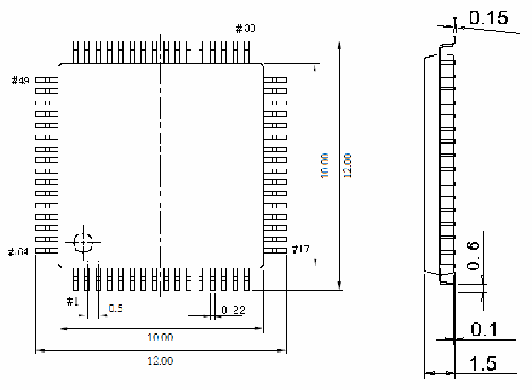
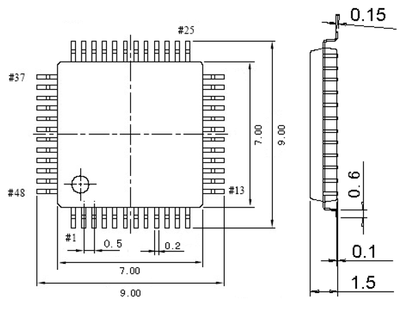

<!-- source-page: 38 -->

[← p.37](0037.md) · [index](../README.md) · [PDF p.38](https://ch32-riscv-ug.github.io/CH32V103/datasheet_en/CH32V103DS0.PDF#page=38) · [p.39 →](0039.md)

<!-- header: CH32V103 Datasheet https://wch-ic.com -->
<em>Note: All dimensions are in millimeters. The pin center spacing values are nominal values, with no error. Other than</em>  
<em>that, the dimensional error is not greater than the greater of ±0.2mm or 10%.</em>  

Figure 4-1 LQFP64M package  
 <!-- rendered from the PDF; verify at https://ch32-riscv-ug.github.io/CH32V103/datasheet_en/CH32V103DS0.PDF#page=38 -->

🖼 Text parsed from the figure above

<!-- image: p38-draw-image-00002 inside the figure -->

Figure 4-2 LQFP48 package  
 <!-- rendered from the PDF; verify at https://ch32-riscv-ug.github.io/CH32V103/datasheet_en/CH32V103DS0.PDF#page=38 -->

🖼 Text parsed from the figure above

<!-- image: p38-draw-image-00003 inside the figure -->

<!-- image: p38-draw-image-00001 bbox=[515.52, 783.36, 535.44, 793.68] -->
<!-- footer: V1.2 36 -->
