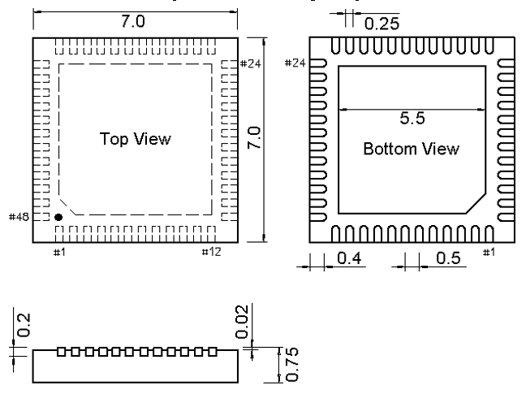

<!-- source-page: 39 -->

[← p.38](0038.md) · [index](../README.md) · [PDF p.39](https://ch32-riscv-ug.github.io/CH32V103/datasheet_en/CH32V103DS0.PDF#page=39) · [p.40 →](0040.md)

<!-- header: CH32V103 Datasheet https://wch-ic.com -->

Figure 4-3 QFN48×7 package  
 <!-- rendered from the PDF; verify at https://ch32-riscv-ug.github.io/CH32V103/datasheet_en/CH32V103DS0.PDF#page=39 -->

🖼 Text parsed from the figure above

<!-- image: p39-draw-image-00002 inside the figure -->

<!-- image: p39-draw-image-00001 bbox=[515.52, 783.36, 535.44, 793.68] -->
<!-- footer: V1.2 37 -->
