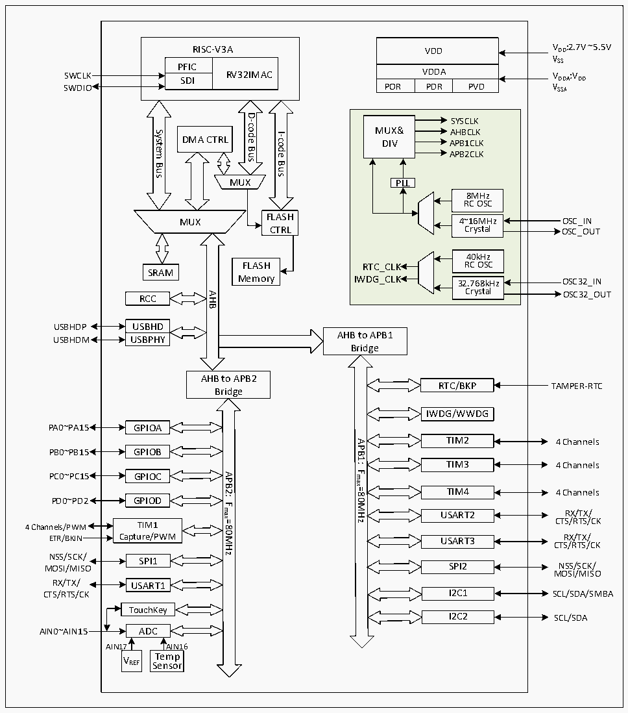

<!-- source-page: 3 -->

[← p.2](0002.md) · [index](../README.md) · [PDF p.3](https://ch32-riscv-ug.github.io/CH32V103/datasheet_zh/CH32V103DS0.PDF#page=3) · [p.4 →](0004.md)

<!-- header: CH32V103数据手册 http://wch.cn -->

## 1.2 系统架构

CH32V103 系列产品是基于青稞 RISC-V3A 处理器设计的通用微控制器，其架构中的内核、仲裁单  
元、DMA模块、SRAM存储等部分通过多组总线实现交互。内核采用流水线处理结构，设置了静态分支  
预测、指令预取机制，实现系统低功耗、低成本、高速运行的最佳性能比。控制器中设有通用DMA控  
制器以减轻CPU负担、提高效率，时钟树分级管理降低了外设总的运行功耗，同时兼有数据保护机制，  
时钟安全系统保护机制等措施来增加系统稳定性。  
下图是系列产品内部架构框图。  

图1-1 系统框图  
 <!-- rendered from the PDF; verify at https://ch32-riscv-ug.github.io/CH32V103/datasheet_zh/CH32V103DS0.PDF#page=3 -->

🖼 Text parsed from the figure above

VDD  VDDA  POR  VDDAPDR  PVD  
VDD VDD:2.7V ~5.5V  
RISC-V3A  
VSS  
PFICSDI  RV32IMAC  SDI  
VDDA VDDA:VDD  
SWDIO  
D-code  
SYSCLK MUX&amp; AHBCLK DIV APB1CLKAPB2CLKPLL8MHz RC OSC4~16MHz Crystal 40kHz RTC_CLK RC OSCIWDG_CLK32.768kHz Crystal  
System  
I-code  
DMA CTRL  
Bus  
Bus  
Bus  
MUX  
8MHz RC OSC  4~16MHz Crystal  
FLASH  
MUX  
Crystal OSC_OUT  
CTRL  
FLASH  
SRAM  
Memory  
Crystal OSC32_OUT  
AHB  
RCC  
USBHD  UUSSBBPHHDY  
USBHDP  
AHB to APB1  
USBHDM USBPHY  
Bridge  
AHB to APB2  
RTC/BKP  
TAMPER-RTC  
Bridge  
IWDG/WWDG  
PA0~PA15 GPIOA  
TIM2  
4 Channels  
APB1:  
PB0~PB15 GPIOB  
TIM3  
4 Channels  
Fmax=80MHz  
APB2:  
PC0~PC15 GPIOC  
TIM4  
4 Channels  
PD0~PD2 GPIOD  
Fmax=80MHz  
RX/TX/  
USART2  
CTS/RTS/CK  
4 Channels/PWM TIM1  
ETR/BKIN Capture/PWM  
RX/TX/  
USART3  
CTS/RTS/CK  
NSS/SCK/  
SPI1  
NSS/SCK/  
SPI2  
MOSI/MISO  
MOSI/MISO  
RX/TX/ USART1  
I2C1  
SCL/SDA/SMBA  
CTS/RTS/CK  
TouchKey  
I2C2  
SCL/SDA  
AIN0~AIN15 ADC  
AIN17 AIN16  
T  
e  
m  
p  
VREF  
S  
e  
n  
so  
r  

<!-- image: p3-draw-image-00001 bbox=[507.72, 779.28, 527.16, 789.6] -->
<!-- footer: V1.2 2 -->
