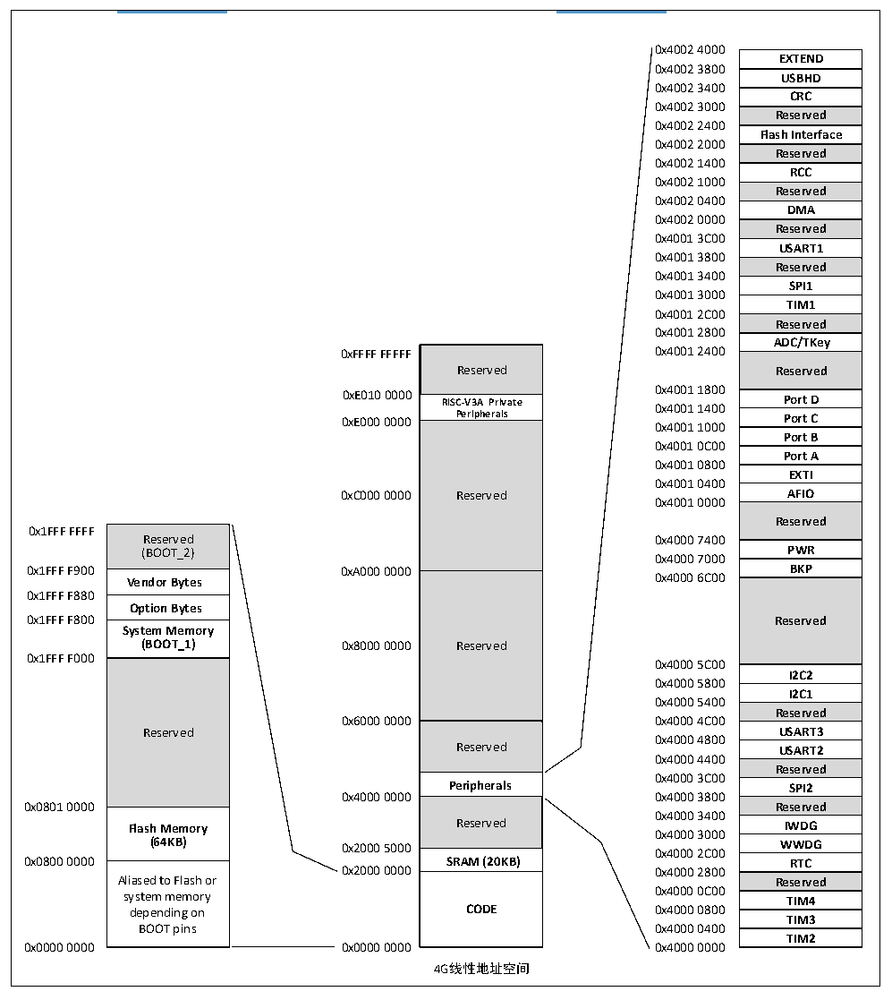

<!-- source-page: 4 -->

[← p.3](0003.md) · [index](../README.md) · [PDF p.4](https://ch32-riscv-ug.github.io/CH32V103/datasheet_zh/CH32V103DS0.PDF#page=4) · [p.5 →](0005.md)

<!-- header: CH32V103数据手册 http://wch.cn -->

## 1.3 存储器映射表

图1-2 存储器地址映射  
 <!-- rendered from the PDF; verify at https://ch32-riscv-ug.github.io/CH32V103/datasheet_zh/CH32V103DS0.PDF#page=4 -->

🖼 Text parsed from the figure above

<!-- image: p4-draw-image-00002 inside the figure -->
<!-- image: p4-draw-image-00003 inside the figure -->
0x4002 4000  
EXTEND  USBHD  CRC  Reserved  Flash Interface  Reserved  RCC  Reserved  DMA  Reserved  USART1  Reserved  SPI1  TIM1  Reserved  ADC/TKey  Reserved  Port D  Port C  Port B  Port A  EXTI  AFIO  Reserved  PWR  BKP  Reserved  I2C2  I2C1  Reserved  USART3  USART2  Reserved  Reserved SPI2  Reserved  IWDG  WWDG  WWDGRTC  Reserved  TIM4  TIM3  TIM2  
0x4002 3800  
<!-- image: p4-draw-image-00004 inside the figure -->
0x4002 3400  
<!-- image: p4-draw-image-00005 inside the figure -->
0x4002 3000  
0x4002 2400  
<!-- image: p4-draw-image-00006 inside the figure -->
0x4002 2000  
<!-- image: p4-draw-image-00007 inside the figure -->
0x4002 1400  
0x4002 1000  
<!-- image: p4-draw-image-00008 inside the figure -->
0x4002 0400  
0x4002 0000  
<!-- image: p4-draw-image-00009 inside the figure -->
0x4001 3C00  
<!-- image: p4-draw-image-00010 inside the figure -->
0x4001 3800  
0x4001 3400  
<!-- image: p4-draw-image-00011 inside the figure -->
0x4001 3000  
<!-- image: p4-draw-image-00012 inside the figure -->
0x4001 2C00  
0x4001 2800  
<!-- image: p4-draw-image-00013 inside the figure -->
Reserved  RISC-V3A Private Peripherals  Reserved  Reserved  Reserved  Peripherals  Reserved  SRAM (20KB)  CODE  
<!-- image: p4-draw-image-00014 inside the figure -->
<strong>Reserved Reserved</strong>  
0xE010 0000 RISC-V3A Private 0 0 x x 4 4 0 0 0 0 1 1 1 1 8 4 0 0 0 0 Port D  
<!-- image: p4-draw-image-00015 inside the figure -->
0xE000 0000 Peripherals 0x4001 1000 Port C  
<!-- image: p4-draw-image-00016 inside the figure -->
0x4001 0C00  
<!-- image: p4-draw-image-00017 inside the figure -->
0x4001 0800  
0x4001 0400  
<!-- image: p4-draw-image-00018 inside the figure -->
0xC000 0000 Reserved AFIO  
0x4001 0000  
<!-- image: p4-draw-image-00019 inside the figure -->
Reserved (BOOT_2)  Vendor Bytes  Option Bytes  System Memory (BOOT_1)  Reserved  Flash Memory (64KB)  Aliased to Flash or system memory depending on BOOT pins  
0x1FFF FFFF  
<!-- image: p4-draw-image-00020 inside the figure -->
0x4000 7000  
0x1FFF F900 0xA000 0000 BKP  
<!-- image: p4-draw-image-00021 inside the figure -->
0x1FFF F880  
<!-- image: p4-draw-image-00022 inside the figure -->
<!-- image: p4-draw-image-00023 inside the figure -->
(BOOT_1) 0x8000 0000 Reserved  
0x1FFF F000  
<!-- image: p4-draw-image-00024 inside the figure -->
0x4000 5C00  
0x4000 5800  
<!-- image: p4-draw-image-00025 inside the figure -->
0x4000 5400  
<!-- image: p4-draw-image-00026 inside the figure -->
0x4000 4800  
Reserved USART2  
<!-- image: p4-draw-image-00027 inside the figure -->
0x4000 4400  
0x4000 3C00  
<!-- image: p4-draw-image-00028 inside the figure -->
Peripherals SPI2  
<!-- image: p4-draw-image-00029 inside the figure -->
0x4000 3400  
0x4000 3000  
<!-- image: p4-draw-image-00030 inside the figure -->
0x0800 0000 SRAM (20KB) RTC  
<!-- image: p4-draw-image-00031 inside the figure -->
<!-- image: p4-draw-image-00032 inside the figure -->
<!-- image: p4-draw-image-00033 inside the figure -->
0x0000 0000 0x0000 0000 0x4000 0000  
<!-- image: p4-draw-image-00034 inside the figure -->
4G线性地址空间  
<!-- image: p4-draw-image-00035 inside the figure -->

<!-- image: p4-draw-image-00001 bbox=[507.72, 779.28, 527.16, 789.6] -->
<!-- footer: V1.2 3 -->
