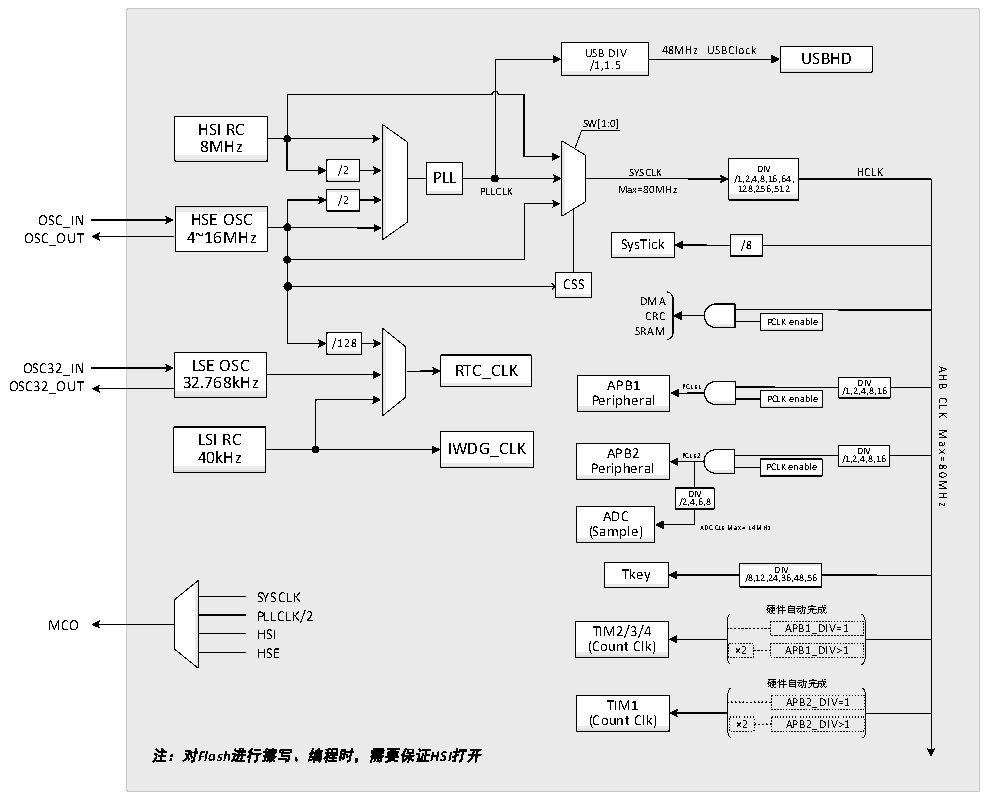

<!-- source-page: 5 -->

[← p.4](0004.md) · [index](../README.md) · [PDF p.5](https://ch32-riscv-ug.github.io/CH32V103/datasheet_zh/CH32V103DS0.PDF#page=5) · [p.6 →](0006.md)

<!-- header: CH32V103数据手册 http://wch.cn -->

## 1.4 时钟树

系统提供4组时钟源：内部高频RC振荡器（HSI）、内部低频RC振荡器(LSI)、外接高频振荡器或  
时钟信号(HSE)、外接低频振荡器或时钟信号(LSE)。其中，系统总线时钟（SYSCLK）来自高频时钟源  
(HSI/HSE)或者其送入PLL倍频后产生的更高时钟。而AHB域、APB1域、APB2域则由系统时钟或前一  
级经过相应的预分频器分频得到。  
低频时钟源为RTC和独立看门狗提供了时钟基准。  
PLL倍频时钟直接通过分频器提供USBHD模块的工作时钟基准48MHz。  

图1-3 时钟树框图  
 <!-- rendered from the PDF; verify at https://ch32-riscv-ug.github.io/CH32V103/datasheet_zh/CH32V103DS0.PDF#page=5 -->

🖼 Text parsed from the figure above

<!-- image: p5-draw-image-00002 inside the figure -->
<!-- image: p5-draw-image-00014 inside the figure -->
48MHz USBClock  
<!-- image: p5-draw-image-00015 inside the figure -->
USB DIV USBHD  
/1,1.5  
<!-- image: p5-draw-image-00003 inside the figure -->
SW[1:0]  
HSI RC  
<!-- image: p5-draw-image-00017 inside the figure -->
8MHz  
<!-- image: p5-draw-image-00018 inside the figure -->
<!-- image: p5-draw-image-00008 inside the figure -->
<!-- image: p5-draw-image-00004 inside the figure -->
<!-- image: p5-draw-image-00005 inside the figure -->
/2 PLL /1,2,4 D ,8 IV ,16,64, HCLK  
SYSCLK  
PLLCLK Max=80MHz  
128,256,512  
<!-- image: p5-draw-image-00007 inside the figure -->
/2  
<!-- image: p5-draw-image-00006 inside the figure -->
OSC_IN HSE OSC  
OSC_OUT 4~16MHz SysTick /8  
<!-- image: p5-draw-image-00020 inside the figure -->
<!-- image: p5-draw-image-00019 inside the figure -->
<!-- image: p5-draw-image-00041 inside the figure -->
CSS  
DMA  
<!-- image: p5-draw-image-00022 inside the figure -->
<!-- image: p5-draw-image-00023 inside the figure -->
CRC  
<!-- image: p5-draw-image-00024 inside the figure -->
PCLK enable  
SRAM  
<!-- image: p5-draw-image-00021 inside the figure -->
<!-- image: p5-draw-image-00010 inside the figure -->
/128  
<!-- image: p5-draw-image-00009 inside the figure -->
<!-- image: p5-draw-image-00013 inside the figure -->
OSC32_IN LSE OSC RTC_CLK  
AHB  
<!-- image: p5-draw-image-00029 inside the figure -->
OSC32_OUT 32.768kHz  
<!-- image: p5-draw-image-00028 inside the figure -->
APB1 PCLK1 /1,2 D ,4 IV ,8,16  
<!-- image: p5-draw-image-00025 inside the figure -->
<!-- image: p5-draw-image-00026 inside the figure -->
<!-- image: p5-draw-image-00027 inside the figure -->
Peripheral PCLK enable  
CLK  
<!-- image: p5-draw-image-00011 inside the figure -->
Max=80MHz  
<!-- image: p5-draw-image-00012 inside the figure -->
LSI RC  
IWDG_CLK 40kHz  
<!-- image: p5-draw-image-00034 inside the figure -->
<!-- image: p5-draw-image-00033 inside the figure -->
APB2 PCLK2 /1,2 D ,4 IV ,8,16  
<!-- image: p5-draw-image-00030 inside the figure -->
<!-- image: p5-draw-image-00031 inside the figure -->
<!-- image: p5-draw-image-00032 inside the figure -->
Peripheral PCLK enable  
<!-- image: p5-draw-image-00035 inside the figure -->
DIV  
/2,4,6,8  
<!-- image: p5-draw-image-00036 inside the figure -->
ADC  
(Sample) ADC CLK Max = 14MHz  
<!-- image: p5-draw-image-00040 inside the figure -->
<!-- image: p5-draw-image-00039 inside the figure -->
Tkey /8,12,24 D , I 3 V 6,48,56  
<!-- image: p5-draw-image-00016 inside the figure -->
SYSCLK  
PLLCLK/2 硬件自动完成  
MCO HSI TIM2/3/4 APB1_DIV=1  
<!-- image: p5-draw-image-00037 inside the figure -->
HSE (Count Clk) ×2 APB1_DIV&gt;1  
硬件自动完成  
<!-- image: p5-draw-image-00038 inside the figure -->
TIM1 APB2_DIV=1  
(Count Clk) ×2 APB2_DIV&gt;1  
注：对Flash进行擦写、编程时，需要保证HSI打开  

注：1、当使用USB功能时，必须同时使用PLL，CPU的频率必须是48MHz或72MHz。  
2、当需要ADC采样时间为1us时，APB2必须设置在14MHz、28MHz或56MHz。  
3、当系统从睡眠状态唤醒时，系统会自动切换为HSI做主频。  
4、对Flash进行擦写、编程时，必须保证HSI打开。  
<!-- image: p5-draw-image-00001 bbox=[507.72, 779.28, 527.16, 789.6] -->
<!-- footer: V1.2 4 -->
