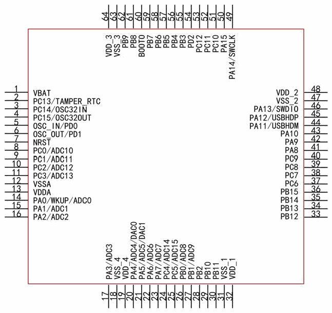
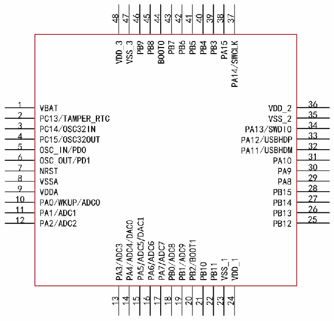

<!-- source-page: 11 -->

[← p.10](0010.md) · [index](../README.md) · [PDF p.11](https://ch32-riscv-ug.github.io/CH32V103/datasheet_zh/CH32V103DS0.PDF#page=11) · [p.12 →](0012.md)

<!-- header: CH32V103数据手册 http://wch.cn -->

# 第 2 章 引脚信息

## 2.1 引脚排列

CH32V103R8T6  

 <!-- p11-draw-image-00002 rendered from the PDF -->

CH32V103Cx  

 <!-- p11-draw-image-00003 rendered from the PDF -->

<!-- image: p11-draw-image-00001 bbox=[501.0, 779.28, 520.44, 789.6] -->
<!-- footer: V1.2 10 -->
