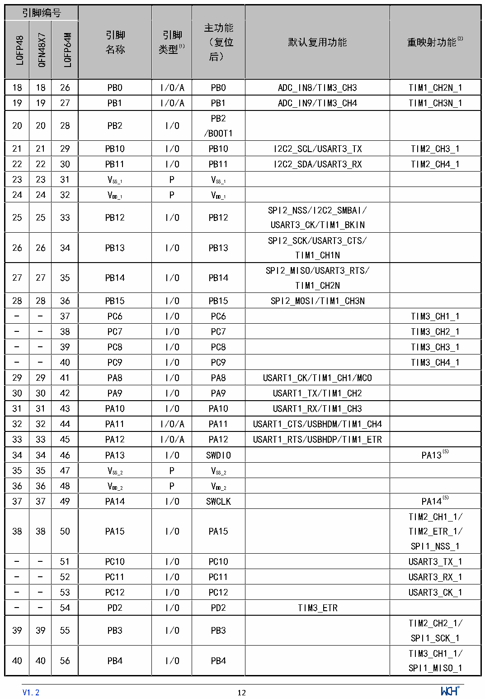

<!-- source-page: 13 -->

[← p.12](0012.md) · [index](../README.md) · [PDF p.13](https://ch32-riscv-ug.github.io/CH32V103/datasheet_zh/CH32V103DS0.PDF#page=13) · [p.14 →](0014.md)

<!-- header: CH32V103数据手册 http://wch.cn -->

 <!-- p13-cluster-01 uncaptioned graphics, rendered from the PDF; verify at https://ch32-riscv-ug.github.io/CH32V103/datasheet_zh/CH32V103DS0.PDF#page=13 -->

🖼 Text parsed from the figure above

<!-- p13-table-001 (table-2-1@1) -->
<table><tr><th colspan="3">引脚编号</th><th rowspan="2" style="text-align:left">引脚名称</th><th rowspan="2" style="text-align:left">引脚类型(1)</th><th rowspan="2" style="text-align:left">主功能 （复位后）</th><th rowspan="2">默认复用功能</th><th rowspan="2">重映射功能(2)</th></tr><tr><td>LQFP48</td><td>QFN48X7</td><td>LQFP64M</td></tr><tr><td>18</td><td>18</td><td>26</td><td>PB0</td><td>I/O/A</td><td>PB0</td><td>ADC_IN8/TIM3_CH3</td><td>TIM1_CH2N_1</td></tr><tr><td>19</td><td>19</td><td>27</td><td>PB1</td><td>I/O/A</td><td>PB1</td><td>ADC_IN9/TIM3_CH4</td><td>TIM1_CH3N_1</td></tr><tr><td>20</td><td>20</td><td>28</td><td>PB2</td><td>I/O</td><td style="text-align:left">PB2 /BOOT1</td><td></td><td></td></tr><tr><td>21</td><td>21</td><td>29</td><td>PB10</td><td>I/O</td><td>PB10</td><td>I2C2_SCL/USART3_TX</td><td>TIM2_CH3_1</td></tr><tr><td>22</td><td>22</td><td>30</td><td>PB11</td><td>I/O</td><td>PB11</td><td>I2C2_SDA/USART3_RX</td><td>TIM2_CH4_1</td></tr><tr><td>23</td><td>23</td><td>31</td><td style="text-align:left">VSS_1</td><td>P</td><td style="text-align:left">VSS_1</td><td></td><td></td></tr><tr><td>24</td><td>24</td><td>32</td><td style="text-align:left">VDD_1</td><td>P</td><td style="text-align:left">VDD_1</td><td></td><td></td></tr><tr><td>25</td><td>25</td><td>33</td><td>PB12</td><td>I/O</td><td>PB12</td><td style="text-align:left">SPI2_NSS/I2C2_SMBAI/ USART3_CK/TIM1_BKIN</td><td></td></tr><tr><td>26</td><td>26</td><td>34</td><td>PB13</td><td>I/O</td><td>PB13</td><td style="text-align:left">SPI2_SCK/USART3_CTS/ TIM1_CH1N</td><td></td></tr><tr><td>27</td><td>27</td><td>35</td><td>PB14</td><td>I/O</td><td>PB14</td><td style="text-align:left">SPI2_MISO/USART3_RTS/ TIM1_CH2N</td><td></td></tr><tr><td>28</td><td>28</td><td>36</td><td>PB15</td><td>I/O</td><td>PB15</td><td>SPI2_MOSI/TIM1_CH3N</td><td></td></tr><tr><td>-</td><td>-</td><td>37</td><td>PC6</td><td>I/O</td><td>PC6</td><td></td><td>TIM3_CH1_1</td></tr><tr><td>-</td><td>-</td><td>38</td><td>PC7</td><td>I/O</td><td>PC7</td><td></td><td>TIM3_CH2_1</td></tr><tr><td>-</td><td>-</td><td>39</td><td>PC8</td><td>I/O</td><td>PC8</td><td></td><td>TIM3_CH3_1</td></tr><tr><td>-</td><td>-</td><td>40</td><td>PC9</td><td>I/O</td><td>PC9</td><td></td><td>TIM3_CH4_1</td></tr><tr><td>29</td><td>29</td><td>41</td><td>PA8</td><td>I/O</td><td>PA8</td><td>USART1_CK/TIM1_CH1/MCO</td><td></td></tr><tr><td>30</td><td>30</td><td>42</td><td>PA9</td><td>I/O</td><td>PA9</td><td>USART1_TX/TIM1_CH2</td><td></td></tr><tr><td>31</td><td>31</td><td>43</td><td>PA10</td><td>I/O</td><td>PA10</td><td>USART1_RX/TIM1_CH3</td><td></td></tr><tr><td>32</td><td>32</td><td>44</td><td>PA11</td><td>I/O/A</td><td>PA11</td><td>USART1_CTS/USBHDM/TIM1_CH4</td><td></td></tr><tr><td>33</td><td>33</td><td>45</td><td>PA12</td><td>I/O/A</td><td>PA12</td><td>USART1_RTS/USBHDP/TIM1_ETR</td><td></td></tr><tr><td>34</td><td>34</td><td>46</td><td>PA13</td><td>I/O</td><td>SWDIO</td><td></td><td>PA13(5)</td></tr><tr><td>35</td><td>35</td><td>47</td><td style="text-align:left">VSS_2</td><td>P</td><td style="text-align:left">VSS_2</td><td></td><td></td></tr><tr><td>36</td><td>36</td><td>48</td><td style="text-align:left">VDD_2</td><td>P</td><td style="text-align:left">VDD_2</td><td></td><td></td></tr><tr><td>37</td><td>37</td><td>49</td><td>PA14</td><td>I/O</td><td>SWCLK</td><td></td><td>PA14(5)</td></tr><tr><td>38</td><td>38</td><td>50</td><td>PA15</td><td>I/O</td><td>PA15</td><td></td><td style="text-align:left">TIM2_CH1_1/ TIM2_ETR_1/ SPI1_NSS_1</td></tr><tr><td>-</td><td>-</td><td>51</td><td>PC10</td><td>I/O</td><td>PC10</td><td></td><td>USART3_TX_1</td></tr><tr><td>-</td><td>-</td><td>52</td><td>PC11</td><td>I/O</td><td>PC11</td><td></td><td>USART3_RX_1</td></tr><tr><td>-</td><td>-</td><td>53</td><td>PC12</td><td>I/O</td><td>PC12</td><td></td><td>USART3_CK_1</td></tr><tr><td>-</td><td>-</td><td>54</td><td>PD2</td><td>I/O</td><td>PD2</td><td>TIM3_ETR</td><td></td></tr><tr><td>39</td><td>39</td><td>55</td><td>PB3</td><td>I/O</td><td>PB3</td><td></td><td style="text-align:left">TIM2_CH2_1/ SPI1_SCK_1</td></tr><tr><td>40</td><td>40</td><td>56</td><td>PB4</td><td>I/O</td><td>PB4</td><td></td><td style="text-align:left">TIM3_CH1_1/ SPI1_MISO_1</td></tr></table>

<!-- image: p13-draw-image-00001 inside the figure -->
<!-- footer: V1.2 12 -->

