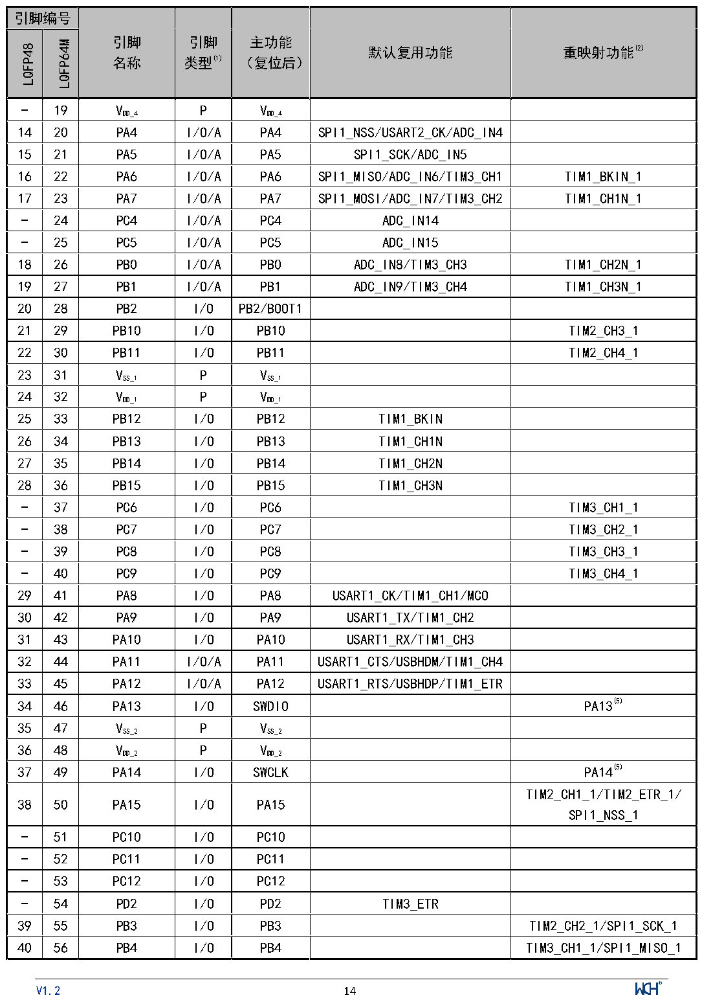

<!-- source-page: 15 -->

[← p.14](0014.md) · [index](../README.md) · [PDF p.15](https://ch32-riscv-ug.github.io/CH32V103/datasheet_zh/CH32V103DS0.PDF#page=15) · [p.16 →](0016.md)

<!-- header: CH32V103数据手册 http://wch.cn -->

 <!-- p15-cluster-01 uncaptioned graphics, rendered from the PDF; verify at https://ch32-riscv-ug.github.io/CH32V103/datasheet_zh/CH32V103DS0.PDF#page=15 -->

🖼 Text parsed from the figure above

> ⬆ **Table continued** — rendered in full at [page 14](0014.md). <!-- p15-table-001 -->

<!-- image: p15-draw-image-00001 inside the figure -->
<!-- footer: V1.2 14 -->

